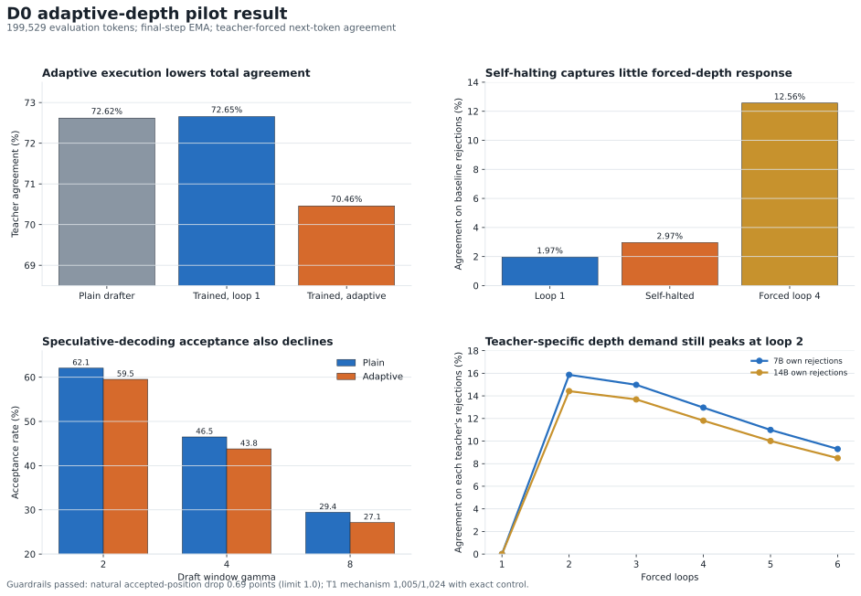

# Handoff: Paper Two D0 Adaptive-Depth Pilot Result and Strategy Decision

**Date:** 2026-07-27

**Run:** `stage5_paper2_d0_20260726`

**Registered scope:** teacher-forced next-token agreement, one seed, one recurrent drafter, one primary teacher

**Operational status:** complete; all aggregate receipts landed; A100 may remain shut down

**Registered interpretation:** `not_recoverable_at_pilot_scale`

**Decision requested:** bank the D0 result and decide whether the D-axis pauses, or whether one bounded utility-targeted follow-up is warranted before the C-track becomes primary

## 0. Executive verdict

D0 is a complete, interpretable negative under its registered recipe.

- The pooled depth-recoverable fraction was **1.003 percentage points**, below the preregistered 2-point boundary for recoverability at pilot scale.
- Adaptive execution matched the 7B teacher on **140,586/199,529 = 70.459%** of evaluation positions, below both the plain drafter at **144,892/199,529 = 72.617%** and the trained model forced to one loop at **144,966/199,529 = 72.654%**.
- On baseline-rejected positions, the trained checkpoint had substantial forced-depth capacity: loop 1 matched **1,074/54,637 = 1.966%**, self-halting matched **1,622/54,637 = 2.969%**, and forced loop 4 matched **6,865/54,637 = 12.565%**. The learned policy therefore captured only a small part of the available forced-depth response.
- Adaptive speculative-decoding simulation was worse than the plain drafter at every registered draft window. Acceptance fell by 2.3 to 2.7 points while loop cost per accepted draft token rose by 21% to 26%.
- Both hard guardrails passed. Natural accepted-position preservation fell by **0.690 points**, inside the 1-point limit. The synthetic T1 mechanism improved from the seed-1 reference of **971/1,024** to **1,005/1,024**, while retaining **1,024/1,024** exact depth selection and perfect continue/stop control.
- The post-training 7B and 14B own-rejection curves both peaked at loop 2 and had median first-correct depth 2. No upward teacher-depth shift appeared.
- ARC allocation was null descriptively: answer positions always selected one loop, and ARC-Easy and ARC-Challenge had nearly identical context-loop means.

**Bottom line:** D0 did not fail because the recurrent actuator broke. It failed because the natural-text supervision and learned allocation policy did not convert existing forced-depth capacity into useful adaptive teacher agreement. The negative is specific to the registered binary target, 4,000-step recipe, teacher-forced corpus, and single seed. It is not evidence that recurrent depth is intrinsically useless on natural text.

## 1. Plain-language summary

The model still knows how to execute a requested number of loops. It retained that ability perfectly on the synthetic control task, and the underlying synthetic answer mechanism improved. The natural-text experiment asked whether the same control pathway could learn when a larger teacher disagreed with the small model and spend one extra recurrent step selectively.

That did not work well enough. More forced computation sometimes changed a rejected prediction into the teacher's prediction, but the self-halting controller rarely chose the useful cases and sometimes spent depth where it damaged an already-correct prediction. The resulting system used more recurrent computation and agreed with the teacher less often than the plain one-loop drafter.

The most important localization is therefore:

1. **Actuation works.** The internal control token still causes exact loop execution on the trained synthetic family.
2. **Forced-depth response exists.** Some natural-text errors are recoverable at deeper forced loops.
3. **Allocation fails.** The registered binary teacher-disagreement target did not teach a policy that selects those recoverable positions without harming others.

This is a control-policy and target-design boundary, not a recurrence-mechanism failure.

## 2. Registered question and rationale

The preregistered question was:

> On natural text, what fraction of a larger same-family teacher's corrections to the small recurrent drafter is recoverable by shallow adaptive vertical depth, one to four loops, gated by the trained control-token pathway?

The design separated two possible sources of a small-to-large model gap:

- **Compute- or composition-responsive errors:** additional tied recurrent passes can reach the teacher token.
- **Unrecovered errors within the tested budget:** no forced depth through loop 4 reaches the teacher token.

The experiment measured teacher agreement, not semantic correctness. A recovered token is a match to the cached teacher's greedy token under a true-prefix context. It must not be described as a corrected factual answer or as reasoning.

The registered interpretation bands were descriptive:

| Pooled depth-recoverable fraction R | Registered reading |
|---:|---|
| Below 2 points | Not recoverable through this recipe at pilot scale; pause D-axis |
| 2 to 10 points | Partial recoverability; any D1 must explain responding severity bins |
| Above 10 points | Strong recoverability; D1 becomes the next registered phase |

The observed **1.003-point** result falls in the first band.

## 3. Canonical lineage and lock

### 3.1 Drafter substrate

- Starting checkpoint: T1-lite-R seed-1 raw endpoint, step 10,500.
- Starting SHA-256: `93d2e5f9a941bbe79a0b2fc3f9bf43d582bf054990c14b1a93ff67024140062d`.
- Architecture: repaired recurrent Qwen2.5-0.5B surgery with split re-entry bridge and internal continue/stop/readout token pathway.
- Starting control property: exact in-support depth selection and causal actuation on depths 1 through 8.
- Known starting limitation: T1-lite-R was a registered joint-gate negative because answer preservation was four rows below its floor, even though control was exact.

### 3.2 Teachers and corpus

- Primary teacher: Qwen2.5-7B-Instruct, cached once and never reloaded for downstream scoring.
- Calibration sensitivity teacher: Qwen2.5-14B, cached on the calibration partition only.
- General-text stratum: FineWeb-Edu, `CC-MAIN-2025-26`, revision `87f09149ef4734204d70ed1d046ddc9ca3f2b8f9`.
- Code stratum: `bigcode/the-stack-smol`, Stack v1 lineage, revision `4a6938ce94446f324c6629e7de00ac591710044b`.
- Frozen corpus: 2.0M tokens, balanced 50/50 across general text and code.
- Partitions: 1.6M label-train, 0.2M calibration, and 0.2M untouched evaluation tokens.
- Evaluation set: 471 source rows, 162 documents, 200,000 frozen tokens; final scorer emitted 199,529 evaluated positions.
- Documents were disjoint across partitions. The evaluation partition was not restored until training had finished.

### 3.3 Registration and run identifiers

- Governing preregistration: `docs/PHASE_D0_PREREGISTRATION_DRAFT7_20260726.md`.
- Machine-readable lock: `outputs/stage5/stage5_paper2_d0_preregistration_20260726/preregistration.json`.
- Lock commit: `90cbc48c9aa749cb2e53dfef35bb2af9a24d9ae3`.
- Mixed-rehearsal code correction before the run: `eae372260db7a87a5b14738dffd0faa2134b764d`.
- Final aggregate receipt commit: `8334715e`.
- Tie policy: fp32 logits, exact ties choose the lowest token ID, and tie cells are counted.

## 4. Experimental design

### 4.1 Single-pass teacher labels

At every teacher-forced corpus position, the cache stored:

- teacher greedy token ID;
- drafter-token log probability and rank under the teacher;
- teacher entropy;
- streamed teacher-to-plain-drafter KL;
- rejection-run length.

A position was accepted when the plain drafter and 7B greedy tokens matched and rejected otherwise. The label is deterministic teacher agreement, not truth.

The 14B cache exposed an important limitation in the target: the deeper teacher endorsed the drafter's loop-1 token on **8,845/53,389 = 16.567%** of cached 7B rejections. This quantifies teacher disagreement inside the supervision target.

### 4.2 Floor and target policy

Before D0 training, forced depths 1 through 6 were evaluated on calibration rejections. The floor met the registered graded-curve condition in every KL quartile. Under the locked branch:

- accepted positions received target depth 1;
- rejected positions in all four KL quartiles received target depth 2;
- isotonic and parametric disagreement-to-depth fits were descriptive only and never set training targets.

The 2,800-step natural schedule contained:

| Target | Steps |
|---|---:|
| Depth 1, accepted positions | 2,038 |
| Depth 2, rejected positions | 762 |

This target policy is central to interpretation. It teaches the controller to distinguish teacher agreement from disagreement. It does not directly teach the narrower causal label, "an extra loop improves this position without harming it."

### 4.3 Training recipe

- Seed: 0.
- Total steps: 4,000.
- Natural-text steps: 2,800.
- Synthetic mechanism rehearsal: 1,200 steps, exactly 30%.
- Rehearsal composition: 829 control-active and 371 mechanism-only steps.
- Optimizer: AdamW.
- Learning rate: `1e-5`.
- Bridge prelude learning-rate multiplier: `10.0`.
- Control-loss coefficient: `0.5` with equal class weights.
- Final-step EMA at decay 0.999: registered primary endpoint.
- Trainable set: the T1-lite-R recurrent block, repaired bridge, and three control-token rows.
- Frozen pretrained base, prelude, coda, and old embedding rows remained protected by hash assertions.

### 4.4 Evaluation battery

After training, the untouched evaluation partition was restored and the primary endpoint was scored under:

1. Plain one-loop reference.
2. Trained one-loop model.
3. Trained self-halting model, maximum four loops.
4. Forced loop-4 response on baseline rejections.
5. Speculative-decoding simulations at draft windows 2, 4, and 8.
6. Trained forced-depth 1-through-6 curves against cached 7B and 14B teachers.
7. T1 synthetic mechanism-retention battery.
8. ARC-Easy and ARC-Challenge allocation probe.

## 5. Run integrity and training behavior

### 5.1 Completion and checkpoint integrity

- Training status: `training_finished`.
- Optimizer steps: 4,000/4,000.
- Raw endpoint SHA-256: `91be70ec9f15fc03f6166048a2de8719a49c29216b4f14ca238c805b4d106211`.
- EMA primary SHA-256: `8245cabfe7639dcd442c19e03496623b9d59eec31b39e253e08fd6f78b1086cf`.
- Frozen-base SHA-256 at start and end: `2c58b8493963f149b0a935bb83aaace9b857f1764f87840d41126875d6ae79f2`.
- Raw and EMA checkpoints were copied and hash-verified in Drive before the final training summary was written.
- All aggregate evaluation receipts landed in GitHub.

### 5.2 Intermediate guardrails

| Step | T1 answer accuracy | Exact depth selection | Continue recall | Stop recall | Natural abort |
|---:|---:|---:|---:|---:|---|
| 1,000 | 240/256 = 93.75% | 256/256 | 100% | 100% | No |
| 2,000 | 228/256 = 89.06% | 240/256 | 98.21% | 100% | No |
| 3,000 | 235/256 = 91.80% | 256/256 | 100% | 100% | No |

The synthetic controller showed a temporary middle-run disturbance and recovered by step 3,000. At step 2,000 the natural control-loss slope met the descriptive flat criterion, but stop recall was 100%, so the registered conjunction for abort was not met.

### 5.3 Final hard guardrails

| Guardrail | Requirement | Result | Verdict |
|---|---:|---:|---|
| Natural accepted-position preservation | Drop no more than 1 point | 100.000% to 99.310%; drop 0.690 points | Pass |
| T1 mechanism retention | Drop no more than 3 points from 971/1,024 reference | 1,005/1,024; improvement of 3.320 points | Pass |
| T1 exact depth selection | Preserve mechanism | 1,024/1,024 | Pass |
| T1 continue decisions | Preserve mechanism | 3,584/3,584 | Pass |
| T1 stop decisions | Preserve mechanism | 1,024/1,024 | Pass |
| T1 exhaustion | None expected | 0 | Pass |

The 30% rehearsal protected the synthetic actuator. The negative natural result therefore cannot be attributed to catastrophic forgetting of the installed control mechanism.

## 6. Primary natural-text results

### 6.1 Headline depth-recoverable fraction

The registered metric was:

`R = self-halted agreement on baseline rejections - trained loop-1 agreement on baseline rejections`

| Stratum | Trained loop 1 | Self-halted | R | Registered reading |
|---|---:|---:|---:|---|
| General | 672/33,103 = 2.030% | 997/33,103 = 3.012% | **0.982 points** | Below 2 |
| Code | 402/21,534 = 1.867% | 625/21,534 = 2.902% | **1.036 points** | Below 2 |
| **Pooled** | **1,074/54,637 = 1.966%** | **1,622/54,637 = 2.969%** | **1.003 points** | **Not recoverable at pilot scale** |

The two strata agree closely. There is no evidence that the in-era code stratum produced a materially stronger adaptive-depth effect than post-cutoff general text under this recipe.

### 6.2 Overall agreement and the cost of misallocation

| Evaluation path | Correct | Agreement |
|---|---:|---:|
| Plain drafter | 144,892/199,529 | 72.617% |
| Trained checkpoint, forced loop 1 | 144,966/199,529 | 72.654% |
| Trained checkpoint, self-halted | 140,586/199,529 | 70.459% |

Training alone did not reduce total loop-1 agreement. It added a net 74 matching positions. The loss appears when the learned policy executes adaptively:

- Self-halting gained a net 548 matches within the baseline-rejected population relative to trained loop 1.
- It lost a net 4,928 matches within the baseline-accepted population relative to trained loop 1.
- Net change versus trained loop 1: **-4,380 matches, or -2.195 points overall**.

This decomposition is more informative than R alone. The policy produced a small rescue effect, but its off-target depth use caused much larger damage.

### 6.3 Forced-depth capacity remains

On the same 54,637 baseline-rejected evaluation positions:

| Path | Correct | Agreement |
|---|---:|---:|
| Trained loop 1 | 1,074 | 1.966% |
| Trained self-halting | 1,622 | 2.969% |
| Trained forced loop 4 | 6,865 | 12.565% |

Forced loop 4 is not an oracle and may harm other positions. It nevertheless proves that the trained recurrent block contains considerably more depth-responsive behavior than the deployed self-halting policy captures. The principal bottleneck is allocation, not absence of all deeper-loop response.

### 6.4 Severity response

Adaptive recovery was strongest in the lowest-disagreement quartile and declined monotonically with KL severity:

| KL quartile | Loop 1 agreement | Self-halted agreement | Forced loop-4 agreement | Unrecovered at loop 4 |
|---|---:|---:|---:|---:|
| q1 | 4.086% | 5.379% | 21.401% | 78.599% |
| q2 | 2.670% | 3.808% | 14.687% | 85.313% |
| q3 | 1.419% | 2.487% | 10.791% | 89.209% |
| q4 | 0.289% | 0.886% | 5.797% | 94.203% |

The harder the teacher disagreement, the less likely shallow recurrence was to recover it. This is consistent with a growing storage or representation gap, but the registered scope permits only the narrower statement: the positions were unrecovered within four loops on this trained substrate.

### 6.5 Loop use was weakly related to disagreement

The self-halting model used **1.158 mean loops** and exhausted the four-loop budget on **3,664/199,529 = 1.836%** of positions. Loop usage had only weak rank correlations with the cached disagreement signals:

| Signal | Spearman correlation with executed loops |
|---|---:|
| Teacher-to-drafter KL | 0.110 |
| Teacher rank of drafter token | 0.051 |
| Rejection-run length | 0.043 |

The controller did not allocate depth strongly according to the severity variables used to define and analyze the task.

## 7. Speculative-decoding simulation

The registered simulation compared the plain and adaptive drafters at identical draft windows.

| Gamma | Plain acceptance | Adaptive acceptance | Change | Plain loops per accepted draft token | Adaptive loops per accepted draft token | Relative loop-cost increase |
|---:|---:|---:|---:|---:|---:|---:|
| 2 | 62.056% | 59.512% | -2.544 points | 1.611 | 1.950 | +21.0% |
| 4 | 46.491% | 43.788% | -2.703 points | 2.151 | 2.654 | +23.4% |
| 8 | 29.450% | 27.134% | -2.316 points | 3.396 | 4.274 | +25.9% |

The adaptive system is dominated by the plain drafter under every simulated draft window: it accepts fewer draft tokens and spends more recurrent passes per accepted token.

The same-session timing receipt is simulation-grade only:

- Plain loop-1 pass over all positions: 16.000 seconds.
- Trained loop-1 pass: 15.508 seconds.
- Forced loop-4 pass: 48.036 seconds.
- Interpolated adaptive pass: 17.224 seconds.

These timings support the direction of the simulation result but are not a production speculative-decoding efficiency claim.

## 8. Teacher-shift result

### 8.1 Pre-training floor

Each teacher was measured on its own loop-1 rejection population:

| Teacher | Own rejections | Recoverable by depth 6 | Recoverable share | Median first-correct depth | Aggregate peak |
|---|---:|---:|---:|---:|---:|
| 7B | 53,386 | 10,557 | 19.775% | 2 | 2 |
| 14B | 56,974 | 10,429 | 18.305% | 2 | 2 |

### 8.2 Post-training forced-depth sweep

| Teacher | Own rejections | Recoverable by depth 6 | Recoverable share | Median first-correct depth | Aggregate peak |
|---|---:|---:|---:|---:|---:|
| 7B | 53,390 | 11,915 | 22.317% | 2 | 2 |
| 14B | 57,007 | 11,605 | 20.357% | 2 | 2 |

Training increased the size of each recoverable set by roughly two points, but the teacher-depth signature did not shift. Both teachers still peaked at loop 2 and had median first-correct depth 2.

The preregistered reading is therefore the same-depth branch: observed depth demand is more consistent with a property of the text/substrate than a simple function of teacher layer depth. This weakens the simple depth-as-composition account. It does not prove that teacher gap never affects depth demand.

Important caveat: all natural rejections were trained toward depth 2, which can compress both post-training distributions toward 2. The pre-training floor is less confounded, and it also showed no shift.

## 9. ARC allocation probe

The ARC probe was descriptive and made no capability claim.

| Benchmark | Rows | Mean answer-position loops | Mean context loops | Answer minus context |
|---|---:|---:|---:|---:|
| ARC-Easy | 128 | 1.000 | 1.120 | -0.120 |
| ARC-Challenge | 128 | 1.000 | 1.118 | -0.118 |

Answer depth had no variance, so the answer-depth versus challenge-indicator Spearman statistic was undefined. The controller did not spend more depth at answer positions or on the harder benchmark. This is consistent with the weak natural disagreement correlations and adds no evidence of content-sensitive allocation.

## 10. Registered interpretation

The correct registered sentence is:

> Under a single-seed, 4,000-step teacher-forced pilot with binary depth-1 versus depth-2 targets, adaptive recurrent depth recovered 1.0 percentage point of the primary teacher's rejected next-token predictions, below the preregistered 2-point recoverability band, while reducing total agreement and simulated speculative-decoding acceptance. The synthetic control actuator and both preservation guardrails remained intact.

The result supports five narrower conclusions:

1. **The actuator is not the limiting component.** Exact synthetic depth control survived and synthetic answer accuracy improved.
2. **Natural forced-depth response exists.** Forced loop 4 matched 12.6% of baseline rejections, much higher than the self-halted 3.0%.
3. **The registered policy does not allocate that response effectively.** Adaptive execution harms substantially more accepted positions than it rescues rejected positions.
4. **Teacher disagreement is an imperfect routing target.** It includes teacher noise and many positions that no tested depth recovers.
5. **A simple teacher-layer-depth signature did not appear.** Both 7B and 14B demand curves peaked at loop 2 before and after training.

## 11. What the result does not establish

- It does not show that recurrent depth cannot improve natural text.
- It does not show that all unrecovered positions are knowledge-limited.
- It does not test depths beyond six for the teacher-shift sweep or beyond four for the deployed policy.
- It does not test a target based directly on marginal benefit from the next loop.
- It does not test on-policy speculative decoding; corpus contexts were teacher-forced.
- It does not establish semantic correctness or reasoning.
- It does not establish seed robustness, model-scale robustness, teacher robustness, or corpus robustness.
- It does not support an efficiency claim beyond the registered simulation-grade measurements.
- It does not reopen or resolve GRAM, guided stochastic width, or the closed Arm G route.
- It does not authorize C-track training, D1, or any new sweep.

## 12. Central diagnosis for strategy review

The registered target may be causally misaligned with the desired policy.

Every teacher rejection was labeled for depth 2, but only a minority of rejected positions were recoverable at depth 2 or at any tested depth. The training label therefore answers:

> Does the teacher disagree with loop 1?

The deployment objective asks:

> Will another loop improve expected teacher agreement enough to justify its compute and avoid damaging the current answer?

Those are different labels. The landed result is consistent with a controller learning a noisy disagreement detector rather than a marginal-utility policy. This diagnosis is strongly suggested by the data but is not yet proven because the public receipt does not contain the full selected-loop by forced-benefit contingency table.

## 13. Recommended decision sequence

### 13.1 Bank D0 before further training

Record the D0 interpretation as `not_recoverable_at_pilot_scale` and preserve all do-not-claim boundaries. Do not extend training, increase lambda, or sweep thresholds on the same target. A longer run would more strongly optimize a target that the result now suggests is misaligned.

### 13.2 One read-only causal allocation audit, if strategy wants to evaluate D1

Use the saved private evaluation rows and per-loop cache to compute, without model training:

1. Selected-loop distribution separately for baseline-accepted and baseline-rejected positions.
2. Per-position rescue and harm at every transition from loop 1 to 4.
3. Oracle marginal-utility frontier on the post-D0 checkpoint under explicit loop costs.
4. Confusion between the trained stop decision and the true next-loop-benefit label.
5. Utility curves for cheap deployable signals available after each loop.
6. A paired decomposition of the 4,928 accepted-population net loss.

This audit would determine whether D1 has a credible target and measurable headroom. It should not alter the D0 verdict.

### 13.3 Conditional D1, only after a positive audit

If a cross-fitted deployable policy shows meaningful held-out utility, one bounded D1 could replace rejection labels with explicit marginal-utility targets:

- continue only when the expected gain from the next loop exceeds a registered compute penalty;
- include both rescue and harm in the label;
- fit thresholds only on calibration rows;
- preserve the natural and T1 hard guardrails;
- compare against fixed depth 1, fixed depth 2, and an oracle utility frontier;
- keep the experiment single-seed and bounded unless it clears a preregistered band.

If the offline audit cannot beat fixed-depth baselines, pause the D-axis and let the COCONUT horizontal-computation program carry the next experimental phase.

## 14. Questions for the strategy agent

1. Should D0's below-2-point reading close the current D-axis immediately, or authorize the read-only causal allocation audit before closure?
2. Is the primary Paper Two framing now "exact actuation does not imply useful natural allocation," with T1 as the actuator positive and D0 as the transfer boundary?
3. Should the simple width-as-storage, depth-as-composition framing be narrowed because 7B and 14B own-rejection demand both peak at loop 2?
4. Does the forced-loop-4 response justify one utility-targeted D1, or is it insufficient because its end-to-end harm has not yet been paired and costed?
5. Should the 16.567% 7B-versus-14B target disagreement be elevated as a methodological limitation of greedy-teacher agreement supervision?
6. Should the C-track become primary now, with D1 permitted only as a small parallel diagnostic if the read-only utility audit is positive?
7. What result would be required to reopen scaled D-axis work: positive R, net total acceptance gain, speculative-decoding dominance, or all three?

## 15. Suggested manuscript framing

### Main finding

The strongest paper-level result is a separation between causal execution and useful allocation:

> A token-pathway controller retained exact causal control of recurrent depth after natural-text training, but binary teacher-disagreement supervision did not produce a useful adaptive-compute policy. Forced depth exposed recoverable next-token behavior, yet self-halting captured little of it and reduced total teacher agreement.

### Supporting findings

- Synthetic control survived natural training and improved in answer accuracy.
- Natural depth response was real but concentrated and difficult to route.
- Teacher disagreement was noisy across teacher sizes.
- The teacher-specific demand curve did not shift with teacher layer depth.
- Adaptive speculative-decoding simulation was dominated by the plain drafter.

### Prohibited stronger language

Do not write that depth cannot help, that deeper recurrence is inefficient in general, that unrecovered positions are knowledge errors, or that adaptive recurrence failed universally. The evidence concerns one frozen lineage, one primary teacher, one target policy, one seed, and teacher-forced next-token agreement.

## 16. Canonical artifacts

### Governing and prelaunch

1. Preregistration: `docs/PHASE_D0_PREREGISTRATION_DRAFT7_20260726.md`
2. Machine lock: `outputs/stage5/stage5_paper2_d0_preregistration_20260726/preregistration.json`
3. Prelaunch summary: `outputs/stage5/stage5_paper2_d0_20260726/prelaunch/summary.json`
4. Target-policy receipt: `outputs/stage5/stage5_paper2_d0_20260726/prelaunch/target_policy_receipt.json`

### Training and final evaluation

5. Run summary: `outputs/stage5/stage5_paper2_d0_20260726/summary.json`
6. Training summary and trace: `outputs/stage5/stage5_paper2_d0_20260726/train/summary.json`
7. Intermediate guardrails: `outputs/stage5/stage5_paper2_d0_20260726/train/guardrails/step_{1000,2000,3000}.json`
8. Natural evaluation: `outputs/stage5/stage5_paper2_d0_20260726/eval/natural_summary.json`
9. Trained forced-depth sweep: `outputs/stage5/stage5_paper2_d0_20260726/eval/trained_teacher_shift_summary.json`
10. Teacher-shift signature: `outputs/stage5/stage5_paper2_d0_20260726/eval/teacher_shift_signature.json`
11. T1 retention: `outputs/stage5/stage5_paper2_d0_20260726/eval/t1_retention_summary.json`
12. ARC allocation: `outputs/stage5/stage5_paper2_d0_20260726/eval/arc_allocation_summary.json`

### Handoff figure

13. Figure builder: `analysis/build_paper2_d0_result_handoff_figure.py`
14. SVG: `docs/figures/paper2_d0_result_handoff_20260727.svg`
15. PNG: `docs/figures/paper2_d0_result_handoff_20260727.png`

## 17. Handoff status

- D0 training and all registered evaluation jobs are complete.
- Both hard guardrails passed.
- The primary interpretation band is locked and negative at pilot scale.
- No live GPU state is required.
- No new model training is recommended before strategy review.
- The next decision is whether to close the D-axis now or authorize one read-only utility audit as the sole prerequisite for considering D1.
