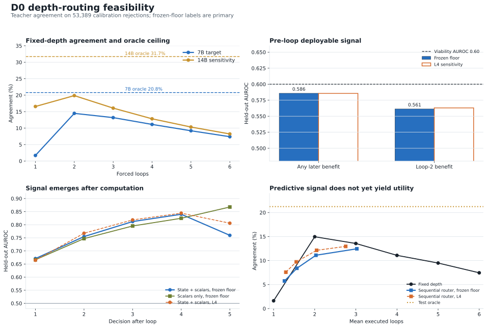

# Paper Two D0 Router Feasibility Handoff

**Date:** 2026-07-27  
**Status:** Floor calibration, oracle audit, and deployable linear-probe audit landed. D0 training has not started.  
**Decision requested:** Reconcile the registered graded-branch target policy with the trainer, then decide whether to launch the locked 4,000-step D0 training run.

## 0. Executive verdict

There is a real depth-allocation opportunity on the calibration rejections, but the frozen model does not expose enough pre-loop deployable signal for the tested linear router to exploit it.

- Against the primary 7B teacher, fixed depth 2 is best at **7,727/53,389 = 14.47%** agreement.
- An oracle choosing the first correct depth from 1 through 6 reaches **11,102/53,389 = 20.79%**, an absolute **+6.32-point** ceiling over fixed depth 2.
- Nearly the entire oracle gain is available at low average compute: **20.16% at 1.25 mean loops**, versus 20.79% at the unconstrained oracle's 1.279 mean loops.
- The pre-loop Prelude-state probe fails its locked feasibility reading: AUROC is **0.586** for any later-loop benefit and **0.561** for loop-2 benefit. The registered probe verdict is `no_deployable_signal`.
- After computation begins, prediction improves substantially: combined state-plus-scalar AUROC rises from **0.671 after loop 1** to **0.755 after loop 2**, **0.812 after loop 3**, and **0.840 after loop 4**.
- Predictive discrimination does not yet translate into a useful policy. At approximately two mean loops, the sequential router achieves **11.10%**, below fixed depth 2 at **14.96%** on the same held-out probe split.
- The result is robust to the observed output-tie instability between the frozen floor and the L4 feature-extraction run. Both label realizations return `no_deployable_signal` and nearly identical AUROCs.

**Bottom line:** depth can help, and an oracle can allocate it efficiently, but the tested pre-loop representation does not identify the beneficiaries well enough. Post-loop signals are learnable, but the current linear threshold policy is not utility-optimal. This is a routing-interface result, not a refutation of learned halting or of D0 training.

## 1. Plain-language summary

Running the model twice is better on average than running it once on these teacher-disagreement positions. Running it more than twice usually hurts the aggregate, even though a small subset is rescued at later loops. If we knew in advance which positions would benefit, we could recover materially more teacher agreement with little added computation. The current hidden state before the first loop does not tell us reliably enough which positions those are. Once the model has taken several steps, its evolving confidence and state contain a much clearer signal, but the first simple sequential policy built from that signal still makes worse choices than the blunt policy of always using two loops.

This suggests that the main unsolved problem is not whether depth ever helps. It does. The problem is converting post-loop evidence into a causal stopping policy that is trained for accuracy-versus-compute utility.

## 2. Canonical lineage and receipts

### Frozen substrate

- Checkpoint: T1-lite-R seed-1 raw endpoint, step 10,500.
- SHA-256: `93d2e5f9a941bbe79a0b2fc3f9bf43d582bf054990c14b1a93ff67024140062d`.
- Model family: recurrent Qwen2.5-0.5B surgery with repaired split bridge and internal control-token pathway.
- No model optimization or parameter mutation occurred in any experiment covered here.

### Receipts

1. Floor calibration: `outputs/stage5/stage5_paper2_d0_20260726/floor/summary.json`
2. Oracle router audit: `outputs/stage5/stage5_paper2_d0_20260726/router_oracle_audit/summary.json`
3. Deployable router probe: `outputs/stage5/stage5_paper2_d0_20260726/router_probe/summary.json`
4. Figure: `docs/figures/paper2_d0_router_handoff_20260727.svg`
5. Figure builder: `analysis/build_paper2_d0_router_handoff_figure.py`

All three receipts share the private floor-row hash:

`525efd031469c68ff7e7d238ead38c1c9818b9f8d25ddaf2ecc059e2db6ba11b`

The untouched evaluation partition was not accessed. These are calibration-partition diagnostics only.

## 3. Experimental sequence and rationale

### 3.1 Forced-depth floor calibration

**Question:** Before training a depth controller, does additional recurrent depth improve agreement with the cached teacher, and how does the response vary with disagreement severity?

**Population:** 53,389 positions rejected by the primary 7B teacher cache, drawn from 456 calibration source rows across general-text and code strata.

**Intervention:** Force the frozen drafter to depths 1 through 6 and compare each next-token prediction with cached 7B and 14B teacher greedy tokens. No teacher reload and no training.

**Registered branch rule:** The floor is graded if depth-4 agreement exceeds depth-1 agreement by at least 2 percentage points in at least two KL quartiles. The result is graded in all four quartiles, so the `graded_floor_curve` branch activates.

**Registered binned targets:** The landed receipt records:

| KL quartile | Registered target depth |
|---|---:|
| q1 | 2 |
| q2 | 2 |
| q3 | 2 |
| q4 | 2 |

The result is therefore a binary natural-text allocation policy at D0: accepted positions target depth 1; rejected positions target depth 2. The separately fitted isotonic curve remains a descriptive mapping deliverable.

### 3.2 Oracle router audit

**Question:** If a perfect router knew which forced depth would agree with the teacher, how much benefit could routing recover, and at what mean-loop cost?

**Oracle:** Select the first correct forced depth if any depth from 1 through 6 is correct; otherwise use depth 1. This is deliberately nondeployable and establishes a ceiling, not a model.

**Additional diagnostics:**

- First-correct-depth distribution.
- Recovery and harm relative to loop 1.
- Compute-constrained oracle frontiers.
- Teacher-only signal AUROCs, marked nondeployable.
- Output-change versus output-stability recovery rates.
- 14B teacher sensitivity on the same 7B-rejected positions.

### 3.3 Deployable pre-loop and sequential probes

**Question:** Can model-internal signals available before or after each loop identify positions that benefit from additional depth?

**Split:** Deterministic, source-row-grouped 70/15/15 split by stratum, preventing positions from the same source row from crossing train, validation, and test.

| Split | Positions | Source rows |
|---|---:|---:|
| Train | 37,464 | 318 |
| Validation | 7,667 | 69 |
| Test | 8,258 | 69 |

**Pre-loop features:**

- Fixed seeded 128-dimensional orthogonal projection of the Prelude hidden state.
- Structural features: normalized position, log sequence length, and corpus stratum.
- No teacher features.

**Pre-loop labels:**

1. Loop 1 is wrong and any later loop is correct.
2. Loop 1 is wrong and loop 2 is correct.

**Sequential features after loops 1 through 5:**

- Projected Prelude state, current recurrent state, and state delta.
- Top-1/top-2 margin, top-1 log probability, and top-1 logit.
- Whether the answer token changed.
- State RMS, update RMS, and state/previous-state cosine.
- Internal control-token stop-minus-continue margin.
- Structural features.

**Probe:** Class-weighted ridge linear model; ridge selected on validation only. Thresholds for sequential policies selected on validation only. Test labels never set thresholds.

**Pre-loop feasibility rule:**

- Viable: loop-2 AUROC at least 0.60 and at least 1-point uplift over random allocation at two of three budgets, with positive source-cluster bootstrap lower bounds.
- Strong: AUROC at least 0.70 and at least 2-point uplift at two of three budgets.

## 4. Results

### 4.1 Forced depth and oracle ceiling

#### Primary 7B teacher

| Forced depth | Correct | Agreement |
|---:|---:|---:|
| 1 | 907 | 1.70% |
| 2 | 7,727 | **14.47%** |
| 3 | 7,039 | 13.18% |
| 4 | 5,936 | 11.12% |
| 5 | 4,909 | 9.19% |
| 6 | 3,943 | 7.39% |
| Oracle, any depth 1-6 | 11,102 | **20.79%** |

The aggregate optimum is depth 2. Deeper loops continue rescuing unique positions, but harm enough other positions that aggregate agreement declines after depth 2.

#### First correct depth, primary teacher

| First correct depth | Positions | Share of all rejections |
|---:|---:|---:|
| 1 | 907 | 1.70% |
| 2 | 7,419 | 13.90% |
| 3 | 1,595 | 2.99% |
| 4 | 635 | 1.19% |
| 5 | 366 | 0.69% |
| 6 | 180 | 0.34% |
| Never correct by 6 | 42,287 | **79.21%** |

This is the central decomposition. Most rejected positions are not rescued by more depth on the frozen substrate. The routeable opportunity is concentrated, and most of it appears at loop 2.

#### Loop-1 to loop-2 transition

- Recovered: 7,419 positions.
- Harmed: 599 positions.
- Net: +6,820 positions.
- Recovery rate: 13.90% of all rejections.
- Harm rate: 1.12% of all rejections.

#### Oracle compute frontier

| Mean-loop budget | Oracle agreement |
|---:|---:|
| 1.00 | 1.70% |
| 1.25 | 20.16% |
| 1.279 realized | 20.79% |

An oracle captures 97.0% of its total correct positions by a 1.25-loop budget. The opportunity is therefore not “run deeply everywhere.” It is “spend one extra loop on a selective minority.”

### 4.2 Teacher sensitivity

Against the cached 14B teacher on the same positions:

- Best fixed depth remains 2: **10,609/53,389 = 19.87%**.
- Oracle any-depth agreement: **16,934/53,389 = 31.72%**.
- Oracle uplift over fixed depth 2: **+11.85 points**.
- Oracle realized mean loops: 1.219.

The larger oracle gap shows that “best depth” depends on the target teacher. It does not establish reasoning depth. It establishes teacher-agreement recoverability under forced recurrent computation.

### 4.3 Pre-loop deployable probe

| Target | Prelude + structure AUROC | Structure-only AUROC | Reading |
|---|---:|---:|---|
| Any later-loop benefit | 0.586 | 0.516 | Below viability threshold |
| Loop-2 benefit | 0.561 | 0.509 | Below viability threshold |

Loop-2 allocation performance:

| Fraction sent to loop 2 | Mean loops | Model agreement | Random expected | Uplift | Oracle agreement | Bootstrap lower bound |
|---:|---:|---:|---:|---:|---:|---:|
| 25% | 1.250 | 5.95% | 4.95% | +0.99 pt | 16.01% | +0.58 pt |
| 50% | 1.500 | 9.32% | 8.29% | +1.04 pt | 16.01% | +0.74 pt |
| 75% | 1.750 | 12.16% | 11.62% | +0.54 pt | 16.01% | +0.19 pt |

Only one budget clears a 1-point uplift, and AUROC is 0.561. The locked verdict is therefore `no_deployable_signal`.

The positive bootstrap lower bounds show the ranking is not entirely random. The effect is too weak to satisfy the predeclared utility form.

### 4.4 Sequential probe after computation begins

| Decision point | Positive test cases | State + scalars AUROC | Scalars-only AUROC | State increment |
|---:|---:|---:|---:|---:|
| After loop 1 | 1,619 | 0.671 | 0.666 | +0.004 |
| After loop 2 | 433 | 0.755 | 0.747 | +0.008 |
| After loop 3 | 196 | 0.812 | 0.795 | +0.017 |
| After loop 4 | 113 | 0.840 | 0.825 | +0.015 |
| After loop 5 | 34 | 0.760 | 0.868 | -0.108 |

The predictive signal strengthens as the computation unfolds. However, most of the signal is already present in cheap scalar dynamics; the projected hidden states add only 0.4 to 1.7 AUROC points through loop 4. Loop 5 has only 34 positive test cases, so its reversal should not be overinterpreted.

The output-change heuristic is specifically unsafe. Among positions still wrong after loop 2, later recovery is more common when the prediction is stable than when it changed:

- Stable: 2,076/23,814 = 8.72% later recoverable.
- Changed: 735/21,848 = 3.36% later recoverable.

“Stop when the answer stabilizes” would stop many positions that later recover.

### 4.5 Sequential policy utility

#### Frozen-floor primary labels

| Target budget | Realized mean loops | Router agreement | Difference from fixed depth 2 |
|---:|---:|---:|---:|
| 1.25 | 1.264 | 5.74% | -9.22 pts |
| 1.50 | 1.566 | 8.39% | -6.56 pts |
| 2.00 | 2.029 | 11.10% | -3.85 pts |
| 3.00 | 3.024 | 12.45% | -2.51 pts |

The sequential policy fails to beat fixed depth 2 even when spending more than two loops on average. High AUROC at later loops is therefore not sufficient evidence of useful routing.

#### L4-native sensitivity labels

| Target budget | Realized mean loops | Router agreement | Difference from L4 fixed depth 2 |
|---:|---:|---:|---:|
| 1.25 | 1.298 | 7.58% | -7.19 pts |
| 1.50 | 1.551 | 9.72% | -5.05 pts |
| 2.00 | 2.047 | 12.13% | -2.64 pts |
| 3.00 | 2.754 | 12.95% | -1.83 pts |

The absolute values change modestly, but the practical conclusion does not.

## 5. Hardware tie sensitivity

The feature-extraction run on an NVIDIA L4 reproduced the frozen floor's token predictions in 304,032 of 320,334 loop-position cells.

- Mismatches: 16,302 cells, 5.09%.
- Affected positions: 13,723/53,389, 25.70%.
- Affected source rows: 455/456.
- Runtime-over-reference logit gap on every mismatch: median 0.0, p95 0.0, maximum 0.0.

The zero gaps show exact output-logit ties under the L4 realization. The different token IDs reflect tied-argmax selection, not a positive-margin reversal. The original floor summary did not record its hardware, so this handoff does not claim a specific cross-GPU pair.

Sensitivity is strong:

| Metric | Frozen-floor labels | L4-native labels |
|---|---:|---:|
| Any-later pre-loop AUROC | 0.5859 | 0.5856 |
| Loop-2 pre-loop AUROC | 0.5613 | 0.5630 |
| Pre-loop verdict | no deployable signal | no deployable signal |
| Best fixed depth | 2 | 2 |
| Best fixed agreement, test | 14.96% | 14.77% |
| Oracle any-depth agreement, test | 21.23% | 22.58% |

The tie issue is material enough to disclose but does not drive the router verdict.

## 6. Interpretation

### 6.1 What is supported

1. **Depth has heterogeneous causal value.** Loop 2 rescues many positions and harms some; later loops rescue smaller, distinct subsets.
2. **The allocation ceiling is meaningful and cheap.** A perfect selector would gain 6.32 points over the best fixed depth at approximately 1.28 mean loops.
3. **Prelude-only linear routing is insufficient.** The tested pre-loop representation and structural features do not meet the predeclared feasibility reading.
4. **Useful evidence appears during recurrence.** AUROC rises above 0.75 after loop 2 and above 0.80 after loops 3 and 4.
5. **A predictive probe is not yet a useful stopping policy.** The sequential frontier remains below fixed depth 2.
6. **Cheap dynamics carry most of the post-loop signal.** Confidence, update, cosine, output-change, and control-margin features nearly match the projected hidden-state probe.
7. **The result is teacher-dependent.** Oracle opportunity is larger against 14B, while depth 2 remains the aggregate optimum.

### 6.2 What is not supported

- No evidence that the current frozen Prelude contains a deployable pre-loop depth route.
- No evidence that the current sequential threshold policy improves accuracy per unit compute.
- No claim that teacher-token agreement is reasoning or correctness.
- No claim that a nonlinear router, trained controller, verifier, or on-policy router would fail.
- No claim outside calibration rejections, this checkpoint, this single probe seed, or these corpus strata.
- No claim that positions never recovered by loop 6 are knowledge-limited rather than deeper-recoverable or structurally unreachable.

## 7. Critical pre-launch reconciliation

D0 training must not start until one target-policy mismatch is fixed.

### Registered and landed behavior

The governing preregistration says that under the graded branch, training uses the binned targets. The floor receipt records target depth 2 for q1, q2, q3, and q4.

### Current trainer behavior

`training/run_speculative_depth_d0.py::target_depth` calls the per-position isotonic mapping whenever the branch is `graded_floor_curve`. `natural_stop_recall` does the same. This bypasses the landed `calibration.targets` table.

### Why this matters

The isotonic mapping was fit to first-correct depths and is an important descriptive result, but it is not the locked target policy for the graded branch. It generally assigns targets around depths 3 and 4, while the registered floor policy assigns depth 2 to every rejected KL quartile. Launching the current trainer would silently change the intervention after observing the floor.

### Recommended correction

1. For accepted positions, retain target depth 1.
2. For rejected positions in the graded branch, compute the KL quartile from the frozen boundaries and use `floor["calibration"]["targets"][quartile]`.
3. Make `natural_stop_recall` use the identical helper.
4. Keep isotonic and parametric fits as descriptive receipts only.
5. Add startup assertions that print the target table and verify the observed training-target distribution follows the landed policy.
6. Add unit tests proving that the graded branch never calls the isotonic mapping.

This is a code correction to implement the locked branch, not a new experimental choice.

## 8. Limitations

1. Calibration partition only; the untouched evaluation partition remains closed.
2. Conditioning on 7B-rejected positions changes the base rate and prevents interpreting these percentages as general next-token accuracy.
3. Teacher-forced prefixes, not on-policy drafting trajectories.
4. Teacher agreement, not semantic correctness.
5. One recurrent checkpoint and one probe seed.
6. Linear ridge probes with a fixed random 128-dimensional projection are not an upper bound on routing capacity.
7. Only 69 source rows in the held-out probe split, despite 8,258 positions; grouping prevents direct leakage but leaves document-level uncertainty.
8. Sequential thresholds optimize the tested validation objective, not an end-to-end learned accuracy-cost utility.
9. Later-loop positive counts become small, especially after loop 5.
10. Exact tied logits create hardware-sensitive token IDs; both realizations were analyzed and agreed on the verdict.

## 9. Recommended next steps

### Immediate, no GPU

1. Patch and test the graded-branch target policy as specified in section 7.
2. Add a target-policy receipt to the D0 launcher before training begins.
3. Record the oracle and deployable audits as exploratory calibration diagnostics. They do not alter D0's registered descriptive bands.
4. Update the project status to say: oracle opportunity confirmed; frozen pre-loop linear route not confirmed; post-loop signal confirmed but policy utility not confirmed.

### Then, registered GPU work

Run the locked 4,000-step D0 training experiment after the target correction. The probe result does not justify canceling D0: D0 explicitly supervises the internal controller and may install a signal absent in the frozen model.

The primary D0 reading remains the registered evaluation-partition recoverable fraction R, speculative-decoding simulation, depth-response curve, loop allocation, per-stratum results, teacher-shift signature, ARC allocation description, and both hard guardrails.

### Conditional follow-ups after D0

If D0 is positive or partial:

1. Train a small temporal stop/continue head on post-loop scalar dynamics. The scalar-only AUROCs indicate that a lightweight head may be sufficient.
2. Optimize expected marginal utility directly: continue only when expected correctness gain exceeds an explicit compute cost. Do not use any-later-correct AUROC as the policy objective.
3. Compare a recurrent-state head against the scalar head to measure whether hidden features add operational value, not merely AUROC.
4. Calibrate per-loop thresholds separately; the positive base rate falls sharply with depth.
5. Consider distilling the nondeployable teacher-KL signal into a student-side critic, with teacher features absent at inference.

If D0 is negative:

1. Bank the result as a controllability boundary for this training interface.
2. Do not spend on larger pre-loop linear sweeps; the current effect is too weak.
3. Reconsider the C-track or a bounded explicit verifier interface before reopening broader routing or stochastic-width work.

## 10. Questions for strategy review

1. Confirm that the landed binned policy, accepted depth 1 and all rejected quartiles depth 2, is the binding D0 training target.
2. Does a binary 1-versus-2 D0 controller still answer the intended pilot question sufficiently, or should the manuscript explicitly narrow D0 to selective extra-compute allocation?
3. Should the deployable probe remain an internal calibration receipt, or enter Paper Two as evidence that control signal emerges during computation rather than before it?
4. If D0 partially succeeds, should the first D1 follow-up be a utility-trained scalar router, given how little incremental AUROC the hidden projection adds?
5. Should future receipts enforce a deterministic tie-breaking rule in a fixed logit space to eliminate hardware-dependent tied argmax IDs?
6. Is the 14B sensitivity useful as a main-text indication that depth demand depends on the target teacher, or should it remain an appendix boundary result?

## 11. Proposed strategy reading

The strongest defensible reading is:

> The frozen recurrent drafter contains a meaningful but highly selective depth benefit. A perfect selector could recover substantially more teacher agreement at low mean compute, but the initial representation does not linearly identify the beneficiaries. Predictive signals emerge as recurrence unfolds, yet a simple threshold policy does not convert them into a gain over fixed depth. This localizes the next question to trained causal control and utility-aware stopping, rather than to more indiscriminate depth.
