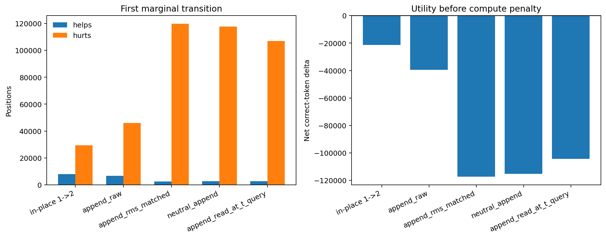

# Paper Two DC0 Depth-by-Append Result Handoff

**Date:** 2026-07-29  
**Experiment:** DC0, forward-only transient depth-by-append diagnostic  
**Status:** Complete; diagnostic requires strategy review  
**Training:** None  
**Evaluation set:** EVAL-B, now spent  
**Landing commit:** `4677a6cdad62ce3633d36ce67c1c834120c22910`

## 0. Executive conclusion

DC0 did not satisfy the pre-stated strong reading that an untrained transient
append would be gentler than one additional in-place recurrent loop. At the
first marginal transition, the registered in-place path produced `7,991`
helps and `29,399` hurts, while raw depth-by-append produced `6,617` helps and
`46,098` hurts. Net teacher agreement changed by `-21,408` for in-place and
`-39,481` for raw append.

The result is not an inertness null. The fed hidden state mattered greatly.
The neutral append produced only `2,633` helps and `117,785` hurts, so raw
feedback prevented `71,687` harms and added `3,984` helps relative to the
neutral control. Raw feedback was also much better than RMS-matched feedback
and the read-at-t query arm. The raw state therefore carries useful predictive
information through the append interface, but the untrained interface is not
usable as a generally safe computation step.

There is also a qualified matched-compute result. One append slot costs 24
full-stack layer applications, equal in the registered accounting to two
additional in-place loops. Against that comparator, raw append was less
destructive:

- raw append `k=1` versus registered `k=0`: net `-39,481`;
- in-place depth 3 versus depth 1: net `-52,267`.

Raw append reduced the matched-compute net loss by `12,786` positions, or
about `24.5%`, while retaining fewer helps. Both interventions remained
strongly harmful. This is evidence of a partial geometric advantage at matched
layer applications, not evidence of a successful composite mechanism.

The recommended strategy reading is:

> **Signal-bearing but unsafe interface.** Raw horizontal feedback preserved
> substantially more information than neutral or RMS-matched append and was
> less destructive than matched-layer in-place depth, but it failed the
> intended gentleness comparison against the first additional in-place loop.
> No trained bridge or composite policy is authorized by this result alone.

## 1. Purpose and rationale

The D0 causal-allocation audit showed that additional in-place recurrence has
real but sparse value and a large harm asymmetry. DC0 asked whether extra
computation could be moved from destructive in-place recurrence into transient
horizontal positions inspired by Coconut-style latent feedback.

At each source position `t`, the modified path appended up to three transient
slots. Each feedback slot received the preceding final post-norm hidden state
through an identity horizontal bridge. The transient slots were evicted before
processing the next real token. The visible source sequence and later real
position IDs therefore remained unchanged.

The experiment was deliberately forward-only. It did not ask whether a trained
composite could learn the interface. It asked whether the untrained geometry
was already less destructive than applying more recurrence in place.

## 2. Frozen design

### 2.1 Substrate

- Post-D0 EMA checkpoint SHA-256:
  `8245cabfe7639dcd442c19e03496623b9d59eec31b39e253e08fd6f78b1086cf`
- Horizontal bridge: exact identity, no parameter updates.
- Device path: CUDA, bfloat16, SDPA.
- Model mutation: prohibited and verified absent.
- Optimizer and backward passes: none.

### 2.2 EVAL-B

EVAL-B was generated specifically for DC0 and was document-disjoint from all
prior D0 material.

| Property | Value |
|---|---:|
| Rows | 475 |
| Source documents | 177 |
| Evaluated positions | 199,525 |
| Source tokens | 200,000 |
| Code/general mix | 50% / 50% |
| Prior-document overlap | 0 of 177 |
| Seed | 20260728 |
| JSONL SHA-256 | `1490cc40c025b01ef74876d7ba8d90790d6b874be059382a54339c51d740f3cc` |

The cached teacher was `Qwen/Qwen2.5-7B-Instruct` at revision
`a09a35458c702b33eeacc393d103063234e8bc28`. Its loop-1 acceptance rate on
EVAL-B was `147,550/199,525 = 73.951%`. EVAL-B has now received its one
interpretive scoring pass and is marked `spent_dc0_complete`. It must not be
used for fitting, threshold selection, or interface tuning.

### 2.3 Arms

All arms used identical positions and cached teacher targets.

1. **In-place vertical:** forced recurrent depths 1 through 4.
2. **Raw append:** `k=0..3`, identity bridge, unscaled final hidden feedback.
3. **RMS-matched append:** same append grid, with feedback rescaled to the
   embedding-row RMS.
4. **Neutral append:** same append grid, but the transient slot carried only
   the unmodified `<|recur_readout|>` embedding.
5. **Read-at-t query:** raw feedback followed by a transient query carrying the
   original token embedding and rotary position. This is not literal backward
   attention from an earlier cached query.

### 2.4 Metrics

For every adjacent depth transition:

- `helps`: teacher-mismatched before, teacher-matched after;
- `hurts`: teacher-matched before, teacher-mismatched after;
- `neutral`: all other positions;
- net utility before compute penalty: `helps - hurts`.

The analysis also reported code/general strata, teacher-rank strata, teacher
entropy quartiles, drafter-log-probability quartiles, exact execution counters,
and a matched-layer-application comparison.

These were diagnostic interpretation bands, not pass/fail gates.

## 3. Preconditions and mechanical validity

All registered preconditions were green.

| Contract | Result |
|---|---:|
| Banked RG-1 composite-off identity | Pass, max logit difference 0 |
| Banked RG-2 identity bridge | Pass, max logit difference 0 |
| Registered `k=0` full-sequence identity | Pass, max difference 0 |
| Append-evict later-real-token difference | 0 |
| Later position IDs equal source sequence | Pass |
| Cache length equals real tokens after eviction | Pass |
| Horizontal bridge remained exact identity | Pass |
| Checkpoint fingerprint unchanged | Pass |

The RMS diagnostic found:

- embedding-row RMS: `0.015064`;
- fed final-hidden RMS: `10.062604`;
- fed-hidden/embedding RMS ratio: `667.997`.

This scale difference was large, but RMS matching did not repair the interface.
Instead, RMS-matched append behaved similarly to the highly destructive
neutral control. Scale mismatch alone therefore does not explain the raw arm's
behavior. One plausible reading is that the large raw state magnitude is part
of how its information survives the unfamiliar slot interface; this is a
hypothesis, not a demonstrated mechanism.

### 3.1 Pipeline-validity replication

The fresh in-place depth `1 -> 2` transition reproduced the banked post-D0 harm
asymmetry.

| Cohort | Helps | Hurts | Harm/help | Row-cluster bootstrap 95% CI |
|---|---:|---:|---:|---:|
| Banked audit | 8,564 | 30,008 | 3.504 | [3.319, 3.692] |
| Fresh EVAL-B | 7,991 | 29,399 | 3.679 | [3.484, 3.883] |

The intervals overlap, hurts exceeded helps, and the receipt marked baseline
validity green. The scope is an out-of-sample replication on the same post-D0
checkpoint, not a cross-checkpoint generalization claim.

## 4. Primary results

### 4.1 Complete pooled transition table

| Arm | Transition | Before correct | After correct | Helps | Hurts | Net | Harm/help | After accuracy |
|---|---|---:|---:|---:|---:|---:|---:|---:|
| In-place | 1 -> 2 | 147,550 | 126,142 | 7,991 | 29,399 | -21,408 | 3.679 | 63.221% |
| In-place | 2 -> 3 | 126,142 | 95,283 | 2,634 | 33,493 | -30,859 | 12.716 | 47.755% |
| In-place | 3 -> 4 | 95,283 | 70,692 | 1,567 | 26,158 | -24,591 | 16.693 | 35.430% |
| Raw append | 0 -> 1 | 147,550 | 108,069 | 6,617 | 46,098 | -39,481 | 6.967 | 54.163% |
| Raw append | 1 -> 2 | 108,069 | 55,359 | 919 | 53,629 | -52,710 | 58.356 | 27.745% |
| Raw append | 2 -> 3 | 55,359 | 20,308 | 360 | 35,411 | -35,051 | 98.364 | 10.178% |
| RMS-matched append | 0 -> 1 | 147,550 | 30,161 | 2,458 | 119,847 | -117,389 | 48.758 | 15.116% |
| RMS-matched append | 1 -> 2 | 30,161 | 20,016 | 6,901 | 17,046 | -10,145 | 2.470 | 10.032% |
| RMS-matched append | 2 -> 3 | 20,016 | 17,967 | 6,583 | 8,632 | -2,049 | 1.311 | 9.005% |
| Neutral append | 0 -> 1 | 147,550 | 32,398 | 2,633 | 117,785 | -115,152 | 44.734 | 16.238% |
| Neutral append | 1 -> 2 | 32,398 | 6,134 | 927 | 27,191 | -26,264 | 29.332 | 3.074% |
| Neutral append | 2 -> 3 | 6,134 | 1,621 | 721 | 5,234 | -4,513 | 7.259 | 0.812% |
| Read-at-t query | 0 -> 1 | 147,550 | 43,278 | 2,729 | 107,001 | -104,272 | 39.209 | 21.691% |
| Read-at-t query | 1 -> 2 | 43,278 | 36,750 | 6,155 | 12,683 | -6,528 | 2.061 | 18.419% |
| Read-at-t query | 2 -> 3 | 36,750 | 35,443 | 3,646 | 4,953 | -1,307 | 1.358 | 17.764% |

Later transitions in arms that collapsed at the first step must not be read as
evidence of safety merely because their marginal net losses became smaller.
Their recoverable correct sets had already contracted sharply.

### 4.2 First-transition comparison

| Arm | Helps | Hurts | Net | Difference from neutral net |
|---|---:|---:|---:|---:|
| In-place 1 -> 2 | 7,991 | 29,399 | -21,408 | +93,744 |
| Raw append | 6,617 | 46,098 | -39,481 | +75,671 |
| RMS-matched append | 2,458 | 119,847 | -117,389 | -2,237 |
| Neutral append | 2,633 | 117,785 | -115,152 | 0 |
| Read-at-t query | 2,729 | 107,001 | -104,272 | +10,880 |

The raw hidden state is not ignored. Relative to neutral append, raw feedback:

- added `3,984` helps;
- prevented `71,687` hurts;
- improved net teacher agreement by `75,671` positions.

That separation is too large to describe the raw interface as inert. It also
shows why the neutral control was load-bearing: without it, the conclusion
would have been only that raw append was harmful, not that it carried substantial
signal while remaining harmful overall.

### 4.3 Code/general heterogeneity

The raw append result differed sharply by source stratum.

| Arm | Stratum | Helps | Hurts | Net | After accuracy |
|---|---|---:|---:|---:|---:|
| In-place 1 -> 2 | Code | 2,981 | 16,092 | -13,111 | 68.41% |
| Raw append | Code | 2,568 | 16,326 | -13,758 | 67.76% |
| In-place 1 -> 2 | General | 5,010 | 13,307 | -8,297 | 58.03% |
| Raw append | General | 4,049 | 29,772 | -25,723 | 40.57% |

On code, raw append was close to the one-extra-loop in-place result: only `647`
additional net losses and `0.65` percentage points lower after accuracy. On
general text, it was substantially worse: `17,426` additional net losses and
`17.46` points lower after accuracy. This heterogeneity is descriptive and was
not a registered subgroup gate. It suggests that interface compatibility may
depend on representation structure or source distribution, but it does not
identify the cause.

### 4.4 Matched layer applications

The registered compute accounting was:

- one additional in-place loop: 12 recurrent-layer applications per position;
- one append slot: 24 full-stack layer applications plus excluded attention
  overhead;
- therefore append `k=1` matches in-place depth 3 versus depth 1, not depth 2.

| Comparator | Helps | Hurts | Net | Harm/help |
|---|---:|---:|---:|---:|
| Raw append `k=1` vs registered `k=0` | 6,617 | 46,098 | -39,481 | 6.967 |
| In-place depth 3 vs depth 1 | 7,533 | 59,800 | -52,267 | 7.938 |

At matched registered layer applications, raw append had:

- `13,702` fewer hurts, a `22.9%` reduction;
- `916` fewer helps, a `12.2%` reduction;
- `12,786` less-negative net utility, a `24.5%` reduction in net loss.

This comparison excludes attention overhead and is not a wall-clock or FLOP
parity result. It supports only a bounded statement: raw append was less
destructive than matched-layer in-place depth, while remaining harmful in
absolute terms.

## 5. Execution-path audit and late-run recovery

The original scoring run completed and cached the expensive raw-append arm,
then stopped because the incremental-cache grid's internal `k=0` predictions
did not exactly match registered full-sequence depth 1 over the complete set.
The one-row startup probe had shown zero argmax disagreements despite a maximum
logit difference of `0.234375`; it was not representative of all 199,525
positions.

The repaired evaluator did not suppress this discrepancy. It:

1. used registered full-sequence depth 1 as the primary `k=0` anchor;
2. retained the incremental-cache `k=0` predictions privately;
3. reported cached-path and registered-anchor transition tables separately;
4. resumed the saved raw batches rather than recomputing them;
5. retained neutral append as the shared-path control.

Across EVAL-B, cached incremental `k=0` differed from registered depth 1 on
`2,910/199,525 = 1.458%` of positions. The primary conclusions were insensitive
to the anchor choice:

| Arm | Cached-anchor net | Registered-anchor net | Difference |
|---|---:|---:|---:|
| Raw append | -39,397 | -39,481 | -84 |
| RMS-matched append | -117,305 | -117,389 | -84 |
| Neutral append | -115,068 | -115,152 | -84 |
| Read-at-t query | -104,188 | -104,272 | -84 |

This robustness does not make the two execution paths identical. Primary raw
append versus registered `k=0` includes both the append intervention and the
move to incremental execution. Raw-versus-neutral and raw-versus-RMS contrasts
are cleaner interface comparisons because those arms share the incremental
execution path. Manuscript claims must preserve that distinction.

## 6. Adjudication against the pre-stated readings

### Reading 1: geometry survives strongly

Required pattern: first-transition append hurts below roughly one third of
in-place hurts, helps at or above in-place, and neutral materially less useful.

**Result: not met.** One third of fresh in-place hurts is about `9,800`; raw
append had `46,098` hurts. Raw helps (`6,617`) were also below in-place helps
(`7,991`). Neutral was materially worse, so the fed state mattered, but the
overall strong geometry reading failed.

### Reading 2: append comparable to in-place; inspect RMS

**Result: not met as a pooled first-transition reading.** Raw append was more
destructive than one extra in-place loop. RMS matching did not repair the
result; it worsened it sharply. However, raw append was close to in-place on
the code stratum and better at matched layer applications. The complete result
is therefore more informative than a uniform architecture rejection.

### Reading 3: inert untrained pathway

Required pattern: append helps and hurts both collapse and neutral matches raw.

**Result: rejected.** Neutral did not match raw. Raw feedback was substantially
more informative and less harmful. The untrained pathway is signal-bearing,
not inert.

### Reading 4: degenerate recoverable set

**Result: not the primary explanation at the first transition.** Thousands of
helps were available in every arm, although the helps were overwhelmed by
hurts. Later-step interpretations are constrained by the sharply contracted
correct sets.

## 7. Scientific interpretation

### 7.1 What is supported

1. **The fresh post-D0 harm asymmetry replicated.** Additional in-place depth
   remained destructive on average on a document-disjoint evaluation set.
2. **Raw horizontal feedback carried real information.** It was dramatically
   better than a neutral slot through the same append machinery.
3. **The untrained append interface was not safe.** Raw append caused more
   first-transition harm than one additional in-place loop.
4. **Naive RMS matching was counterproductive.** The RMS-matched arm collapsed
   toward the neutral control rather than improving raw feedback.
5. **Read-at-t querying did not solve the interface.** It improved over neutral
   but remained substantially worse than raw append.
6. **At matched registered layer applications, raw append was partially less
   destructive than in-place recurrence.** The benefit did not produce positive
   net utility.
7. **Behavior was heterogeneous by source type.** Raw append nearly matched
   one-extra-loop in-place behavior on code but failed badly on general text.

### 7.2 Best current mechanistic reading

The result localizes the problem more narrowly than either "geometry works" or
"the model ignores latent feedback." The final hidden state can drive useful
predictions through an appended slot, but the slot/readout interface is outside
the model's trained computation distribution and destroys too many previously
correct predictions. Raw magnitude appears to preserve more of the state signal
than embedding-RMS normalization, but the experiment does not identify whether
the remaining damage comes from representation geometry, position semantics,
readout semantics, attention behavior, or lack of interface training.

The code/general split makes a uniform impossibility claim especially weak.
The same raw append interface was almost as gentle as one extra in-place loop on
code while failing strongly on general text. That pattern is compatible with a
trainable interface, but it does not prove one.

## 8. Limitations and do-not-claim boundaries

- DC0 used one frozen post-D0 checkpoint and one spent evaluation partition.
- The metric is exact agreement with a cached 7B teacher, not ground-truth
  correctness.
- No horizontal bridge, readout, router, or substrate parameter was trained.
- The result does not test end-task reasoning, speculative-decoding speedup,
  generated-answer quality, or natural-task accuracy.
- The matched-layer comparison is not matched FLOPs, attention cost, memory,
  latency, or energy.
- Registered `k=0` and positive-append predictions use different execution
  paths. Their 1.458% baseline prediction disagreement is disclosed. Shared-path
  arm contrasts are cleaner than absolute append-versus-registered contrasts.
- The subgroup results are descriptive and were not separately powered or
  preregistered as gates.
- No causal claim should be made that large hidden-state RMS caused the raw arm
  to outperform RMS matching.
- The experiment does not authorize bridge adaptation, persistent scratchpads,
  RG-12, `L>1`, or composite training.
- EVAL-B is spent and cannot be reused to select among follow-up designs.

## 9. Strategy questions

1. **How should DC0 be banked?** Recommended label:
   `signal_bearing_interface_failed_gentleness_reading`, with the matched-layer
   partial advantage recorded descriptively.
2. **Does the raw-versus-neutral separation justify the previously held bounded
   bridge-adaptation contingency?** If yes, it requires a new preregistration,
   a development partition distinct from EVAL-B, and a second untouched
   evaluation partition.
3. **Should interface diagnosis precede any training?** Candidate cheap work:
   characterize raw/neutral attention maps, logit margins, position sensitivity,
   and code/general differences on non-evaluation development material.
4. **Should the next trained interface preserve raw scale rather than enforce
   embedding RMS?** DC0 argues against naive per-vector RMS matching but does
   not select an alternative normalization.
5. **Is the matched-layer advantage strategically meaningful?** It suggests
   that horizontal placement may reduce damage per registered layer application,
   but the absolute utility remains negative and attention overhead is omitted.
6. **Should code and general text be modeled separately?** The large stratum
   interaction may indicate different interface compatibility, but a split
   policy risks post-hoc specialization unless tested on fresh data.
7. **Does D1 pure-vertical utility training remain the cleaner next positive-
   seeking experiment?** DC0 does not cancel it. It shows that untrained append
   is not an immediate escape from destructive recurrence.

## 10. Recommended next-step options

### Option A: bank DC0 and return to D1

Treat DC0 as a completed forward-only boundary result. Resume the utility-label
vertical program, where the causal-allocation audit already established an
oracle opportunity. This is the lowest-risk route and requires no reinterpretation
of EVAL-B.

### Option B: authorize one bounded interface-adaptation study

Only if strategy judges the raw-versus-neutral and matched-layer differences
worth pursuing:

1. create a fresh development partition and a separately frozen evaluation
   partition;
2. freeze the entire model except the horizontal bridge and, if separately
   authorized, a minimal append readout adapter;
3. preserve raw feedback as the primary initialization;
4. train against a utility-aligned objective that penalizes hurts rather than
   generic teacher disagreement;
5. retain neutral, raw-untrained, and in-place controls;
6. run RG-4 and RG-11 before any training loop, per the standing composite
   contract;
7. pre-register code/general reporting without fitting separate policies unless
   a later design explicitly authorizes it.

This option is scientifically motivated but not authorized by DC0 itself.

### Option C: retire transient append on this substrate

Bank the result as evidence that an untrained transient slot is too far outside
the pretrained interface, and focus on explicit control tokens, persistent
scratchpads, or a new substrate only under future independent authorization.
This is defensible if the program prioritizes stable checkpoints over another
interface-installation cycle.

### Coding-agent recommendation

Bank DC0 now and send the result to strategy review before spending more GPU.
The raw-versus-neutral separation is strong enough that the architecture should
not be declared inert or impossible. It is not strong enough to launch training
without a fresh spec. If the composite lane remains strategically important,
authorize exactly one bounded interface-adaptation study with utility-aligned
labels and fresh partitions; otherwise resume D1.

## 11. Plain-language summary

We tried giving the model extra thinking space by inserting temporary hidden
positions instead of repeatedly rewriting the current position. The hidden
state carried real information: using it was far better than inserting an empty
temporary position. But the model had never been trained to use this pathway,
and the temporary-position interface still broke many more correct predictions
than it fixed. It was somewhat less damaging than spending the same registered
layer count on deeper in-place recurrence, especially on code, but it was not
good enough to use. The experiment says "promising signal through an unsafe
interface," not "horizontal recurrence works" and not "horizontal recurrence
is impossible."

## 12. Canonical artifacts and lineage

### Public repository artifacts

- Machine-readable summary:
  `outputs/stage5/stage5_paper2_dc0_20260728/dc0/summary.json`
- Paste-ready summary:
  `outputs/stage5/stage5_paper2_dc0_20260728/dc0/summary.md`
- Figure PNG:
  `outputs/stage5/stage5_paper2_dc0_20260728/dc0/dc0_first_transition.png`
- Figure SVG:
  `outputs/stage5/stage5_paper2_dc0_20260728/dc0/dc0_first_transition.svg`
- EVAL-B receipt:
  `outputs/stage5/stage5_paper2_dc0_20260728/eval_b/summary.json`
- Landing commit:
  `4677a6cdad62ce3633d36ce67c1c834120c22910`

### Private receipt

- Prediction payload SHA-256:
  `40422fa770f3a12793136b9fb87f9fbe7e309dcacc4c9c64106f5d3c57a92157`
- Drive root:
  `MyDrive/recurrent-qwen-svgd-artifacts/stage5/stage5_paper2_dc0_20260728/private/dc0`

### Governing documents

- `docs/STRATEGY_TO_CODING_AGENT_COMPOSITE_DEPTH_BY_APPEND_20260728.md`
- `docs/STRATEGY_ADDENDUM_COMPOSITE_DEPTH_BY_APPEND_20260728.md`
- `docs/COCONUT_INTEGRATION_DESIGN_20260725.md`

## 13. Requested strategy decision

Please ratify one of the following before further GPU work:

1. bank DC0 and resume D1;
2. bank DC0 and authorize one bounded interface-adaptation preregistration;
3. bank DC0 and retire transient append on this substrate.

No additional use of EVAL-B is permitted under any branch.
