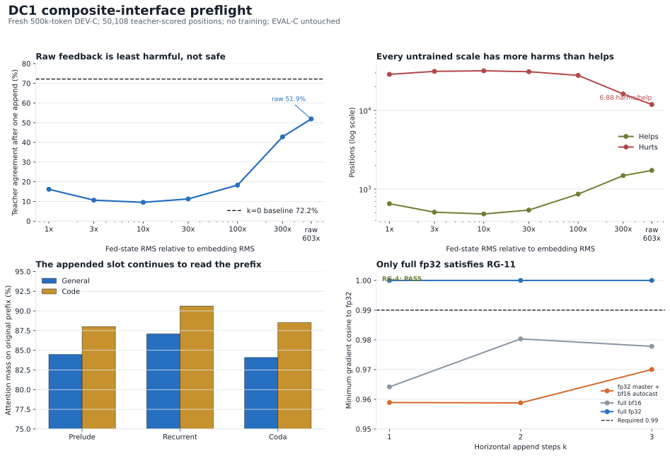

# Paper Two DC1 Composite-Interface Preflight Result Handoff

**Date:** 2026-07-30  
**Run:** `stage5_paper2_dc1_preflight_20260729`  
**Landing commit:** `55cffc373f184a752e885bad2c27eb25681afc0d`  
**Governing design:** `COMPOSITE_TRAINING_DESIGN_20260729.md`, SHA-256 `0ae848f560dda18abc89deb7716b53b24f40b49f5a7d44a6d5f2e514c9d5ed7b`  
**Status:** `complete_ready_for_preregistration_draft`  
**Scope:** forward-only DEV-C diagnostics and RG-4/RG-11 engineering checks; no training; EVAL-C untouched

## 0. Executive decision

The DC1 preflight packet is complete and internally consistent. The two engineering preconditions are green under one specific production policy:

- RG-4 finite-difference stability passed.
- RG-11 passed only with full fp32. Neither tested bfloat16 policy passed.

The preflight therefore permits strategy to draft and lock the bounded Stage A preregistration. It does not itself authorize training. The remaining precondition is the locked preregistration with its Drive SHA-256.

The mechanistic result is mixed but actionable:

1. Every untrained append scale was harmful on fresh DEV-C.
2. Raw feedback was the least harmful tested scale and is the operational initialization candidate.
3. The pre-stated strictly monotone copy-through prediction did not hold. Agreement first fell as scale increased from 1x to 10x, then recovered sharply through raw scale. Copy-through remains a hypothesis, not a confirmed mechanism.
4. Superposing the appended slot at position `t` did not repair the interface. It was slightly worse than the standing `t+1` convention.
5. The appended slot attended strongly to the original prefix in every layer group. The path is context-connected, but attention weights are descriptive rather than causal.

Recommended Stage A lock, subject to strategy approval: bridge-only, identity initialization, raw feedback scale, advancing position IDs, forced `k=1`, global `L=1`, recompute-only execution, full-fp32 training, teacher CE at the slot readout, and one read-once EVAL-C evaluation after the bounded run.

## 1. Purpose and registered context

DC0 established that the untrained horizontal pathway was signal-bearing but unsafe. Raw feedback was substantially less destructive than neutral or RMS-matched append, yet still caused many more harms than helps. DC1-P was authorized to answer four development-only questions before any interface training:

1. Does behavior improve monotonically as fed-state scale moves from embedding RMS to raw hidden-state RMS?
2. Does the appended slot attend to the original context?
3. Does position-ID convention explain the damage?
4. Are harms concentrated in fragile baseline predictions?

In parallel, RG-4 and RG-11 had to establish a graph-correct derivative and a viable precision policy. None of the four diagnostic findings was a gate. RG-4 and RG-11 were preconditions.

The intended next experiment remains Stage A from the governing composite design: train only the horizontal bridge under forced `k=1` and ask whether the append actuator can be made safe before any routing policy is introduced.

## 2. Experimental design

### 2.1 Frozen substrate

- Checkpoint: post-D0 EMA.
- Required SHA-256: `8245cabfe7639dcd442c19e03496623b9d59eec31b39e253e08fd6f78b1086cf`.
- Vertical loops: globally fixed at `L=1`.
- Horizontal cap: asserted `k <= 3`.
- Training: none.
- Optimizer steps: zero.
- EVAL-C: untouched.

### 2.2 DEV-C

DEV-C was frozen before analysis:

| Property | Receipt |
|---|---:|
| Tokens | 500,000 |
| Rows | 1,171 |
| Documents | 432 |
| Mix | 50% general, 50% code |
| Seed | 20260729 |
| Prior documents checked | 1,786 |
| Overlapping documents | 0 |
| DEV-C SHA-256 | `05bca2ee3ba71421296b2e31a0439746eb9c1b0e15e2cea4471be202ab6ac29d` |
| Private manifest SHA-256 | `1816d9e953280cfb335c23de80292b64e36270599c3b4d273474b25f2e476caf` |

The single cached 7B pass produced:

- accepted positions: 363,776;
- rejected positions: 135,053;
- acceptance rate: 72.926%;
- teacher: `Qwen/Qwen2.5-7B-Instruct`, pinned revision `a09a35458c702b33eeacc393d103063234e8bc28`.

The diagnostic probe selected 113 rows containing 50,108 scored positions, just above the registered 50,000-position budget.

### 2.3 Arms

All scale and position arms used the same selected rows and cached teacher targets.

- Scale sweep: embedding-RMS matched, 3x, 10x, 30x, 100x, 300x, and raw hidden-state scale.
- Position ablation: advancing `t+1` versus superposed `t`.
- Attention profile: eager-attention capture, split by general and code, aggregated over prelude, recurrent block, and coda.
- Numerical checks: recompute-only RG-4 epsilon sweep and RG-11 precision comparison at `k=1,2,3`.

The primary `k=0` baseline came from the registered full-sequence one-loop path. Positive-`k` execution used incremental append. Those two paths disagreed on 735 of 50,108 positions, 1.467%. The analysis explicitly anchors `k=0` to the registered path. Shared positive-`k` comparisons remain the cleaner interface contrasts.

## 3. Integrity and receipt audit

The first attempt completed the expensive caches but stopped at an invalid integrity comparison between two separately loaded model instances. Commit `56f1d1042c0a8ca49a18eac8cc541515b4404205` changed the check to compare each instance against its own pre-evaluation fingerprint. The resumed run reused the cached batches and completed.

The final receipt establishes:

| Instance | Before | After | Match |
|---|---|---|---:|
| SDPA | `5b6d9810...530fcc1b` | `5b6d9810...530fcc1b` | Yes |
| Eager attention | `ffd5c73e...6b98c56` | `ffd5c73e...6b98c56` | Yes |

Additional integrity facts:

- checkpoint mutation: false;
- checkpoint written by RG battery: false;
- training performed: false;
- optimizer steps: zero;
- EVAL-C touched: false;
- transient eviction accounting: one eviction and one eviction assertion for every evaluated append position.

Public receipt hashes:

| Receipt | SHA-256 |
|---|---|
| `dev_c/summary.json` | `b5869216fc94cdb817a3a6164e8a5454843ec2f6ea796b91f0115967b338ea60` |
| `dc1_p/summary.json` | `cc7584b514e9522e5783c38ccded32899b4b1decbecff197dd752ce122b5cf88` |
| `rg4_rg11/summary.json` | `bf8886f251418b457ec552022c618ec0d8b5c3f3e01a42bb7e12432f2270f30c` |
| Combined `summary.json` | `c5ad2e6eb891c5aee9a8b66cbac9aa4127b32ba208c916d9a0672d73afc3bef5` |

## 4. Results

### 4.1 Scale interpolation

The embedding RMS was `0.014994`; raw hidden-state RMS was `9.044947`, a ratio of `603.24x`.

| Scale | After accuracy | Helps | Hurts | Net correct delta | Harms/help |
|---|---:|---:|---:|---:|---:|
| Embedding matched, 1x | 16.19% | 651 | 28,701 | -28,050 | 44.09 |
| 3x | 10.64% | 508 | 31,336 | -30,828 | 61.69 |
| 10x | 9.54% | 482 | 31,864 | -31,382 | 66.11 |
| 30x | 11.27% | 540 | 31,053 | -30,513 | 57.51 |
| 100x | 18.29% | 862 | 27,858 | -26,996 | 32.32 |
| 300x | 42.83% | 1,481 | 16,182 | -14,701 | 10.93 |
| Raw, 603.24x | 51.90% | 1,726 | 11,881 | -10,155 | 6.88 |

The registered `k=0` baseline was 72.17%. Raw feedback therefore remained 20.27 points below baseline. Relative to RMS matching, raw feedback improved after-accuracy by 35.71 points, prevented 16,820 harms, added 1,075 helps, and improved net utility by 17,895 positions.

The curve is not monotone over the full scale range. It has a trough near 10x and then improves from 10x through raw. Raw is the best tested endpoint, not a demonstrated global optimum. The pre-stated simple monotone copy-through signature therefore did not pass.

### 4.2 Position-ID ablation

| Position convention | After accuracy | Helps | Hurts | Net | Harms/help |
|---|---:|---:|---:|---:|---:|
| Advance to `t+1` | 51.90% | 1,726 | 11,881 | -10,155 | 6.88 |
| Superpose at `t` | 51.64% | 1,700 | 11,987 | -10,287 | 7.05 |

Superposition was worse by 132 net-correct positions, only 0.263 percentage points. This is a small descriptive difference, but there is no evidence that advancing rotary position IDs caused the principal damage. The standing `t+1` convention should remain the default.

### 4.3 Slot-attention profile

The profile covered all 50,108 selected positions: 25,780 general and 24,328 code.

| Stratum | Prelude prefix mass | Recurrent prefix mass | Coda prefix mass |
|---|---:|---:|---:|
| General | 84.46% | 87.07% | 84.08% |
| Code | 88.01% | 90.62% | 88.51% |

The remaining mass was self-attention at the appended slot. Because this probe used `k=1`, no prior appended slot existed and prior-slot mass was zero by construction.

The result rules out a simple picture in which the appended slot ignores the prompt. It does not show that the slot uses the context correctly, and attention mass alone is not a causal attribution. The implementation aggregated the entire original prefix and did not separately retain mass on source position `t`, despite the original diagnostic request naming that comparison. Recovering that subcomponent would require rerunning the attention batches with one additional summary field. This omission does not affect any precondition or gate.

### 4.4 Fragility proxy

The requested baseline top-two model margin was not saved in DC0 and cannot be reconstructed without reopening spent EVAL-B text. The receipt correctly reports this as unavailable and substitutes the already banked teacher-log-probability quartiles as a labeled proxy.

| Teacher-log-probability quartile | Hurt rate |
|---|---:|
| Q1 | 9.57% |
| Q2 | 47.59% |
| Q3 | 29.26% |
| Q4 | 6.00% |

The non-monotone pattern does not support a simple fragile-low-confidence-only account. Because this is a teacher-side proxy on saved DC0 outputs rather than the requested drafter margin, it should not be used to claim that confidence fails to predict harm.

### 4.5 RG-4 finite-difference stability

RG-4 passed its registered adjacent-epsilon rule. The analytic directional derivative was `-0.0110439`.

- Epsilon 0.1 and 0.03 both passed and formed the required adjacent pair.
- Epsilon 0.01 and 0.003 also passed individually.
- Epsilon 0.001 and smaller became cancellation-dominated and failed the original relative criterion; one sign flipped at 0.0003.

This is the expected reason for the epsilon-stability procedure: the derivative is supported over a stable finite-difference range without treating arbitrarily small fp32 perturbations as a stronger test.

### 4.6 RG-11 precision policy

The criterion required every example to reach gradient cosine at least 0.99 relative to full fp32 at `k=1,2,3`.

| Policy | Passing examples | Minimum cosine | Verdict |
|---|---:|---:|---|
| fp32 master plus bfloat16 autocast | 1/12 | 0.9588 | Fail |
| full bfloat16 | 0/12 | 0.9642 | Fail |
| full fp32 | 12/12 | 0.9999998 | Pass |

The declared Stage A precision policy must therefore be full fp32. This is an engineering finding about feedback-gradient fidelity, not a claim that bfloat16 generally fails for Qwen training.

## 5. Interpretation against the governing design

### 5.1 What is supported

1. **The horizontal pathway remains signal-bearing on fresh data.** Scale changes alter tens of thousands of outcomes, and raw feedback is far superior to normalized feedback.
2. **Naive RMS matching is again rejected as the interface fix.** The fresh DEV-C result reproduces the ordering from DC0.
3. **Raw scale is the operational Stage A initialization.** It is the best tested scale and the natural identity-bridge endpoint.
4. **Position-ID convention is not the main failure.** Superposition does not rescue the path.
5. **The appended slot remains context-connected.** It assigns 84% to 91% of attention mass to the original prefix.
6. **A graph-correct training policy exists.** Recompute plus full fp32 clears RG-4 and RG-11.

### 5.2 What is not supported

1. The strict monotone copy-through signature was not observed.
2. No untrained append scale was safe or useful in absolute terms.
3. Raw scale was not shown to be globally optimal beyond the tested natural endpoint.
4. Attention profiles do not establish causal use or correct arbitration.
5. The requested drafter-margin fragility analysis was not completed.
6. No controller, dynamic `k`, persistent scratchpad, Stage B capability, or Stage D hybrid claim was tested.

### 5.3 Why Stage A remains justified

Stage A was designed for exactly this result class: a transmitting but unsafe interface. The experiment asks whether a bounded bridge-only adaptation can learn arbitration and fallback under forced append. Preflight harm is therefore the baseline to improve, not a reason to skip the registered adaptation. The important restriction is that success must be measured on untouched EVAL-C, once, against same-partition untrained append and in-place-depth anchors.

## 6. Queue reconciliation

Two items listed as outstanding in the July 29 strategy documents had already landed in the Rung 0 receipt:

- `outputs/stage5/stage5_paper2_d0_expert_choice_rung0_20260728/summary.json`
- Rung 0 verdict: `all_local_budgets_negative`.
- Pre-D0 floor transition `1 -> 2`: 7,419 helps, 599 hurts, net `+6,820`, harm/help `0.0807` over 53,389 positions.
- Post-D0 reference: 8,564 helps, 30,008 hurts, net `-21,444`, harm/help `3.504`.

The pre-D0 decomposition materially scopes the story: the severe harm asymmetry did not exist on the pre-D0 floor. It emerged on the post-D0 substrate. It is therefore not support for an architecture-wide claim that additional recurrent depth is intrinsically destructive. DC1 deliberately uses the post-D0 checkpoint and asks whether the horizontal interface can be domesticated on that installed substrate.

The status language in `COMPOSITE_TRAINING_DESIGN_20260729.md` and `STRATEGY_ADDENDUM_DC1_ROADMAP_20260729.md` that still calls these two receipts outstanding is stale and should be corrected during preregistration reconciliation.

## 7. Decisions requested from strategy

1. **Authorize the Stage A preregistration draft now?** Recommendation: yes. DC1-P is banked, RG-4 is green, and RG-11 supplies a valid full-fp32 policy.
2. **Lock raw scale despite the failed monotonic signature?** Recommendation: yes, as an operational initialization only. Remove any sentence that treats the simple copy-through mechanism as confirmed.
3. **Lock advancing position IDs?** Recommendation: yes. Superposition offered no repair and was slightly worse.
4. **Require the missing source-position attention split before lock?** Recommendation: no. It is descriptive, non-gating, and would require rerunning eager-attention batches. Record the limitation instead.
5. **Lock Stage A to bridge-only?** Recommendation: yes, matching the governing design. A readout adapter belongs only in a separately justified amendment after a bridge-only result.
6. **Define `material improvement` numerically before lock.** The qualification band is already explicit. The partial-domestication and no-improvement branches need a practical paired margin or confidence procedure so the verdict cannot be narrated after EVAL-C is read.
7. **Lock checkpoint selection before training.** Name the final-step primary and any fixed intermediate receipts in advance. DEV-C may guide only the procedure named before launch; EVAL-C remains read once.
8. **Confirm A100-class full-fp32 execution.** Full fp32 is required by RG-11. Record batch size, accumulation, and memory policy in the preregistration rather than silently falling back to autocast.

## 8. Proposed next steps

1. Reconcile the two stale outstanding-item status lines against the landed Rung 0 receipt.
2. Draft the Stage A preregistration and machine-readable JSON.
3. Lock raw scale, advancing positions, recompute-only execution, full fp32, bridge-only trainable set, forced `k=1`, `L=1`, and the post-D0 EMA checkpoint hash.
4. Lock the training budget, seed, learning rate, final-step primary, intermediate receipt cadence, and numerical partial/no-improvement margins.
5. Assert at launch and every backward:
   - horizontal bridge is the only trainable module;
   - all frozen parameters have no gradient or exact zero gradient;
   - `k=0` remains bit-identical before and after training;
   - `k <= 3`, with Stage A fixed at `k=1`;
   - full fp32 is active at the feedback boundary and optimizer;
   - checkpoint SHA matches `8245cabf...86cf`.
6. Train on DEV-C only, bounded by the locked ceiling.
7. Run the single registered EVAL-C pass and bank the three-way verdict:
   - actuator qualifies;
   - partial domestication;
   - no material improvement and transient append retires.
8. Open Stage B only after a qualifying Stage A result and a separate locked preregistration.

## 9. Plain-language summary

The extra latent slot is not disconnected. It reads the prompt, and the state fed into it strongly changes what the model predicts. But without training, it changes too many answers in the wrong direction. Keeping the state at its natural hidden-state scale is much better than shrinking it to token-embedding scale, although even the natural scale remains harmful overall. Changing the slot's position number does not solve the problem.

The engineering checks found a reliable way to train the interface: use the full recompute graph and full fp32. The next bounded question is therefore well posed. Train only the small horizontal bridge and ask whether it can make one forced latent step safe on new, untouched text. Do not train a router until that actuator has qualified.

## 10. Canonical artifacts

| Artifact | Path |
|---|---|
| Combined packet | `outputs/stage5/stage5_paper2_dc1_preflight_20260729/summary.json` |
| DEV-C receipt | `outputs/stage5/stage5_paper2_dc1_preflight_20260729/dev_c/summary.json` |
| DC1-P receipt | `outputs/stage5/stage5_paper2_dc1_preflight_20260729/dc1_p/summary.json` |
| RG-4/RG-11 receipt | `outputs/stage5/stage5_paper2_dc1_preflight_20260729/rg4_rg11/summary.json` |
| Result figure | `docs/figures/paper2_dc1_preflight_handoff_20260730.svg` |
| Figure builder | `analysis/build_paper2_dc1_preflight_handoff_figure.py` |
| Governing design | `docs/COMPOSITE_TRAINING_DESIGN_20260729.md` |
| Roadmap addendum | `docs/STRATEGY_ADDENDUM_DC1_ROADMAP_20260729.md` |
| DC0 result handoff | `docs/PAPER2_DC0_DEPTH_BY_APPEND_RESULT_HANDOFF_20260729.md` |
| Rung 0 and pre-D0 receipt | `outputs/stage5/stage5_paper2_d0_expert_choice_rung0_20260728/summary.json` |

## 11. Do-not-claim list

- Do not say DC1-P trained or improved the model.
- Do not say append is safe, useful, or accuracy-positive.
- Do not say the copy-through hypothesis was confirmed; its strict monotonic prediction failed.
- Do not say raw scale is globally optimal.
- Do not treat attention mass as causal attribution.
- Do not claim source-position-specific attention was measured.
- Do not treat teacher log probability as the requested drafter top-two margin.
- Do not generalize the post-D0 harm asymmetry to the untrained architecture or all recurrent checkpoints.
- Do not authorize Stage B, Stage C, Stage D, RG-12, policy training, persistent scratchpad, GRAM, or width work from this packet.
- Do not touch EVAL-C before the locked Stage A evaluation.
