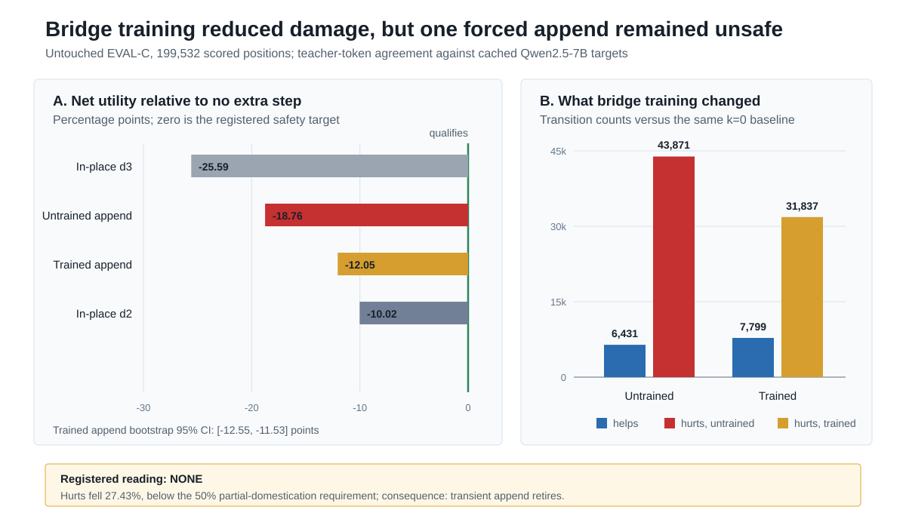

# Handoff: DC1 Stage A Bridge-Only Interface Adaptation Result

- **Date:** 2026-07-31
- **Run:** `stage5_paper2_dc1_stage_a_20260730`
- **Registered verdict:** `none`
- **Registered consequence:** `transient_append_retires`

## 0. Executive conclusion

Stage A produced a clean registered negative. Training only the horizontal
bridge made one forced transient append step materially less destructive, but
did not make it safe and did not reach the preregistered partial-domestication
band.

On the untouched EVAL-C partition, the trained append arm had normalized net
utility

`u = (helps - hurts) / scored positions = -24,038 / 199,532 = -0.12047`,

with a row-cluster bootstrap 95% interval of `[-0.12553, -0.11531]`. The
qualification target was a nonnegative point estimate with interval lower
bound at least `-0.0025`. This result is far from that boundary.

Relative to the same-partition untrained append anchor, training:

- increased helps from `6,431` to `7,799` (`+21.27%`);
- reduced hurts from `43,871` to `31,837` (`-27.43%`);
- improved net utility by `13,402` positions, or `6.72` percentage points; and
- raised teacher-agreement accuracy from `55.46%` to `62.17%`.

Those are real learning effects. They do not satisfy the registered partial
band, which required at least a 50% reduction in hurts while preserving or
increasing helps. The final hurts ratio was `0.7257`, not at most `0.5`.
Therefore the locked consequence applies: retire the transient-append line on
this substrate. Stage B does not open.

## 1. Question and rationale

DC0 and DC1-P had established that a COCONUT-style transient latent append was
signal-bearing but unsafe. Raw hidden-state feedback was much less destructive
than neutral or RMS-matched append, and the appended slot attended to the
prompt, but every untrained append arm remained net harmful. Stage A asked the
smallest remaining causal question:

> Can a bounded bridge-only training run make one forced scratchpad step safe?

The experiment intentionally did not test routing, dynamic horizontal depth,
reasoning quality, acceleration, persistent scratchpads, multiple appended
steps, or a wider trainable set. A pass would only have qualified the actuator
and authorized drafting Stage B.

## 2. Locked experimental design

### 2.1 Substrate and lineage

- Initialization: post-D0 EMA step-4,000 checkpoint.
- Initialization SHA-256:
  `8245cabfe7639dcd442c19e03496623b9d59eec31b39e253e08fd6f78b1086cf`.
- Teacher: `Qwen/Qwen2.5-7B-Instruct`, revision
  `a09a35458c702b33eeacc393d103063234e8bc28`.
- Training partition: DEV-C, hash
  `05bca2ee3ba71421296b2e31a0439746eb9c1b0e15e2cea4471be202ab6ac29d`.
- Evaluation partition: EVAL-C, frozen before training and read once only for
  the registered final evaluation.

### 2.2 Architecture and trainable set

The horizontal bridge was an identity-plus-delta map,
`h_out = h + DeltaW h`, with `DeltaW` initialized exactly to zero. The only
trainable tensor was:

`horizontal_bridge.delta.weight`

This was `802,816` trainable parameters. Every other model parameter was
frozen and protected by before/after hash assertions.

Mechanics were fixed at forced `k=1`, global vertical depth `L=1`, advancing
position IDs, recompute-only execution, and transient eviction. The global
horizontal cap remained asserted at `k <= 3`.

### 2.3 Objective and sampling

Each optimizer step sampled one DEV-C row uniformly and then one valid token
position uniformly from that row. The prefix was followed by one latent slot
and a terminal token. Cross-entropy was applied only at the appended-slot
readout against the cached 7B greedy token for the sampled position.

This is teacher-token agreement supervision at one sampled position per step.
It is not sequence-level reasoning supervision or end-task correctness
training.

### 2.4 Optimization

| Item | Locked value |
|---|---:|
| Optimizer | AdamW |
| Steps | 2,000 |
| Effective batch | 1 row / 1 sampled position |
| Maximum sequence length | 512 |
| Learning rate | `1e-4` |
| Weight decay | `0.0` |
| Global gradient clip | `0.5` |
| Precision | full fp32 |
| Seed | 0 |
| Passive checkpoints | 500, 1,000, 1,500, 2,000 |
| Primary | final-step raw weights |
| Early stopping | none |

### 2.5 Single registered EVAL-C pass

EVAL-C contained `200,000` source tokens from `164` documents, with a 50/50
code/general mix and zero document overlap with the prior `2,218` documents.
The final scorer evaluated `199,532` valid prediction positions clustered in
`468` source rows.

All five arms were computed from one immutable scoring cache:

1. registered full-sequence `k=0` baseline;
2. trained append, forced `k=1`;
3. untrained identity append, forced `k=1`;
4. in-place forced depth 2, descriptive only; and
5. in-place forced depth 3, descriptive only.

The row-cluster bootstrap used 10,000 replicates, seed `20260730`, and a 95%
percentile interval. The EVAL-C data, manifest, teacher cache, immutable scoring
cache, and verdict script were all hash-asserted.

## 3. Integrity and completion

The run completed exactly as registered.

| Check | Receipt |
|---|---|
| Training endpoint | 2,000 / 2,000 steps |
| Primary checkpoint SHA-256 | `5f2f2d89d26642e16c0e4640ea01fa79a408c25bdf71794e6235948ed96ce0cb` |
| Exact trainable allowlist | one tensor, `horizontal_bridge.delta.weight` |
| Frozen parameter hash | identical before and after |
| `k=0` bit identity | passed, maximum absolute difference `0.0` |
| EVAL-C touched during training | false |
| Training during evaluation | false |
| Optimizer steps during evaluation | 0 |
| Arm-specific rescoring | false |
| Read-once scoring spent | true |
| Immutable scoring-cache SHA-256 | `bd40c743b1f9ec28c44a9f4d49c483e888bcb2b66de746c2277ffc9583f56502` |

Only one cached-`k=0` versus registered-`k=0` prediction disagreement was
observed for each append arm. Execution-path anchoring is therefore not a
material explanation for the result.

## 4. Training behavior

The bridge was not inert. Its delta-weight RMS grew from approximately
`0.00010` after step 1 to `0.00441` at step 2,000. The final 100-step mean
cross-entropy was `1.8363`.

The one-position objective was intrinsically noisy. Recorded 25-step rolling
means were `2.353`, `1.439`, `1.471`, and `1.987` at steps 500, 1,000, 1,500,
and 2,000. Among the 81 logged gradient snapshots, 67 (`82.7%`) had a pre-clip
norm above `0.5`. These sparse diagnostics indicate sustained, often clipped
updates and no monotone loss convergence. They do not establish that a longer
run would pass, and the registered `none` outcome does not authorize a duration
extension.

Training itself took `341.1` seconds (`5.69` minutes) on the recorded A100
session. Passive checkpoint availability does not license post-hoc checkpoint
selection; final-step raw weights were the locked primary.

## 5. Primary results

All accuracies below mean agreement with the cached 7B greedy token at the
scored position, not independent semantic correctness.

| Arm | Agreement | Helps | Hurts | Net | Normalized utility |
|---|---:|---:|---:|---:|---:|
| Registered `k=0` | `148,091 / 199,532 = 74.22%` | - | - | `0` | `0.00%` |
| Trained append `k=1` | `124,053 / 199,532 = 62.17%` | 7,799 | 31,837 | -24,038 | `-12.05%` |
| Untrained append `k=1` | `110,651 / 199,532 = 55.46%` | 6,431 | 43,871 | -37,440 | `-18.76%` |
| In-place depth 2 | `128,101 / 199,532 = 64.20%` | 7,936 | 27,926 | -19,990 | `-10.02%` |
| In-place depth 3 | `97,027 / 199,532 = 48.63%` | 7,726 | 58,790 | -51,064 | `-25.59%` |

### 5.1 What training changed

The trained bridge improved net utility by `13,402` positions against the
untrained append anchor. Of that improvement:

- `12,034` positions (`89.8%`) came from prevented harms; and
- `1,368` positions (`10.2%`) came from additional helps.

The harm/help ratio improved from `6.82` to `4.08`, but remained strongly on
the harmful side. The learned bridge primarily suppressed damage; it did not
turn the appended step into a net-positive operation.

### 5.2 Code/general strata

| Stratum | `k=0` agreement | Untrained append utility | Trained append utility | Training gain |
|---|---:|---:|---:|---:|
| Code | `81.61%` | `-12.90%` | `-8.28%` | `+4.62` points |
| General | `66.82%` | `-24.63%` | `-15.81%` | `+8.81` points |

Training improved both strata and produced no sign reversal. General text
gained more from training but remained much more vulnerable in absolute terms.
Pooled trained append was slightly worse than in-place depth 2 (`-12.05%`
versus `-10.02%`). The ordering reversed on code but not on general text, so
the descriptive anchors do not supply a hidden qualification result.

## 6. Registered gate adjudication

| Reading | Locked requirement | Observed | Verdict |
|---|---|---:|---|
| Qualifies, point estimate | `u >= 0` | `-0.12047` | Fail |
| Qualifies, confidence floor | bootstrap lower bound `>= -0.0025` | `-0.12553` | Fail |
| Partial, hurts | trained/untrained hurts ratio `<= 0.5` | `0.72570` | Fail |
| Partial, helps | trained/untrained helps ratio `>= 1.0` | `1.21272` | Pass |
| Partial, negative utility | `u < 0` | true | Pass |
| No material improvement | hurts reduction `< 0.5` | `0.27430` | **Met** |

The trained arm still incurred `9,901.5` more hurts than the 50%-reduction
ceiling. This is not a threshold-noise case: the confidence interval is tight,
fully negative, and about 11.3 percentage points below the permitted
qualification lower-bound floor at its nearest edge.

**Registered verdict:** `none`.

**Registered consequence:** `transient_append_retires`.

## 7. Scientific interpretation

### 7.1 Supported

1. **The horizontal bridge is trainable and behaviorally consequential.** A
   single frozen-substrate linear delta changed 13,402 net position outcomes
   relative to identity initialization.
2. **Bridge-only adaptation can reduce append damage.** Harms fell 27.43% and
   helps increased 21.27% on untouched data.
3. **Damage suppression is insufficient for actuator safety.** Even after
   training, forced append changed far more correct teacher matches into
   mismatches than the reverse.
4. **The negative is attributable to the tested interface.** The base model was
   hash-identical before and after, `k=0` was bit-identical, and evaluation made
   no updates.
5. **The problem is not confined to one text stratum.** Both code and general
   remain net harmful, although their magnitude differs.

### 7.2 Best current mechanistic reading

The untrained feedback state carries predictive information, and a global
linear bridge can learn to attenuate some of its destructive effects. What it
did not learn is sufficiently selective arbitration: when to preserve the
existing token prediction and when to let the latent state redirect it.

That reading is consistent with three observations: most improvement came from
preventing harms, the final arm still had 4.08 harms per help, and the residual
damage differed substantially across code and general text. A single global
`I + DeltaW` map has no explicit content-dependent gate. This is a plausible
capacity or interface mismatch, not a demonstrated causal mechanism.

The noisy one-position loss, batch size one, frequent clipping in logged
snapshots, and 2,000-step ceiling leave optimization alternatives imaginable.
They do not weaken the registered conclusion. The preregistration explicitly
reserved one rescue round only for a partial-domestication result, and this run
did not enter that band.

### 7.3 Relation to the preceding composite evidence

- **DC0:** raw transient feedback was signal-bearing but strongly unsafe.
- **DC1-P:** raw scale was the least harmful tested initialization; RG-4 and
  RG-11 established graph-correct gradients and required full fp32.
- **Stage A:** the bridge learned and reduced damage, but did not make one
  forced append safe.
- **Parity ledger:** fixed in-place depth 2 was also net harmful on exact DEV-C
  pre- and post-D0 comparisons. EVAL-C repeats that descriptive direction.

Together, these results close the cheap composite alternatives: neither a free
fixed-depth in-place step nor a bridge-only transient append is a safe generic
actuator on this checkpoint lineage.

The contrast with T1-lite is strategically useful but should remain scoped.
T1-lite-R replicated exact causal loop execution while narrowly missing its
preservation gate. Stage A instead failed to make the latent-state append
non-destructive. This supports an interface-level distinction between explicit
decision control and implicit state injection; it does not prove that all
explicit token interfaces succeed or all latent-state interfaces fail.

## 8. Limitations and do-not-claim boundaries

- One training seed, one checkpoint lineage, one 7B teacher, one data mixture,
  one forced appended step, and one bridge architecture were tested.
- Teacher agreement is not semantic correctness. A teacher token can be wrong,
  and this experiment does not measure downstream task accuracy.
- The result does not test a wider nonlinear bridge, a content-dependent gate,
  multiple horizontal steps, persistent memory, joint substrate adaptation, or
  a different training objective.
- Passive checkpoints were not registered primaries and must not be mined for
  a better EVAL-C result.
- EVAL-C read-once scoring is spent. Do not rerun, re-threshold, or conduct
  arm-specific rescoring on it.
- Do not say the bridge learned nothing. It materially improved the append arm.
- Do not say transient append is universally impossible. The supported scope is
  bridge-only forced `k=1`, 2,000 steps, this frozen post-D0 substrate and
  teacher-agreement objective.
- Do not call Stage A partial domestication or a near miss.
- Do not open Stage B, C, or D from this result.

## 9. Required record updates

1. Mark DC1 Stage A `complete`, registered verdict `none`, in the project status,
   experiment log, and claim ledger.
2. Record consequence `transient_append_retires` and close the Stage B/C/D
   composite queue.
3. Preserve the final checkpoint as an archival receipt only; do not promote it
   into keeper lineage.
4. Record EVAL-C `read_once_scoring_spent=true` and immutable-cache SHA-256.
5. Attach this handoff and the result figure to the Paper Two artifact map.

## 10. Questions for strategy review

1. Should Stage A appear in the main Paper Two causal-control narrative or as a
   bounded negative in the appendix?
2. Is the preferred synthesis that explicit control channels can causally
   select computation while raw latent-state injection remains difficult to
   preserve, with both claims carefully scoped to their tested interfaces?
3. Does the registered retirement consequence close the composite branch
   completely for this paper, allowing effort to return to the in-place
   control/halting line and manuscript consolidation?
4. Should the code/general asymmetry be reported descriptively, or omitted from
   the main narrative because it was not a gate and has no mechanistic test?
5. Is any additional read-only analysis needed for publication, given that
   EVAL-C cannot be rescored and no rescue experiment is authorized?

## 11. Recommended next steps

### Immediate, no GPU

1. Bank the registered verdict and complete the record updates in section 9.
2. Close the transient-append queue. Do not draft or launch Stage B.
3. Convene the Paper Two framing decision using Stage A alongside T1-lite-R,
   Arm G, and the in-place parity ledger.
4. Draft the manuscript language around the supported interface-level boundary,
   not around universal claims about latent computation.

### Experimental queue

No follow-on composite training is authorized by this result. Any return to
horizontal append would require a new program decision that explicitly
overrides the preregistered consequence; the current evidence does not support
doing so. The next active experiment, if any, should come from the already
governed in-place causal-control plan after strategy review, not from a Stage A
rescue sweep.

## 12. Plain-language summary

We trained only the small connector that feeds one temporary internal thinking
slot. The connector clearly learned: compared with the untrained version, it
prevented about twelve thousand bad changes and created about fourteen hundred
additional good changes. But the temporary step still broke roughly four
teacher-matching predictions for every one it fixed. Its final accuracy stayed
twelve percentage points below doing no extra step at all, with a tight
confidence interval.

So the result is informative but negative. A temporary latent state is not
useless, and the bridge is not disconnected. The tested bridge simply could
not make that state safe enough to use as a generic extra computation step.
Under the rules fixed before the run, this closes the transient-append branch
on this substrate and returns the program to the explicit in-place control
line.

## 13. Canonical artifacts

### Governing lock

- `docs/PHASE_DC1_STAGE_A_PREREGISTRATION_DRAFT1_20260730.md`
- `docs/stage_a_prereg.json`
- Preregistration file SHA-256:
  `d9f6dfa55b16715c00cdf2126a8c483c8c53ca0b63dac8c474c92875a02c66ef`
- Governing Drive document: `1o-RtPRHS5F7aMsKHmBahVc1jTiRDlkdH`
- Governing Drive SHA-256:
  `bd834c42d92b559dabd638c326dd76724f24adba6ade27bcdd4adb32703dc581`

### Landed run

- `outputs/stage5/stage5_paper2_dc1_stage_a_20260730/training/summary.json`
- `outputs/stage5/stage5_paper2_dc1_stage_a_20260730/eval_c_result/summary.json`
- `outputs/stage5/stage5_paper2_dc1_stage_a_20260730/eval_c_result/verdict.json`
- `outputs/stage5/stage5_paper2_dc1_stage_a_20260730/summary.json`
- Training commit: `f9fef8db`
- Verdict commit: `5c803b39`

### Figure

- `docs/figures/paper2_dc1_stage_a_result_20260731.svg`
