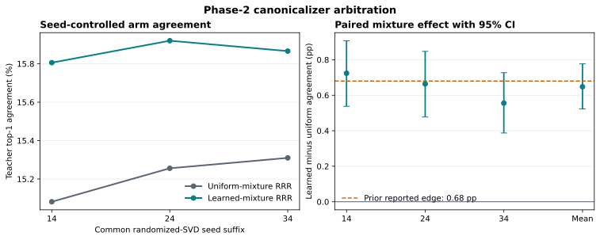

# Paper Two Phase-2 Handoff: Canonicalizer Arbitration and Loss-Free Student Build

Date: 2026-08-04  
Status: CPU-only work complete and banked; matched alpha pilots remain held  
Run: `stage5_paper2_phase2_arbitration_build_20260804`

## 0. Executive verdict

Both authorized CPU blockers closed cleanly.

1. The seed-controlled canonicalizer comparison selects **learned-mixture RRR** over uniform-mixture RRR. The learned mixture improves teacher top-1 agreement by `0.006478`, or **0.648 percentage points**, with a paired bootstrap 95% CI of **[0.523, 0.777] points**. The effect is positive in all three common-seed refits and in both code and general-text strata. The largest within-arm randomized-SVD seed range is **0.228 points**, well below the preregistered `0.68`-point comparability threshold. The prior edge therefore survives the seed audit and is not explained by decomposition seed noise.
2. The loss-free student implementation passes every registered build contract on an actual Qwen2.5-0.5B checkpoint. It adds **1,184,917 trainable parameters**, preserves exact zero-loop hidden states and logits, leaves the pretrained base hash unchanged, exposes the future Stage-C control read, enforces `K <= 4`, and contains no optimizer or attached loss.

No model training occurred, no optimizer step was taken, and no frozen evaluation partition was touched. This result selects a canonicalizer and validates an implementation surface. It does not establish student quality, acceptance, or a winning whitening exponent.

## 1. Why this job existed

Experiment 0A/0B left two practical blockers before matched alpha pilots.

First, the legacy comparison called `tucker_predictive` was discovered to be a learned layer mixture followed by predictive reduced-rank regression, not a separate Tucker factorization. Its small apparent edge over uniform-mixture RRR could therefore have been either a real layer-mixture effect or randomized-SVD fit noise. The corrected arbitration refit both candidates under the same three seeds and applied a locked paired-bootstrap decision rule.

Second, the proposed DC2 student existed only as design and isolated unit contracts. A checkpoint-integrated, loss-free build was needed to establish parameter count, exact inactive identity, frozen-lineage integrity, trust-region plumbing, masked-slot handling, and Stage-C-ready control access before any training protocol could be locked.

## 2. Experimental design

### 2.1 Canonicalizer arms

The comparison held the predictive RRR form fixed and changed only the layer mixture:

- `uniform_mixture_rrr`: uniform mixture over the three teacher layers.
- `learned_mixture_rrr`: the frozen learned mixture `[0.584022, 0.332361, 0.083618]`.

Both arms were fit with the same randomized low-rank SVD seeds:

```text
20260814, 20260824, 20260834
```

The fit matrix had shape `166,708 x 5,120`, so exact LAPACK decomposition was not practical for this authorized cached CPU job. The governing comparison therefore used common-seed randomized fits and explicitly measured fit spread.

Primary metric: teacher top-1 agreement on the document-disjoint development holdout.  
Secondary metric: future KL, where lower is better.  
Uncertainty: paired row-level bootstrap with 10,000 replicates.  
Fit-noise alarm: maximum within-arm agreement range at least `0.0068`.

Locked selection rule: choose learned-mixture RRR only if the paired agreement CI excludes zero on the positive side and the sign is consistent across strata; otherwise use uniform-mixture RRR on parsimony.

### 2.2 Whitening floor audit

For each refit, the job recomputed the raw covariance eigenspectrum and applied the single registered effective-eigenvalue rule:

```text
lambda_eff = max(lambda_raw, tau * lambda_max, eps_abs)
tau = 1e-4
eps_abs = 1e-6
```

No second epsilon was applied in the forward transform. The audit records exact counts at the floor, effective condition number, and fit accumulation precision.

### 2.3 Student build

The build instantiated the loss-free DC2 student around `Qwen/Qwen2.5-0.5B-Instruct` with:

- hidden size `896`;
- canonical latent dimension `128`;
- draft rank `64`;
- control dimension `32`;
- eight slots, four populated future slots and four masked span/trace slots;
- maximum four recurrent steps;
- `c = 0.15`, state-RMS cap `0.5508932316303252`, and bridge persistence `rho = 0.95`;
- zero-loop checkpoint-integrated identity and frozen-base hash assertions.

The target deliberately attached no losses and created no optimizer.

## 3. Canonicalizer results

### 3.1 Seed-level agreement

| SVD seed | Uniform RRR | Learned-mixture RRR | Learned minus uniform |
|---:|---:|---:|---:|
| 20260814 | 15.082% | 15.806% | +0.724 points |
| 20260824 | 15.256% | 15.920% | +0.664 points |
| 20260834 | 15.310% | 15.866% | +0.556 points |

The learned arm wins at every seed. Its mean advantage is **0.648 points**, and the paired 95% CI is **[0.523, 0.777] points**.

The seed-spread audit is decisive:

| Quantity | Value |
|---|---:|
| Learned-arm range | 0.114 points |
| Uniform-arm range | 0.228 points |
| Maximum within-arm range | 0.228 points |
| Range of paired deltas | 0.168 points |
| Preregistered fit-noise comparability threshold | 0.680 points |

The corrected mean edge is almost identical to the legacy `0.655`-point edge. The original result was mislabeled by factorization, but its measured advantage was not an SVD-seed artifact.

### 3.2 Strata and secondary metric

The agreement gain is positive in both strata:

| Stratum | Rows | Agreement delta |
|---|---:|---:|
| Code | 11,812 | +0.799 points |
| General text | 21,480 | +0.565 points |

The seed-averaged future-KL difference is **-0.0180**, 95% CI **[-0.0225, -0.0135]**. Both primary and secondary metrics therefore favor the learned mixture. The KL gain is stronger on code (`-0.0305`) than general text (`-0.0112`).

### 3.3 Locked decision

```text
primary: learned_mixture_rrr
fallback: uniform_mixture_rrr
reason: agreement_ci_excludes_zero_positive_and_sign_is_consistent
```

The learned weights put most mass on the first two measured teacher layers:

```text
layer mixture = [0.5840, 0.3324, 0.0836]
```

This supports a mid-stack-heavy predictive state for the next phase. It does not prove that the mixture is universally optimal or that it improves downstream acceptance before student training.

## 4. Floor and rank audit

Across exact refits, the 128-dimensional whitening covariance placed:

- uniform RRR: `29/128 = 22.66%` at the floor for all three seeds;
- learned-mixture RRR: `30/128 = 23.44%`, `30/128 = 23.44%`, and `29/128 = 22.66%`;
- legacy effective-clamp image: `34/128 = 26.56%`.

The relative floor binds, the absolute epsilon does not, and every effective condition number is exactly `10,000`. The fit accumulated in fp64.

**Scope correction:** this audit is the post-projection, per-slot `128`-dimensional whitening eigenspectrum. It is not a direct singular-rank audit of the `256`-component predictive RRR map. It shows that roughly 98-99 whitening directions remain above the floor and that regularization is materially active. It does not by itself establish that `r_c = 256` is over-provisioned. If strategy wants a direct rank-support statement, a separate cached singular-spectrum receipt should be added as nonblocking CPU analysis.

## 5. Student build results

### 5.1 Exact implementation facts

| Item | Result |
|---|---:|
| New trainable parameters | 1,184,917 |
| Rough design estimate | 2.5-3.5M |
| Optimizer steps | 0 |
| Losses attached | 0 |
| Frozen evaluation partitions touched | 0 |
| Maximum recurrent steps | 4 |
| Populated / reserved slots | 4 / 4 |

The concrete v1 build is substantially smaller than the design estimate. This is an implementation fact, not a capacity or quality result.

### 5.2 Identity and lineage

- Zero-loop hidden state: bit-identical, maximum absolute difference `0.0`.
- Zero-loop logits: bit-identical, maximum absolute difference `0.0`.
- Base parameters: `requires_grad=False`.
- Base hash before and after: identical, `e21c19e...aa2b`.
- Input and output embedding storage: tied under the base policy.
- Frozen tied-embedding hash: unchanged.

### 5.3 Plumbing contracts

All assertions passed, including:

- inactive hidden and logit identity;
- nonzero bridge-output initialization;
- softplus scalar magnitude and trust-region wiring;
- no projection of the persistent canonical state;
- closed position-zero writeback gate;
- four-step cap;
- masked slots excluded from both losses and effective-rank telemetry;
- Stage-C control read exposed;
- no loss, optimizer, or training step.

### 5.4 Pilot watch item

The measured initial update-to-state ratio is approximately `0.86`, despite an initial softplus magnitude near `0.01815`. This occurs because the anchor-dominated initial canonical state has small RMS. It is not a failed assertion, and the tube cap remains wired, but it means trust-region pressure may be active immediately. The matched pilots should log the ratio from step zero, the rent/penalty contribution, clipping, gate-open rate, and whether the ratio settles without destabilizing quality. Constants should not be changed from this build-only observation without a preregistration amendment.

### 5.5 Constants hash note

The Colab receipt records the canonical Git LF-byte hash for `training/paper2_phase2_dc2_constants.json`:

```text
4e56a43a6692a4c88e60c17cd5e12076f1a2f0c3c65b3027dfc3f0800ef558fc
```

A Windows checkout can produce a different working-tree byte hash because of CRLF conversion. The content is equivalent, and the Colab receipt used canonical repository bytes. Future launch integrity checks should continue to hash canonical LF bytes or enforce LF for the constants file.

## 6. Interpretation

This is a clean positive for **state construction**, not yet for **state use**.

The teacher layer mixture adds a small but reproducible amount of predictive information after controlling decomposition randomness. Its value is statistically resolved, consistent across strata, and supported by lower future KL. The result justifies carrying learned-mixture RRR into the matched alpha pilots.

The student build simultaneously establishes that the proposed DC2 control surface can be added without perturbing the inactive pretrained model. It is small, frozen-base compatible, bounded, masked correctly, and already exposes the later control interface.

What remains unknown is the central question: whether any whitening exponent allows the trained student to turn this predictive state into verified accepted computation without degrading the upper model. That is what the matched alpha pilots test.

## 7. Limitations and do-not-claim boundaries

Do not claim:

- that legacy `tucker_predictive` was a distinct Tucker factorization;
- that the learned mixture wins because of factorization rather than layer weighting;
- that the `0.648`-point DEV agreement gain is downstream acceptance or task quality;
- that arbitration selected alpha;
- that the 128-dimensional floor audit directly proves `r_c = 256` is excessive;
- that the untrained student improves teacher agreement or verified acceptance;
- that build assertions establish pilot quality;
- that the lower parameter count establishes sufficient capacity;
- that E1 confirmation is open.

The arbitration is development-only, uses three randomized-SVD seeds, and selects within the tested two-arm family. The student receipt is build-only.

## 8. Queue and decision requests

### Closed now

1. Canonicalizer choice: **learned-mixture RRR**.
2. Common-seed decomposition-noise audit: green.
3. Exact whitening floor audit: landed, with the rank-scope caveat above.
4. Loss-free checkpoint-integrated student build: green.

### Required before GPU training

1. Strategy reviews and locks `docs/PAPER2_PHASE2_MATCHED_ALPHA_PILOT_PROTOCOL_DRAFT_20260804.md`.
2. The lock fills the proposed optimizer, learning rate, weight decay, batch size, steps, seeds, evaluation cadence, clipping, hashes, and canonicalizer selection.
3. The pilot receipt explicitly includes the initial trust-ratio and rent telemetry noted in section 5.4.
4. A resource note confirms expected GPU, memory, wall time, and resume/Drive policy.

### Matched pilot after lock

Run alpha `{0.0, 0.5, 1.0}` with identical seeds and all non-alpha state byte-identical. Quality is a disqualifying gate; qualifying arms rank by verified acceptance. The practical-equivalence band is `+/-2%` relative accepted length, with alpha `0.5` winning equivalence. Add alpha `0.75` only if `1.0` beats `0.5` outside the band, or alpha `0.25` symmetrically if `0.0` beats `0.5`.

### Questions for strategy

1. Does the 128-dimensional whitening floor audit satisfy the owed floor receipt as scoped? Recommended answer: yes for whitening support; authorize a separate nonblocking cached `r_c=256` singular-spectrum table only if a direct rank claim is desired.
2. Should the pilot protocol leave the initial ratio unchanged and treat it only as telemetry, or add a locked abort boundary for persistent trust-ratio saturation? Recommended answer: log it and rely on existing non-finite, tube, preservation, and quality rules unless a principled boundary is specified before lock.
3. Are the proposed pilot constants (`AdamW`, `3e-4`, weight decay `0.01`, batch `128`, `1,000` steps, seeds `0/1`) accepted, or does strategy want a mechanism-installation receipt to determine them?

## 9. Plain-language summary

We asked whether a small earlier edge was real or merely caused by randomized matrix factorization. It was real: three matched refits reproduced essentially the same advantage, and the random-fit variability was much smaller than the effect. We also built the proposed controller around the real model and proved that, while inactive, it changes nothing. The next experiment is therefore well posed: train the same small controller under three coordinate scalings and determine which one produces useful, accepted computation without harming the frozen model.

## 10. Artifacts and lineage

- Bundle: `outputs/stage5/stage5_paper2_phase2_arbitration_build_20260804/summary.json`
- Arbitration: `outputs/stage5/stage5_paper2_phase2_arbitration_build_20260804/canonicalizer_arbitration_summary.json`
- Student build: `outputs/stage5/stage5_paper2_phase2_arbitration_build_20260804/student_build_summary.json`
- Figure: `docs/figures/paper2_phase2_canonicalizer_arbitration_20260804.svg`
- Pilot draft: `docs/PAPER2_PHASE2_MATCHED_ALPHA_PILOT_PROTOCOL_DRAFT_20260804.md`
- Governing strategy response: `docs/STRATEGY_TO_CODING_AGENT_EXP0AB_BANK_20260804_r2.md`
- Landed receipt commit: `0c793c0f`


