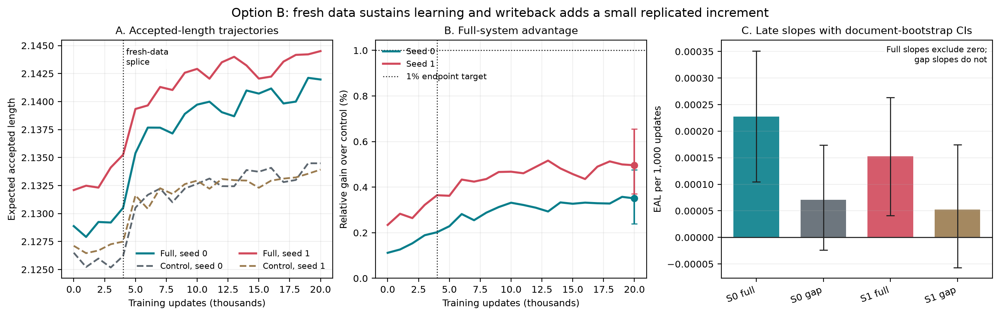

# Handoff: Option B Dose-Then-Data Matrix and Corrected Bootstrap Verdict

Date: 2026-08-08. Audience: strategy and research agents. Status: complete and
ready for strategy ratification. No additional Option B GPU work is recommended.

## 0. Executive verdict

The four-arm Option B matrix completed all 20,000 updates, passed every named
execution cliff, and landed at commit `ce79e913`. The subsequent read-only audit
completed the document-bootstrap estimators required by the locked protocol and
landed at commit `e26d349e`.

The corrected registered verdict is:

- `curve_supports_E1_recipe_transfer` in both seeds;
- retain writeback for E1;
- the one-percent endpoint target was not met in either seed;
- the full-system late slope excludes zero in both seeds, satisfying the
  alternative E1-support condition;
- the full-minus-control advantage grew significantly from step zero to step
  20,000 in both seeds, but its second-half slope does not exclude zero.

Plainly: the bridge contributes a small, reproducible, quality-stable increment.
Fresh data keeps the full system learning, which opens E1. The bridge's marginal
advantage appears largely established before the final half of the run rather
than continuing to widen rapidly. E1 should include writeback, but another
unchanged Option B extension is not supported.

## 1. Question and rationale

The preceding A2 experiment showed that the full writeback system beat a
matched no-writeback control in both seeds but missed its larger headroom and
quality targets. The registered interpretation was `budget-limited`: the run
could not distinguish an underexposed mechanism from a bounded one.

Option B was designed to turn that endpoint comparison into a dose-and-data
curve. It asked:

1. Does additional exposure on the original 41,969 anchors continue to help?
2. Does a clean expansion to approximately 182,000 anchors change the slope?
3. Does the full system retain an advantage over a schedule-matched
   drafter-only control?
4. Does the full-minus-control increment grow enough to retain writeback in E1?
5. Can all of this occur without crossing a named quality or lineage cliff?

## 2. Experimental design

### Arms

Four arms continued from the banked A2 endpoints:

| Seed | Full arm | Control arm |
|---:|---|---|
| 0 | frozen A1 flow plus trainable writeback/use graph | matched drafter-only graph, no writeback |
| 1 | frozen A1 flow plus trainable writeback/use graph | matched drafter-only graph, no writeback |

Alpha remained `0.5`. AdamW started with fresh state. Each within-seed pair used
the same sampled-anchor schedule. The full arms inherited the exact registered
A2 loss weights; controls retained only losses defined on their no-writeback
graph.

### Dose and data intervention

- Steps 0-4,000: original 41,969-anchor training population.
- Step 4,000: durable splice with model, optimizer, schedules, rules, and
  constants unchanged; only the admissible training population changed.
- Steps 4,001-20,000: expanded population of 181,969 anchors, including 140,000
  new anchors from excluded documents.
- Batch size: 128 anchors.
- Evaluation: fixed 8,031-anchor DEV slice at step zero and every 1,000 updates.
- Directional objective audit: every 2,000 updates in the full arms.

The fresh-data generation was separately hash-locked. Evaluation and
confirmatory documents were excluded from both training populations. All four
source endpoints and frozen-parameter digests were asserted before and after.

### Registered readings

1. Fresh-data versus dose slopes, with document-block bootstrap intervals.
2. Endpoint full-over-control relative EAL gain, with a one-percent target.
3. Alternative E1 support from a positive full-system second-half slope whose
   document-bootstrap 95 percent interval excludes zero.
4. Retain writeback when the full-minus-control increment or share grows in
   both seeds.
5. Quality and lineage tripwires remain hard stops; other thresholds are
   measurements.

## 3. Execution and provenance

All four arms reached step 20,000 with `abort_reason = null`.

- Matrix launch commit: `bf132d0f097cb8c73a8eb010bf9811181cd43da8`
- Matrix result commit: `ce79e913e041276f19d2b92d19d2c46cc12f6f40`
- Bootstrap implementation commit: `69ef00312ba69540f86808877e0e261a32c8bad3`
- Corrected audit result commit: `e26d349e`
- Matrix receipt:
  `outputs/stage5/stage5_paper2_phase2_option_b_20260807/summary.json`
- Corrected audit receipt:
  `outputs/stage5/stage5_paper2_phase2_option_b_bootstrap_audit_20260808/summary.json`
- Fixed audit method:
  `docs/PAPER2_PHASE2_OPTION_B_BOOTSTRAP_AUDIT_METHOD_20260808.md`
  with SHA-256 `db5d42b47b879c219be3123ffd8ece2853ff22264c95f381ab6b70894712a9b0`.

The audit used 10,000 paired percentile cluster-bootstrap replicates at seed
`20260808`. The 8,031 evaluation anchors belong to 85 unique documents. The
same sampled document multiplicities were used across arms, checkpoints, and
seeds. All 60 consumed row receipts were hashed into the output. Row-level EAL
means were required to reproduce the public checkpoint means within `2e-6`.

No model was loaded and no optimizer update occurred during the audit.

## 4. Primary results

### Endpoint effect

| Seed | Full EAL | Control EAL | Absolute increment | Relative gain | Document-bootstrap 95% CI |
|---:|---:|---:|---:|---:|---:|
| 0 | 2.141969 | 2.134485 | 0.007485 | 0.351% | [0.240%, 0.477%] |
| 1 | 2.144506 | 2.133922 | 0.010584 | 0.496% | [0.370%, 0.655%] |
| Descriptive mean | - | - | 0.009034 | 0.423% | [0.313%, 0.558%] |

The full system advantage is positive under document resampling in both seeds.
Neither endpoint reaches the registered one-percent target, and even the upper
confidence limits remain below one percent.

### Effect accumulated during Option B

The full-minus-control gap grew from step zero to step 20,000 by:

| Seed | Gap growth | Document-bootstrap 95% CI |
|---:|---:|---:|
| 0 | 0.005106 EAL | [0.003186, 0.007201] |
| 1 | 0.005603 EAL | [0.003636, 0.007903] |
| Descriptive mean | 0.005354 EAL | [0.003567, 0.007406] |

This is the strongest attribution result in the matrix. The near-identical
gap growth across seeds and positive intervals show that writeback training
added benefit beyond the pre-existing endpoint difference and ordinary
drafter-only training.

### Dose versus fresh data

All slopes are EAL per 1,000 updates.

| Seed/arm | Dose slope, steps 2k-4k | Fresh slope, steps 4k-6k | Separated intervals? |
|---|---:|---:|:---:|
| Seed 0 full | 0.000632 [0.000106, 0.001138] | 0.003583 [0.002778, 0.004438] | yes |
| Seed 0 control | 0.000114 [-0.000319, 0.000500] | 0.002728 [0.002055, 0.003369] | yes |
| Seed 1 full | 0.001466 [0.000962, 0.001971] | 0.002203 [0.001553, 0.002834] | no |
| Seed 1 control | 0.000399 [-0.000021, 0.000791] | 0.001465 [0.000793, 0.002083] | yes |

The splice response is clear in both controls and in the seed-zero full arm.
The seed-one full point estimate also rises, but the dose and fresh intervals
overlap and the fresh-minus-dose contrast includes zero. Therefore the strict
full-system data-starvation reading is replicated only partially. The
two-seed descriptive full-system intervals are separated, but they do not
supply inference over training seeds.

The correct interpretation is that fresh data was materially useful and
clearly relieved a limitation in the shared drafter path. It is not evidence
for a general unique-data scaling law or an identical causal response in every
full-system seed.

### Late slopes and corrected E1 support

| Seed | Full-system late slope | 95% CI | Writeback-gap late slope | 95% CI |
|---:|---:|---:|---:|---:|
| 0 | 0.000228 | [0.000104, 0.000351] | 0.000071 | [-0.000023, 0.000174] |
| 1 | 0.000152 | [0.000041, 0.000264] | 0.000053 | [-0.000057, 0.000174] |
| Descriptive mean | 0.000190 | [0.000086, 0.000296] | 0.000062 | [-0.000031, 0.000166] |

The full-system late slope excludes zero in both seeds. This satisfies the
locked alternative E1-support condition and corrects the original receipt's
point-estimate-only implementation.

The late slope of the *gap* does not exclude zero. Thus the full systems keep
learning late, but the data do not establish that the bridge advantage is
still widening during the second half. This is why the result supports E1 but
not another unchanged Option B extension.

## 5. Quality, mechanism, and selector diagnostics

### Quality

The full-arm fixed-evaluation retention remained essentially flat:

| Seed | Step-zero retention | Step-20k retention | Endpoint Wilson lower bound |
|---:|---:|---:|---:|
| 0 | 99.6145% | 99.5510% | 99.4572% |
| 1 | 99.5679% | 99.5976% | 99.5083% |

No point-drift or Wilson-floor tripwire fired. The control paths remained bit
exact with 100 percent retention. The full arms' stricter absolute
`quality_noninferior` flag was false at step zero and remained false; Option B
did not create that pre-existing shortfall and did not repair it.

### Bridge use

Mean bridge gate rose from approximately `0.020` to `0.084` in seed zero and
`0.088` in seed one. The mechanism was increasingly used rather than merely
carrying a static initialization advantage. All ten directional audits in each
full arm passed without a marginal or gross objective-share miss.

### Remaining oracle headroom

Quality-safe oracle headroom at the endpoint remained 2.28 percent and 2.38
percent. The observed relative gains of 0.35 percent and 0.50 percent capture
only about 15 to 21 percent of that ceiling. Probe-top-1 correlation with EAL
was weak, 0.056 and 0.029, so the current gating signal is not close to oracle
arbitration. This is remaining design headroom, not evidence that a deployable
selector already exists.

## 6. Figure

Figure: Panel A shows the four fixed-DEV EAL trajectories and the step-4,000
fresh-data splice. Panel B shows the positive but sub-one-percent full-system
advantage. Panel C separates the registered positive late full-system slopes
from the uncertain late slopes of the full-minus-control gap. Error bars are
paired document-bootstrap 95 percent intervals.

## 7. Registered readings resolved

1. **Data starvation confirmed:** partial. The strict separated-interval result
   holds in both controls and seed-zero full, but not seed-one full. Fresh data
   is useful; full-system replication is incomplete.
2. **Exposure suffices:** not the governing reading. Control dose intervals
   include zero while fresh intervals are positive.
3. **Bounded at tested scale:** rejected. Fresh and late full-system intervals
   do not include zero.
4. **Overall E1 support:** passed in both seeds through the CI-qualified
   second-half slope alternative, not through the one-percent endpoint target.
5. **Writeback at scale:** passed. Full-minus-control gap growth is positive in
   both seeds, so writeback remains in E1.
6. **Overfit:** no widening fixed-old-train versus fixed-evaluation gap was
   observed. The full-arm gap moved toward zero; control gaps remained stable.

## 8. Scientific interpretation

Option B changes the program's status from "promising endpoint under an
ambiguous budget" to "small replicated writeback effect under a recipe that
continues learning." It establishes three things:

1. The state-use/writeback mechanism produces a positive incremental effect
   beyond a matched drafter-only system.
2. Expanded data sustains useful learning and clears the registered route into
   E1.
3. The present mechanism realizes only a minority of its quality-safe oracle
   headroom and remains below the one-percent endpoint ambition.

The result is neither a large win nor a negative. It is the measured precursor
E1 needed: a functioning but modest mechanism with a finished exploratory
recipe, explicit quality debt, and quantified selector headroom.

## 9. Limitations and do-not-claim boundaries

- Two training seeds do not estimate a seed population. Bootstrap intervals
  resample 85 documents, not seeds.
- The 8,031 anchors are clustered within only 85 documents; the audit accounts
  for this clustering, but the document population remains bounded.
- DEV expected accepted length is not serving throughput.
- The endpoint gain did not reach one percent.
- The late full-system slope is positive, but the late writeback-gap slope is
  uncertain.
- The splice is one data intervention and does not establish a general scaling
  law.
- No confirmatory E1 partition was touched.
- Oracle headroom is not achievable by the current selector unless a
  deployable held-out selector study demonstrates it.

## 10. Questions for strategy review

1. Ratify the corrected `curve_supports_E1_recipe_transfer` verdict and close
   Option B.
2. Confirm that E1 starts with writeback retained, alpha `0.5`, and the expanded
   population available from the outset.
3. Decide whether E1's primary goal is a confirmatory writeback increment, a
   quality repair, or a joint gate requiring both. The current result supports
   the first but does not resolve the inherited absolute quality shortfall.
4. Decide whether E1 starts from fresh module initialization under the finished
   recipe or promotes one of the Option B endpoints. Promotion would require a
   separate lineage decision because Option B is DEV exploration.
5. Specify whether the existing one-percent ambition remains an E1 endpoint
   gate or becomes an effect-size target reported alongside a lower nonzero
   superiority gate.
6. Decide whether selector work belongs inside E1. The oracle gap is large, but
   current probe correlations are weak and prior static-router evidence was
   negative.

## 11. Recommended next sequence

1. Strategy ratifies this handoff and the corrected audit receipt.
2. Update `PROJECT_STATUS_PAPER.md`, `EXPERIMENT_LOG.md`, and the Paper Two claim
   ledger with the corrected verdict and paths.
3. Close Option B. Do not extend its unchanged training schedule.
4. Draft E1's preregistration using the expanded data budget, retained
   writeback, and explicit quality scope.
5. Lock E1 before any new optimizer step. No A100 is needed until that lock is
   complete.

## 12. Plain-language summary

Giving the system more varied training data helped it continue improving. The
version with the recurrent writeback bridge improved more than the otherwise
matched version without that bridge, and this happened in both runs. The extra
benefit was real but small: roughly 0.35 to 0.50 percent at the endpoint, below
the one-percent goal. The corrected statistical audit confirms that the full
system was still improving late in training, which is enough under the
prewritten rules to proceed to E1. It also shows that the bridge's extra
advantage was no longer clearly widening late in the run. The next experiment
should therefore use the learned recipe in E1, retain the bridge, and address
quality and selection directly rather than simply running Option B longer.
