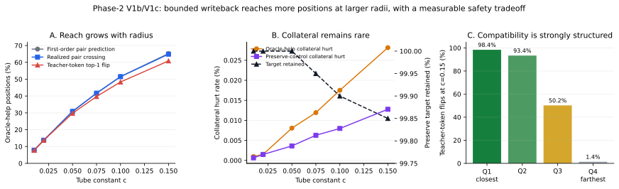

# Handoff: Phase-2 V1c Radius Extension and RMS-Tail Audit

**Date:** 2026-08-02  
**Program:** Paper Two, Phase 2 pre-window diagnostics  
**Status:** V1c and the V1b RMS audit are complete; no training occurred; E1 remains unopened pending strategy review.  
**Primary receipts:** `outputs/stage5/stage5_paper2_phase2_prewindow_20260731/v1c/summary.json` and `outputs/stage5/stage5_paper2_phase2_prewindow_20260731/v1b_rms_audit/summary.json`

## 0. Executive verdict

V1c produced the expected reach-versus-radius curve. At the largest tested constant, `c=0.15`, a locally optimal bounded bridge perturbation made the teacher token top-1 on `1,217/2,000` oracle-help positions, or **60.85%**. The realized pair-margin crossing rate was **64.85%**, within 0.35 percentage points of the first-order prediction of 65.20%. The margin-gradient calculation therefore remains a useful local design instrument through the tested range.

The result is promising but not an unconditional safety pass. At `c=0.15`, the target remained correct on `1,997/2,000` preserve controls, and other-position collateral hurt remained rare: **262/930,625 (0.0282%)** on oracle-help rows and **120/940,023 (0.0128%)** on preserve-control rows. Nevertheless, three preserve targets were lost, so preservation was not exact.

The companion RMS audit identified the main safety concern. State RMS has a median of 0.406 and a p99 of 0.551, but a maximum of 58.49. Because the permitted radius scales with RMS, the uncapped `c=0.15` rule produced rare radii as large as 65.65. The top 1% RMS tail had a collateral-hurt rate about **65 times** the non-tail rate and contributed 42 of 109 harms in the audited V1b records despite containing only 1% of positions. The audit therefore recommends a **p99 state-RMS cap of 0.550893**.

The cleanest next step is not E1 training yet. Strategy should first choose between a conservative `c=0.10` window and a `c=0.15` window with the p99 RMS cap. If the latter is preferred, a cheap DEV-only capped-radius V1d should measure the actual reach and safety after capping rather than infer them from the uncapped run.

## 1. Why these experiments were run

V1 and V1b asked whether a bounded correction inserted at the designated bridge location could move the wrong-token-versus-teacher-token margin far enough to change the decision without broadly damaging other positions. V1 established first-order compatibility. V1b then applied finite perturbations at `c={0.01, 0.02, 0.05}` and showed that the first-order margin-gradient prediction tracked realized pair crossing closely, but the largest tested radius flipped the teacher token on only 29.75% of oracle-help positions.

The strategy memo authorized two follow-ups:

1. V1c extended the same finite-perturbation protocol to `c={0.075, 0.10, 0.15}` on the same 2,000 oracle-help and 2,000 preserve-control samples.
2. The RMS audit examined whether the radius formula was being driven by rare hidden-state scale outliers and, if so, identified a defensible cap.

Both were DEV-only diagnostics. Neither updated model parameters, touched the frozen evaluation partition, or constituted a deployable controller.

## 2. V1c experimental design

For each sampled oracle-help position, V1c used the exact gradient of the original top-1 wrong-token-versus-teacher-token margin at the registered insertion point. It applied the perturbation

`-r(c) * grad(m) / ||grad(m)||`, where `r(c) = gamma * c * RMS(h0) * sqrt(d) / (1-rho)`.

The locked constants were `gamma=0.05`, `rho=0.8`, and `c={0.075, 0.10, 0.15}`. For each radius, the receipt reports:

- first-order predicted pair crossing;
- realized pair crossing;
- realized teacher-token top-1 flips;
- correctness changes at every other scored causal position on the same row;
- the same perturbation protocol on matched preserve controls;
- full-population results as primary and first-order-distance quartiles as secondary.

The distinction between pair crossing and teacher-token top-1 flipping is essential. Crossing the selected wrong-token-versus-teacher-token margin does not guarantee that no third token remains above the teacher token.

## 3. V1c primary results

| `c` | First-order pair prediction | Realized pair crossing | Teacher-token top-1 flip | Oracle collateral hurt | Preserve target retained | Preserve collateral hurt |
|---:|---:|---:|---:|---:|---:|---:|
| 0.010 | 7.85% | 7.85% | 7.75% | 9/930,625 (0.0010%) | 2,000/2,000 (100.00%) | 6/940,023 (0.0006%) |
| 0.020 | 13.65% | 13.75% | 13.70% | 14/930,625 (0.0015%) | 2,000/2,000 (100.00%) | 14/940,023 (0.0015%) |
| 0.050 | 30.90% | 30.85% | 29.75% | 75/930,625 (0.0081%) | 2,000/2,000 (100.00%) | 34/940,023 (0.0036%) |
| 0.075 | 41.65% | 41.70% | 39.70% | 111/930,625 (0.0119%) | 1,999/2,000 (99.95%) | 59/940,023 (0.0063%) |
| 0.100 | 51.55% | 51.50% | 48.35% | 163/930,625 (0.0175%) | 1,998/2,000 (99.90%) | 75/940,023 (0.0080%) |
| 0.150 | 65.20% | 64.85% | 60.85% | 262/930,625 (0.0282%) | 1,997/2,000 (99.85%) | 120/940,023 (0.0128%) |

Three findings are robust within this DEV sample:

1. Reach grows smoothly with radius; it does not show a sudden threshold or collapse.
2. First-order prediction remains accurate for the specific pair margin through `c=0.15`.
3. Teacher-token flipping lags pair crossing increasingly at larger radii, reaching a 4.0-point gap at `c=0.15`. This is ranking competition from other tokens, not evidence that the pair-margin linearization failed.

At `c=0.15`, collateral changes were not uniformly harmful. Oracle-help rows had 272 collateral gains and 262 harms, for a net of +10. Preserve controls had 138 gains and 120 harms, for a net of +18. These net counts do not replace the preservation requirement; they only show that the perturbation did not create a broad one-directional degradation.

## 4. Compatibility is structured, not homogeneous

The preregistered secondary stratification by first-order minimal distance sharply separates positions at `c=0.15`:

| Distance quartile | Distance range | Teacher-token flip rate |
|---|---:|---:|
| Q1, closest | 0.00016 to 0.12507 | 98.4% |
| Q2 | 0.12512 to 0.29718 | 93.4% |
| Q3 | 0.29768 to 0.62384 | 50.2% |
| Q4, farthest | 0.62428 to 5.24316 | 1.4% |

This is consequential for E1 design. A per-position gate has a strong measurable signal to exploit: locally compatible positions are almost always flippable at the tested radius, while the farthest quartile is almost never flippable. A global, always-on writeback would spend radius on many positions for which the bounded path is predictably ineffective.

The content split is less decisive. At `c=0.15`, teacher-token flips were 62.41% for code and 59.98% for general text. Preserve retention was 99.72% for code and 100% for general text. The three preserve-target losses therefore appear in the code stratum, but the sample is too small to claim a general code-specific failure mode.

## 5. RMS-tail audit design and results

The CPU-only audit reused 12,000 finite V1b records representing 4,000 unique sampled positions. It performed no model inference. It summarized state RMS, margin, gradient norm, position, content stratum, and collateral outcomes, then compared the top 1% state-RMS tail with the remaining 99%.

| Quantity | Median | p95 | p99 | Maximum |
|---|---:|---:|---:|---:|
| State RMS | 0.4058 | 0.4882 | 0.5509 | 58.4901 |
| Gradient L2 norm | 1.7310 | 5.7696 | 10.7008 | 34.9825 |
| Absolute original margin | 1.2498 | 9.0241 | 11.6542 | 19.0135 |

The state-RMS distribution is the anomaly. Its maximum is more than 100 times its p99. Under the uncapped radius formula, V1c therefore observed median radii near 0.46 at `c=0.15` but maxima above 65.

The tail was also operationally riskier:

- Top 1% RMS tail: 42 harms over 17,778 collateral positions, **0.2362%**.
- Remaining 99%: 67 harms over 1,852,870 collateral positions, **0.00362%**.
- Relative hurt rate: approximately **65.3 times** higher in the top tail.
- Harm concentration: the top 1% contributed **42/109 (38.5%)** of audited harms.

The tail is position-concentrated. Of the 40 unique positions in the top 1%, 19 were at sequence position zero, 10 were elsewhere in the early quartile, 7 were in the middle, and 4 were late. Position zero was 47.5% of the tail, which is not a majority, so the receipt does not reduce the entire phenomenon to an attention sink. It does show that sequence position is a meaningful risk feature. Independently, the position-zero collateral-hurt rate at `c=0.05` was 0.472%, versus 0.0245% for positions 1-3 and approximately 0.0024-0.0065% for the remaining position buckets.

The registered audit rule therefore selected `p99_state_rms_cap` with value **0.5508932316303252**.

## 6. Interpretation against the pre-stated readings

The V1c reach target was approximately 55-70% teacher-token flipping at the most permissive tested radius. The observed 60.85% enters that range. The bounded bridge-writeback premise therefore survives the reach test.

The safety reading is mixed rather than clean. Collateral hurt rates remain numerically small, and 99.85% of preserve targets remain correct, but preservation is no longer exact. More importantly, the uncapped rule gives a small number of positions a radius two orders of magnitude above the ordinary scale. The correct conclusion is:

> A bounded bridge perturbation can causally correct a majority of oracle-help positions at `c=0.15`, and first-order margin geometry predicts the pair crossing well, but the uncapped RMS-scaled rule has a rare, position-concentrated safety tail that must be capped or gated before training.

This result does not authorize the sentence that the V1c perturbations are a deployable controller. It is an oracle-direction experiment, not a learned sidecar.

## 7. Two-path accounting

V1b and V1c test the bounded bridge-writeback path. They do not upper-bound the separate direct-logit residual drafter path adopted in the v0.4 composite design. The two paths must retain separate accounting:

- Bridge writeback: governed by tube radius, local compatibility, collateral safety, and per-position gating.
- Direct-logit residual: not bounded by the bridge margin geometry; judged by accepted-length improvement, quality non-regression, and causal-use tests.

The result supports a hybrid architecture rather than collapsing the two paths into one score. The bridge path has strong local reach on compatible positions. The direct residual path remains necessary for positions outside that local correction envelope.

## 8. Limitations and do-not-claim boundaries

- DEV-only samples were used; the frozen evaluation slice was untouched.
- The perturbation direction used the teacher-token margin gradient. A learned controller does not receive this oracle direction at inference.
- Only one model lineage and the registered sample seeds were measured.
- Local finite perturbations do not establish global reachability or training stability.
- Pair crossing is not equivalent to teacher-token top-1 flipping.
- The p99 cap is recommended from existing records but has not yet been applied in a finite-perturbation run.
- Aggregate collateral rates can hide position-specific risk, which is why the RMS and sequence-position analyses are retained.
- V1c does not validate E1, E4, or the direct-logit path.

## 9. Questions for strategy review

1. Should E1 use the conservative uncapped `c=0.10`, or should it target `c=0.15` with the p99 RMS cap?
2. If `c=0.15` is preferred, should a DEV-only capped V1d be required before E1 lock? The coding recommendation is yes because capping changes the realized perturbation and may reduce the 60.85% reach.
3. What preservation criterion should bind E1: exact target retention, a fixed target-loss count, or a confidence interval around a preregistered non-inferiority margin? The V1c sample shows that exact zero-loss preservation becomes brittle at larger radii.
4. Should sequence position and first-order distance be explicit sidecar gate features from the first E1 build, or should position be used only for stratified monitoring?
5. Does E4 upper-layer adaptation remain a contingency? The coding recommendation is to defer E4 until the capped-radius diagnostic. Open E4 only if the cap pushes useful reach materially below the registered range or if a learned gate cannot reproduce the oracle-compatible subset.
6. Should the direct-logit path and bridge path receive separate acceptance budgets and ablations in E1, consistent with the v0.4 two-path accounting?

## 10. Recommended next sequence

1. Bank V1c and the RMS audit as completed DEV-only diagnostics.
2. Run no training until strategy resolves the E1 radius and cap decision.
3. If strategy selects `c=0.15`, run one capped V1d on the same DEV samples, with no new parameter updates and no frozen-slice contact.
4. Lock the E1 per-position gating inputs, cap, and two-path accounting before the first training step.
5. Keep E4 upper-layer adaptation held unless the capped test or E1 gate diagnostics show the bounded bridge path is insufficient.
6. Judge trained success by accepted speculative length versus the draft-head and feed-forward controls, quality non-regression, and causal use. Retain helps/hurts as a safety diagnostic rather than the sole success currency.

## 11. Plain-language summary

The bridge can change many of the decisions we want it to change. Giving it more room raises the successful correction rate from about 30% at the old maximum to about 61% at `c=0.15`, and the local gradient calculation predicts that behavior accurately. Most other answers remain unchanged.

The problem is that the current radius formula occasionally gives enormous permission to a small number of unusual hidden states. Those rare positions create a disproportionate share of the damage. A p99 cap and a position-sensitive gate are therefore not optional refinements; they are the conditions under which the promising reach result can become a responsible training design.

## 12. Canonical artifacts and lineage

| Artifact | Path or identifier | SHA-256 / commit |
|---|---|---|
| V1c summary | `outputs/stage5/stage5_paper2_phase2_prewindow_20260731/v1c/summary.json` | `10bf6cd6b88b513fd913e72115b78ec643f3d21d538cf8d9df22a624b78a46a7`; receipt commit `164693c3` |
| RMS audit summary | `outputs/stage5/stage5_paper2_phase2_prewindow_20260731/v1b_rms_audit/summary.json` | `793a04af35b06c437c49f9b0db6bfa59d79c9738e9ee57c7b6adec8c3ad22554`; receipt commit `b992e6b9` |
| Implementation | V1c and RMS-audit code | commit `47603b4b53bbc329f01a2fc3539e7a46475fa5c6` |
| Figure | `docs/figures/paper2_phase2_v1c_radius_extension_20260802.svg` | generated from the two canonical summaries |
| Strategy memo | Google Doc ID `1N9tSReJwq7RWJwr1T_4CYCRVel8mdiaR1XxGkh0j_NM` | visually confirmed as `STRATEGY_TO_CODING_AGENT_V1B_BANK_V1C_20260802.md` on 2026-08-02 |

The strategy memo is confirmed accessible as a native Google Doc. That confirms its Drive presence and visible identity. It does not establish byte identity with a raw Markdown file; a raw `.md` upload with a recorded SHA remains the stronger governance form when an exact byte lock is required.
