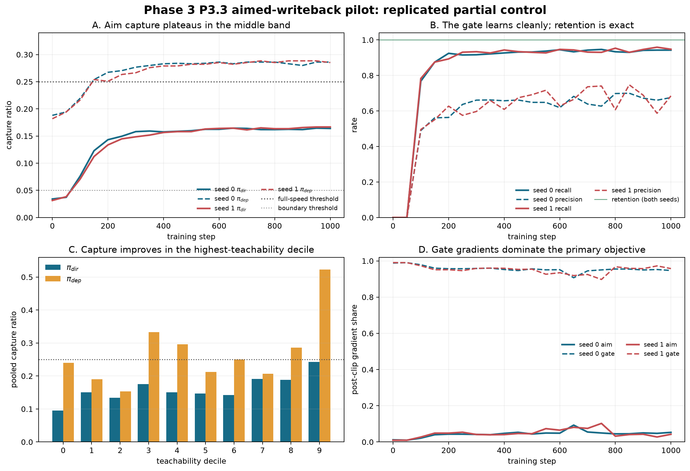

# Handoff: Phase 3 P3.3 Aimed-Writeback Pilot

Date: 2026-08-11. Audience: strategy and research agents. Status: both
registered seeds complete, artifacts recovered and hash-verified, A100 sessions
released, and ready for strategy review. P3.4 remains unauthorized.

## 0. Executive verdict

P3.3 produced a replicated partial-control result. The trained bridge captured
about one sixth of oracle forced-open aim while preserving every token in the
registered retention panel:

- pooled `pi_dir = 0.1653`, document-bootstrap 95% CI `[0.1472, 0.1833]`;
- seed 0 `pi_dir = 0.1640`, CI `[0.1464, 0.1821]`;
- seed 1 `pi_dir = 0.1667`, CI `[0.1487, 0.1841]`;
- pooled `pi_dep = 0.2857`, CI `[0.2360, 0.3367]`, but this secondary is
  materially BF16-reader-sensitive and must not carry the interpretation;
- retention `1024/1024` at all 20 looks in both seeds;
- collateral `chi = 0/24,576` observed held-out negative executions;
- both seeds completed 1,000 updates without warnings or a hard stop.

The primary registered reading is the middle band: `0.05 <= pi_dir < 0.25`.
The result neither opens P3.4 at full speed nor reaches the boundary condition.
Under the locked protocol, it authorizes exactly one preregistered iteration on
features or capacity, followed by a re-read.

The mechanistic diagnosis is sharper than "more capacity may help." The gate
learned well, but it dominated the primary optimization signal. At the final
look, gate gradients carried 94.7% and 95.7% of post-clip primary gradient in
seeds 0 and 1; aim carried only 5.3% and 4.3%. Mean held-out direction cosine
rose from about `0.0068` at initialization to about `0.069`, but remained low.
The next iteration should therefore test aim-specific optimization or
representation capacity, not merely extend the same recipe.

## 1. Question and rationale

Phase 2 established that bounded writeback has causal reach under oracle aim,
but its learned, unaimed path was harm-dominated. P3.3 asked the cheapest
question capable of killing or funding the larger Phase 3 program:

> Can a bridge trained from privileged oracle directions learn enough aim from
> deployable internal features to capture a useful fraction of the oracle
> writeback effect?

This is not an answer-quality experiment. P3.3 owns a local token-level causal
estimator and no multi-token task-inference contract. Strategy erratum e2
therefore correctly replaced the incompatible task guardrail with an
init-relative held-out token-retention panel and deferred task scoring to P3.4.

## 2. Locked design

### Lineages and trainable set

The two E1-confirmation full-system seeds were migrated independently:

| Seed | Migrated source checkpoint SHA-256 | Final checkpoint SHA-256 |
|---:|---|---|
| 0 | `d0f2b735825d29ab9801a5200493ca9aa65294778aea2fb7f728eb8e85dfc519` | `84dc0fb2d1f69114b20888acd95101d6b31c810974a536dc36358b69fe13c70e` |
| 1 | `3ca1cdf8dd16bf4f435e81a675d7514778144c5c881af52a70171659f7734b4f` | `e80ad205eb3c4712fdee5303a4887260488f67ff858a2b4b005d724675e52067` |

The full Phase 3 sidecar configuration contains 1,185,973 parameters. Under the
P3.3 freeze policy, 280,880 bridge, per-position-gate, and control parameters
were optimizer-marked; flow and draft head remained frozen. Frozen-parameter
digests matched before and after each run. Zero-loop hidden states and logits
were bit-exact in both seeds.

### Data and losses

- Training positives: 34,521, with `T >= 0.70` and strict 14B/32B concurrence.
- Training negatives: 103,563, rank-selected confident agreements.
- Positive audit: 4,096 held-out rows.
- Negative audit: 12,288 held-out rows, disjoint from training negatives.
- Retention panel: 1,024 held-out positions, 256 per horizon.
- Losses: cosine aim, inverse-class-weighted gate BCE, and preservation KL.
- Batch: 128, composed of 32 positives and 96 negatives.
- Optimizer: AdamW, learning rate `3e-4`, 100-step warmup, betas `(0.9, 0.999)`,
  weight decay `0.01`.
- Budget: 1,000 updates, exactly 20 registered looks every 50 updates.
- Gate ceiling: `gamma = 0.02` throughout training.
- Forced-open audit magnitude: `0.15` times the capped-RMS reference, with the
  oracle denominator evaluated at the identical magnitude.

### Guardrails and sealed material

Both runs asserted the final preflight hashes:

| Artifact | SHA-256 |
|---|---|
| Preflight summary | `9a71e3e59526383b3dd830a320a0e18ad3778571f67dac1e262ee2713ea0ffd0` |
| Guardrail calibration | `e46198291bdea16f3561b44eaa1a77764aa7a0fcc49a60c4c58802491aef985c` |
| Positive audit | `6dea4392c8c9e19d4903cd86ab70c7c922389c03e0be5f25615e2756c80f0579` |
| Negative audit | `8aed17517c1931a0b7ce4f4ae1feb4c50affd3edf5219621c39215180305791a` |
| Retention panel | `03167599552601caca753ae67233c569283757456065cade201c0312814a7418` |

Tier S stopped only after two consecutive retention drops past `-0.006` from
initialization. Tier W warned after two consecutive drops past `-0.001`.
Directional-share checks required aim plus gate to carry at least half of
post-clip gradient and preservation to remain at or below one quarter. No
guardrail fired. CONFIRM and EVAL-E remained untouched, and task-level
capability scoring remained disabled by assertion.

## 3. Primary and deployed capture

| Reading | Seed 0 | Seed 1 | Pooled | Pooled 95% CI |
|---|---:|---:|---:|---:|
| `pi_dir`, forced-open direction capture | 16.40% | 16.67% | **16.53%** | **[14.72%, 18.33%]** |
| `pi_dep`, realized-gate capture | 28.62% | 28.53% | **28.57%** | **[23.60%, 33.67%]** |

The pooled `pi_dir` numerator was 621 trained flips against 3,756 matched
oracle flips across 746 represented documents. The pooled `pi_dep` numerator
was 182 against 637 matched deployed-oracle flips.

Both seed curves rise rapidly through roughly step 300 and then flatten. The
near identity of the endpoints and curve shapes is stronger evidence of
replication than either point estimate alone. Additional duration under the
unchanged recipe is not supported by the observed slope.

### BF16 reader sensitivity

The locked primary includes all audit rows and uses the same BF16 hidden-state
reader in numerator and denominator. That reader disagreed with the originally
cached student top-1 on 153 of 4,096 positive rows per seed, a 3.74% mismatch.
The preregistered primary remains the all-row estimate, but the sensitivity is
scientifically important:

| Population | `pi_dir` | `pi_dep` |
|---|---:|---:|
| All rows, locked primary | 16.53% | 28.57% |
| Reader-matched rows only | 14.64% | 13.87% |
| Reader-mismatched rows only | 50.51% | 93.22% |

`pi_dir` remains in the same registered middle band after the sensitivity
restriction. `pi_dep` does not: the small mismatch subset carries most of its
apparent advantage. The defensible conclusion therefore rests on `pi_dir`.
The deployed reading is a watch item for P3.4's inference-contract build, not a
claim-ready result.

## 4. Gate, collateral, and retention

| Metric | Pooled point | Document-bootstrap 95% CI | Counts |
|---|---:|---:|---:|
| Gate recall | 94.51% | [93.53%, 95.45%] | 7,742 / 8,192 |
| Gate precision | 68.01% | [65.77%, 70.38%] | 7,742 / 11,383 predicted positives |
| Negative false-positive rate | 14.82% | [13.56%, 16.27%] | 3,641 / 24,576 |
| Collateral `chi` | 0.00% observed | bootstrap [0.00%, 0.00%] | 0 / 24,576 |
| Token retention | 100.00% | exact observed panel value | 2,048 / 2,048 seed-panel executions at every look |

The gate result is a genuine positive component: it detects almost all labeled
write positions and does so reproducibly. Precision remains imperfect, but the
deployed clamp is small enough that the held-out negative top-1 tokens did not
change. The observed zero collateral is bounded to this token-level estimator
and does not imply task-level or unrestricted safety.

## 5. Optimization diagnosis

### Direction learning occurred, but remained weak

Mean held-out direction cosine changed as follows:

| Seed | Step 0 | Step 1,000 | Change |
|---:|---:|---:|---:|
| 0 | 0.00697 | 0.06849 | +0.06152 |
| 1 | 0.00655 | 0.06961 | +0.06306 |

The final values are below the pre-run linear forecast's loop-4 values of
approximately 0.095 and 0.087. That comparison is descriptive because the
ridge forecast and nonlinear bridge optimize different objects, but it argues
against declaring that the available feature signal was exhausted.

### The registered combined-primary share concealed an internal imbalance

| Seed | Aim share | Gate share | Preserve share | Combined contract |
|---:|---:|---:|---:|:---:|
| 0 | 5.31% | 94.69% | 0.0007% | pass |
| 1 | 4.25% | 95.75% | 0.0011% | pass |

The contract correctly prevented preservation from becoming the experiment,
but it did not require balance inside the combined aim-plus-gate primary. The
gate objective therefore carried nearly all of the update geometry. This is
not a protocol violation. It is a measured reason the one allowed iteration
should rebalance or isolate aim before adding broad capacity or more steps.

## 6. Localization

Pooled forced-open capture increases with teachability but is not monotone.
The highest decile reaches `pi_dir = 0.2424`, just below the 0.25 full-speed
reading, while deciles 0 through 6 range from about 0.095 to 0.175. Deployed
capture reaches 0.5227 in decile 9, but the BF16 sensitivity above prevents
promoting that secondary.

The localization supports a selective iteration: concentrate additional aim
capacity or better-conditioned aim training where the cached teacher signal is
strong, but preserve the frozen audit and do not fit a mask to its outcomes.

## 7. Tier-1 observatory and A-state interventions

The exact teacher-minus-student local margin gradient aligned more positively
with the trained write by the endpoint. Mean `gradient_dot_write` reached
`0.01115` and `0.01156` in seeds 0 and 1. Mean bridge-write ratios were `0.1700`
and `0.1545`. The frozen flow's state-geometry measures were stable by design.

The 512-row paired A-state battery reports the fraction of the recurrent margin
effect removed by each intervention. A value of one means the full measured
effect disappeared; a value near zero means the intervention left it largely
unchanged.

| Intervention | Seed 0 mean ratio | Seed 1 mean ratio | Reading |
|---|---:|---:|---|
| Zero state | 1.000 | 1.000 | Removing state removes the measured recurrent margin effect. |
| Bridge bypass | 1.000 | 1.000 | The effect travels through writeback. |
| Norm-matched random | 0.433 | 0.489 | State geometry or distribution matters. |
| Cross-example state | 0.111 | 0.009 | Most effect survives another example's state. |
| Stale prior-loop state | -0.013 | -0.009 | Current-loop specificity is weak under this probe. |

This is mixed causal evidence. State and bridge presence are necessary, but
example-specific and current-loop state content account for little of the
measured margin effect. Combined with low direction cosine, the most plausible
failure signature is a bridge that learned a generic state-conditioned shift
and an effective gate, but not a sufficiently semantic per-example aim map.
The battery is local and ratio-based; this interpretation should remain a
hypothesis until the iteration tests it directly.

## 8. Registered reading

The primary decision statistic is `pi_dir`, not `pi_dep`.

- Full-speed reading: `pi_dir >= 0.25` — **not met**.
- Boundary reading: `pi_dir < 0.05` after the iteration budget — **not met**.
- Middle reading: one preregistered features/capacity iteration, then re-read —
  **met in both seeds and pooled**.

P3.3 is therefore a successful falsifier in the methodological sense: it ruled
out both the easy-win and no-channel stories. It found a reproducible,
collateral-free local signal that is too small for immediate P3.4 promotion.

## 9. Recommended next step and creativity slot

Do not launch P3.4 yet. Strategy should lock one bounded P3.3-R iteration with
the frozen audit unchanged. The recommended ordering is:

1. **Aim-specific balance first.** Separate aim and gate updates, or calibrate
   their post-clip shares so aim receives a material floor. Keep the gate
   architecture and labels unchanged because that component already works.
2. **Then test aim capacity if needed.** Add low-rank direction capacity or a
   richer deployable feature map, guided by decile localization. Do not widen
   every module indiscriminately.
3. **Refresh no oracle labels yet.** The current data produced a stable plateau;
   first determine whether optimization allocation, rather than label coverage,
   caused it.
4. **Repair the P3.4 reader contract before task scoring.** Use one canonical
   hidden-state precision/reader path so the deployed metric cannot be carried
   by near-boundary serialization differences.

Creativity slot: a cheap, training-free attribution on the final checkpoints
can decompose direction cosine and flip capture after replacing each deployable
feature block (`h_p`, scratch, control) with a cross-example counterpart. That
would identify which feature family carries the small learned aim before the
single iteration spends GPU. It should be run on DEV audit material only and
must not alter the registered P3.3 result.

## 10. Questions for strategy review

1. Does the one allowed iteration permit objective balancing, or must it be
   formally named a features/capacity change? The result indicates balancing
   is the first causal lever.
2. Should the iteration target the full population or the high-teachability
   strata where `pi_dir` approaches 0.25? A stratified curriculum may improve
   aim while narrowing scope.
3. Should the A-state cross-example result be treated as evidence for weak
   semantic use, or does the intervention need a feature-conditional matching
   control before that interpretation is adopted?
4. Is `pi_dep` retired until the canonical P3.4 inference reader exists? The
   present sensitivity strongly supports doing so.
5. What aim-share floor is large enough to make the iteration informative
   without turning a diagnostic shaper into the experiment? This should be
   calibrated from a short observe-only gradient pass before lock.

## 11. Integrity and artifacts

### Execution

- Implementation commit: `b7625fd1`.
- One fresh A100 session per seed; both released after archive verification.
- Both seeds completed 1,000/1,000 updates and 20/20 registered looks.
- Warnings: none. Stop reasons: none.
- Task-level scoring: false. CONFIRM scored: false. EVAL-E scored: false.

### Public receipts

- Combined receipt:
  `outputs/stage5/stage5_paper2_phase3_p33_20260811/combined_summary.json`
- Seed 0 public summary SHA-256:
  `779ac10f74462947c1b82040f91762cf02ec193cce9268963dbe30aa29d097d5`
- Seed 1 public summary SHA-256:
  `d9e4923bd127241d9d624e08538e5d56fecec63e5dc85a64b877191acb81a20d`
- Figure:
  `docs/figures/paper2_phase3_p33_result_20260811.svg` and `.png`
- Rebuild script:
  `scripts/build_paper2_phase3_p33_result.py`

### Recovered private archives

- Seed 0 archive SHA-256:
  `70bacfba059845def6710ba16fdc7f0c8995ccba9107a09b241a4640655733db`
- Seed 1 archive SHA-256:
  `8b071129039e3230088b7dace47e5263ab7f02f38e129269f8ce89c3df29347b`

Each archive contains the final and every-look checkpoints, step 0/500/1,000
row-level audits and observatory events, the public summary/status, and the
complete run log. The archives are transport artifacts and are not committed
to Git.

### Drive research-folder mirrors

| Artifact | Drive ID |
|---|---|
| Handoff markdown | `1F42Tm5CGximFgQkiw8tL9AUrZJBhtGZ8` |
| Combined JSON receipt | `1rlO-_v-qn3KEg8PnT6EJPNf_93Xw06yV` |
| SVG figure | `1o6lkgAXku1GE55WvkWBWafr6FBar23OH` |
| PNG figure | `1KDDEz710fLsc1LYQ6wEs8If2MEEx-FT8` |
| Seed 0 private archive | `1cItVRgd0L1Uf7REAwGcGUQxjM8lgtR8T` |
| Seed 1 private archive | `1XPVZUbpGnVIc_Pomwg9bY9W0QB7--eeX` |

## 12. Claim boundaries

Permitted:

> On the held-out P3.3 token audit, direction-supervised writeback captured
> about 16.5 percent of matched oracle forced-open flips in two closely
> replicating seeds, with no observed token-retention loss or collateral top-1
> changes under the tested clamp.

Not permitted:

- the model is better on tasks;
- P3.4 is confirmed or authorized;
- deployed capture is 28.6 percent without the BF16-reader caveat;
- collateral is universally zero or the system is generally safe;
- the 0.25 full-speed reading passed;
- the state is semantically routed merely because zeroing it removes the effect;
- either seed estimates population-level seed variability.

## 13. Plain-language summary

The experiment taught the system when to write much more successfully than it
taught the system what direction to write. It learned a real and highly
repeatable fraction of the oracle correction, caused no observed damage under
the registered local safety checks, and stopped improving well below the level
that would justify the full task-training campaign. This is neither a failure
nor a green light. It is the preregistered middle outcome: one focused repair,
aimed at the weak directional learner rather than the already-working gate,
then the same audit is read again.
