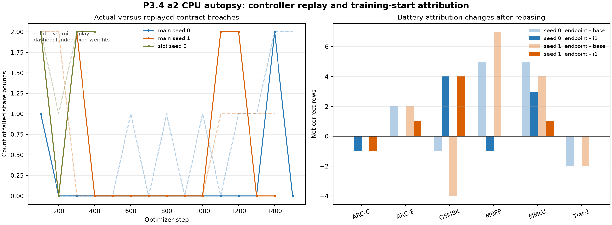

# Handoff: P3.4 a2 CPU Autopsy, Task Rebase, and Amendment Draft

Date: 2026-08-14. Audience: strategy and research review. Experimental status: authorized CPU-only analysis complete; amendment a2 drafted; no resumed training authorized.

## 1. Bottom line

The strategy response is reconciled and its two authorized desk jobs are complete to the extent permitted by the landed artifacts.

The controller diagnosis is confirmed. Rung demotion was the wrong actuator for objective-share failures. One static weight vector per rung cannot robustly satisfy the contract across both main seeds without effectively deleting preservation. A bounded dynamic log-weight controller avoids the four-consecutive-miss stop in a local replay of both main histories. Because the original campaign did not persist per-loss gradient bundles, that replay holds the observed group-clip geometry fixed and is not an exact counterfactual. The a2 draft therefore requires an exact gradient-bundle preflight at each pinned continuation checkpoint before optimizer construction.

The task diagnostic also changes the attribution. The published +9 and +7 endpoint rows compare against the frozen base, but P3.4 actually started from i1 checkpoints already +4 and +2 above base. P3.4 training itself added five pooled rows in each main seed. It improved GSM8K by four rows in each seed and did not newly lose the two Tier-1 items; both Tier-1 misses were already present at i1. The base-relative battery pattern is real as an endpoint description, but it is not all attributable to P3.4 training.

The sealed CONFIRM panel remains untouched and is underpowered for the currently priced effect. On the registered pooled membership, a single-seed paired sign-test plan needs approximately 2.06 accuracy points, 31 net CONFIRM rows, for 80% power at one-sided alpha 0.05. The observed mechanism-consistent range of 0.6 to 1.1 points has only about 17% to 37% projected pooled power.

Recommended next action: review and ratify the a2 draft. Do not resume GPU training before that signature and the exact pre-optimizer checks.

## 2. Provenance and integrity

Governing strategy response:

- Drive ID: `16lVxjVNEPUurmZ-TLN1hIh94QFXf13Go`.
- Repo mirror: `docs/STRATEGY_P34_RESULT_RESPONSE_20260814.md`.
- Bytes: 12,943.
- SHA-256: `76b4dd29024f86fb6b01c76ba747e7f60eea0280315b233ab51923f61308a761`.

Primary CPU receipt:

- Path: `outputs/stage5/stage5_paper2_phase3_p34_a2_autopsy_20260814/summary.json`.
- Bytes: 129,060.
- SHA-256: `25836439b34bebd83fd63286a1876cf974305f324479a0687c75e15e5037b1d4`.

The analysis loaded no model, constructed no optimizer, performed zero optimizer steps, and read only landed DEV receipts. `CONFIRM` and `EVAL-E` remain unscored.

## 3. Controller autopsy design

### 3.1 Reconstruction

For each landed share window, the analysis reconstructs the rung that generated the window. Share-controller transitions are applied before same-step task-controller transitions, matching the runner's event order.

The artifacts persist post-clip loss shares and the active scalar weights. The analysis divides each share by its active scalar weight to reconstruct a local unit mass. Alternative weights are then evaluated while holding the observed combined group-clip scales fixed. This answers whether reweighting is locally compatible with the observed geometry; it does not reproduce how the group clip would itself change under new weights.

### 3.2 Static tests

Two static analyses run per rung:

1. A linear program asks whether one vector can satisfy every hard floor and the preservation ceiling across both main seeds.
2. A nondegenerate geometric-mean fit aims at a rung-specific target allocation while retaining preservation.

The rung-specific preservation target is the median main-arm preservation share. The remaining mass is allocated in the registered floor ratio for KL, aim, CE, and gate.

### 3.3 Dynamic replay

The candidate controller applies at each non-overlapping 100-step window:

```text
delta_log_weight_i = clip(0.5 * log(target_share_i / observed_share_i), -0.5, 0.5)
```

Weights are then normalized to `KL = 1`. The controller logs the observed shares, proposed update, and same-window counterfactual before application. It cannot change the annealing rung.

## 4. Controller results

### 4.1 Continuation checkpoints

| Arm | Last evaluation with every share bound satisfied | SHA-256 |
|---|---:|---|
| main seed 0 | step 400 | `56dfa30d19166dfd3a788e2e6f68e0613f366e55601b5d690b087e1a3edb9230` |
| main seed 1 | step 1,000 | `2ff122cdc1d3c3208c9eb367345f360a31676f0f821c311ed98f6cc690c8e66f` |
| slot seed 0 | none | shelved |

### 4.2 Main-arm rung targets

| Rung | KL | Aim | CE | Gate | Preserve |
|---:|---:|---:|---:|---:|---:|
| 0 | 54.55% | 23.38% | 15.58% | 4.68% | 1.82% |
| 1 | 49.52% | 21.22% | 14.15% | 4.24% | 10.86% |

The slot arm is excluded from these binding targets because it adds a slot loss and is not continuing.

### 4.3 Static versus dynamic

| Analysis | Rung 0 | Rung 1 | Reading |
|---|---:|---:|---|
| joint hard-floor linear program | feasible only with preserve weight about `1e-8` | same | algebraically feasible, operationally degenerate |
| geometric target-fit static vector | 10/12 windows pass | 13/17 pass | nondegenerate but not robust |
| dynamic replay, main seed 0 | max miss streak 1 | pooled across its trajectory | no four-miss stop |
| dynamic replay, main seed 1 | max miss streak 2 | pooled across its trajectory | no four-miss stop |

The dynamic replay does not prove a resumed run will pass. It establishes that bounded per-window weight feedback addresses the measured failure mode under the local observed geometry, whereas a single static policy does not.

The optional cached PCGrad comparison could not run because exact gradient bundles were not persisted. No substitute statistic is presented as PCGrad evidence.

## 5. Task stratification

### 5.1 Rebased endpoint results

| Battery | Seed 0 endpoint minus base | Seed 0 endpoint minus i1 | Seed 1 endpoint minus base | Seed 1 endpoint minus i1 |
|---|---:|---:|---:|---:|
| ARC-Challenge | 0 | -1 | 0 | -1 |
| ARC-Easy | +2 | 0 | +2 | +1 |
| GSM8K | -1 | +4 | -4 | +4 |
| MBPP | +5 | -1 | +7 | 0 |
| MMLU | +5 | +3 | +4 | +1 |
| Tier-1 | -2 | 0 | -2 | 0 |
| **Pooled** | **+9** | **+5** | **+7** | **+5** |
| **Target half** | **+4** | **+2** | **+3** | **+3** |

This does not erase the endpoint-versus-base result. It distinguishes what the deployed endpoint is from what P3.4 training caused.

### 5.2 Tier-1 rows

The same two rows were wrong at i1 and at every P3.4 endpoint:

- `base_capability_addition_00`: `13 + 7`; expected `20`; sidecar output `10`.
- `base_capability_addition_02`: `15 + 13`; expected `28`; sidecar output `38`.

They are inherited task-inference-path failures. P3.4 did not create them, and preservation amplification during P3.4 cannot explain their first occurrence.

### 5.3 Unanswered gate questions

The cached task rows omit `position_gate` and realized writeback magnitude. Therefore the CPU artifacts cannot answer:

- gate-open rate by battery;
- whether GSM8K fixes or regressions co-locate with open writes;
- realized write magnitude by fix/regression class.

The a2 draft adds these fields to resumed DEV receipts as score-preserving telemetry. They cannot affect scoring, checkpoint choice, or the controller.



Figure reading: dashed lines in the left panel are the landed fixed-weight contract failures; solid lines are the local dynamic replay. The right panel separates endpoint-versus-base changes from the smaller endpoint-versus-i1 changes actually attributable to P3.4 training.

## 6. Confirmation power

CONFIRM membership from the sealed P3.1 manifest contains 1,502 pooled rows and 926 target-group rows. No row was scored.

| Accounting | DEV discordance | 80%-power minimum net rows | Minimum points | Planning gap closed |
|---|---:|---:|---:|---:|
| pooled | 9.38% | 31/1,502 | 2.064 | 7.24% |
| target group | 15.33% | 31/926 | 3.348 | 10.92% |

Projected pooled power at 0.6, 0.8, and 1.1 points is 16.6%, 23.6%, and 36.8%. Target-group power is 10.3%, 13.4%, and 19.1%.

The two seed row-delta vectors are highly correlated: 0.917 pooled and 0.930 on the target group. A normal planning approximation to the average two-seed effect only lowers the required pooled effect from 2.064 to 1.923 points. Treating seed rows as independent observations would be invalid.

The amendment recommends a conservative eligibility threshold of a mean `+22/1024` pooled DEV rows across the two registered endpoints, with each seed positive and each target-half delta non-negative. If strategy prefers a joint-seed CONFIRM test, its cluster-level estimator and power simulation must be locked before the seal is spent.

## 7. Amendment a2 delivered

Human-readable draft:

- `docs/PAPER2_PHASE3_P34_AMENDMENT_A2_DRAFT_20260814.md`.
- Bytes: 11,056.
- SHA-256: `0d6a7a4d7b07c16ec6d790af1ab931e1c88a0f7f54902bc68814b6e654fc9320`.

Machine-readable non-executable companion:

- `training/paper2_phase3_p34_amendment_a2.draft.json`.
- It explicitly sets `locked_before_resumed_training=false`, `training_authorized=false`, and `mark_ratified=false`.

The draft binds the continuation hashes, controller formula and cadence, rung targets, exact pre-optimizer requirement, telemetry additions, confirmation-planning arithmetic, unchanged contracts, and do-not-claim boundaries.

## 8. Interpretation

The result supports continuation, but not blind continuation. The task signal survives the more honest i1 rebase: both main seeds still gain five pooled rows during P3.4, so the campaign did not merely inherit all improvement. The mechanism appears to be working at the small scale predicted by its causal capture ceiling.

The failure is a controller design failure, not evidence that the model path is incapable. The objective controller used the annealing rung as an indirect actuator for a gradient-allocation problem. The local replay shows that direct weight-space feedback is the appropriate actuator. However, because clipping is part of the estimator, the exact preflight is essential; omitting it would repeat the earlier matched-estimator error in a subtler form.

The power result is the largest strategic constraint. Completing training may consolidate the observed effect without making it large enough for the existing sealed panel to resolve. That is not a reason to alter the experiment now. It is a reason to set confirmation eligibility from power before spending the seal and to accept an exploratory-positive boundary if the completed effect stays below it.

## 9. Limitations and claim boundaries

- CPU reweighting replay holds observed group-clip scales fixed.
- No exact cached PCGrad arm was possible.
- Gate-by-battery telemetry was absent from the landed task rows.
- Task effects remain small DEV counts with uncertainty spanning zero.
- The two seeds share highly correlated row-level outcomes and do not behave like independent row samples.
- Slot-arm shelving is a cost decision after 400 steps, not a falsification.
- CONFIRM and EVAL-E remain sealed.

Do not claim a better model, confirmation, a general GSM8K or MBPP capability result, universal safety from `chi=0`, or that all endpoint-versus-base changes were caused by P3.4.

## 10. Questions for strategy and Mark

1. Ratify the dynamic controller constants, main-only rung targets, and exact pre-optimizer preflight as drafted?
2. Ratify `+22/1024` mean pooled DEV rows as the minimum exploration effect that may open a P3.6 draft, while retaining positive-per-seed and non-negative-target-half coherence?
3. Confirm that a cluster-level two-seed estimator remains a P3.6 design option but is not silently substituted now?
4. Confirm that the missing gate/write telemetry is instrumentation-only and may ride the resumed DEV pass without another amendment?

## 11. Next steps after ratification

1. Mark the a2 document and machine companion locked and approved.
2. Implement the dynamic controller and telemetry under focused tests.
3. Run exact no-update gradient-bundle preflights at the two pinned checkpoints.
4. Resume main seed 0 from step 400 and main seed 1 from step 1,000 toward step 4,000.
5. Report every original task look and every 100-step share window; preserve the original catastrophe tripwires.
6. Read the completed DEV endpoints against the bound confirmation-eligibility criterion before drafting P3.6.

## 12. Plain-language summary

The earlier report said the two main models ended nine and seven questions above the frozen base. That is true, but some of those gains and losses were already present before this training phase began. Starting from the models that actually entered P3.4, training added five correct answers in each seed. It also improved the math battery rather than damaging it, and the two easy arithmetic misses were inherited from the starting model.

The training controller still needs repair. Its old response to an imbalanced learning objective was to change model operating conditions, which often worsened the imbalance. A direct controller that adjusts the loss weights would have avoided the shutdowns in a careful replay. Before trusting that replay, the resumed launcher must recompute the exact gradients and clipping behavior at step zero. Nothing trains unless that check passes.

The final exam is probably too small to settle an effect as small as the one currently measured. We now know that before opening it. The correct sequence is to repair and finish the exploratory run, then open the sealed confirmation only if the completed effect is large enough for that exam to answer the question.
