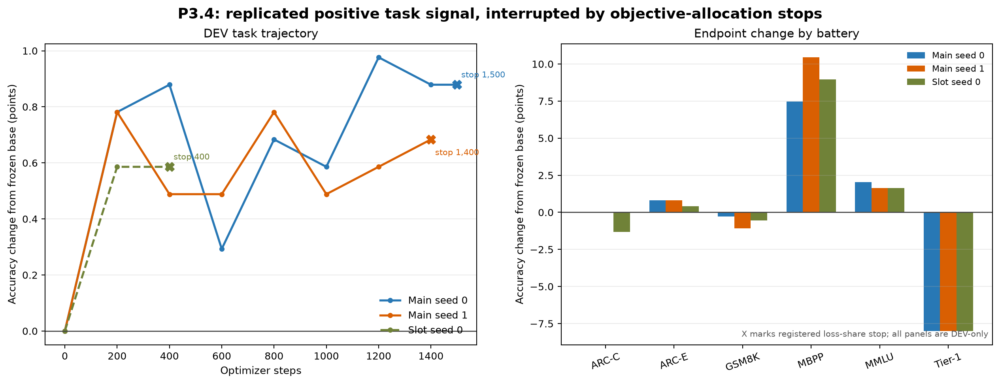
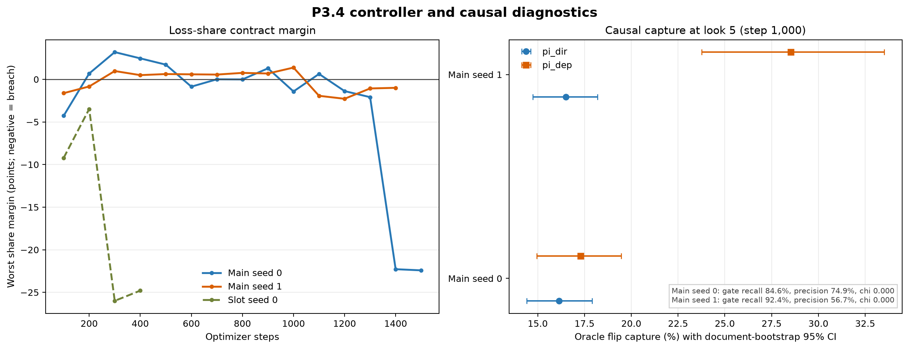

# Handoff: P3.4 DEV Campaign - Replicated Positive Signal, Objective-Controller Stop

**Date:** 2026-08-13
**Audience:** strategy and research review
**Experimental status:** all three authorized runs landed; each exited through the registered loss-share stop; both A100 sessions released; CONFIRM and EVAL-E remain sealed
**Recommended ledger reading:** `POSITIVE_SIGNAL_WITH_OBJECTIVE_CONTROLLER_STOP`
**Claim scope:** exploratory DEV evidence only

## 0. Bottom line

P3.4 produced a small positive DEV task signal in all three authorized conditions, but it did not complete the registered 4,000-step campaigns. The full-system main arms improved the frozen base by 9/1,024 rows at step 1,500 (seed 0) and 7/1,024 at step 1,400 (seed 1). The slot arm improved by 6/1,024 at step 400. All three then stopped under the exact four-consecutive-window loss-share rule.

The task signal is replicated in direction but not statistically resolved. The endpoint paired sign-test p-values are 0.417, 0.538, and 0.610, and all document-bootstrap confidence intervals for the accuracy difference include zero. No `better model`, confirmation, or general capability claim is supported.

The campaign nevertheless answers two mechanism questions:

1. **The sidecar can change real task answers beneficially under the registered inference graph.** Every scored look in both main seeds remained above the frozen base, ranging from +3 to +10 rows. The slot arm was +6 rows at both looks.
2. **The current objective controller cannot sustain the registered multi-loss allocation.** Rung demotion did not restore the loss shares. In seed 0 and the slot arm, demotion was followed by aim dominance and collapse of KL and CE shares. In seed 1, gate share remained below its floor. The scientific run ended because the optimizer allocation became invalid, not because of a crash, lineage failure, task guardrail, or sealed-data contact.

The appropriate next decision is a narrow controller amendment, not a null declaration and not immediate confirmation. Rebalance loss weights under the observed rung-specific gradients, decouple loss-share recovery from annealing-rung demotion, and determine whether the three stopped checkpoints may resume under one pre-specified amendment. Do not score CONFIRM or EVAL-E.

## 1. Governing authority and lineage

The campaign used:

- pinned code commit `431fdfed30db8439e1ed9d60180e39ac28926ed8`;
- one governing machine lock, SHA-256 `4dc4cf82856552375e976bf1b4813c29f6ca8d1eb0b7c1084c6843b40ccc19c3`;
- the strategy share-rule ratification in `docs/STRATEGY_P34_SHARE_CONTRACT_CONFIRMATION_20260813_r2.md`;
- sampled-depth amendment ratification in `docs/STRATEGY_P34_AMENDMENT_A1_RATIFICATION_20260813.md`;
- the executed lock in `docs/PAPER2_PHASE3_P34_EXECUTED_LOCK_20260813.md` and `training/paper2_phase3_p34_preregistration.json`.

The three conditions intentionally had distinct deterministic sampled-depth schedules:

| Condition | Schedule SHA-256 | Source lineage |
|---|---|---|
| Main seed 0 | `a81a7e4e...0a685` | seed-0 migrated P3.3 + i1 endpoint |
| Main seed 1 | `1a12a88e...1dee1` | seed-1 migrated P3.3 + i1 endpoint |
| Slot seed 0 | `269551e9...a2062` | seed-0 migrated P3.3 + i1 endpoint, plus slot lift |

For every arm, the frozen digest before and after training is identical. The task-row receipts assert `confirm_scored=false` and `eval_e_scored=false`. Checkpoint transport preserved the registered state keys and hashes.

## 2. Experimental design

### 2.1 Question

P3.4 asks whether the previously installed causal write pathway converts token-level oracle-flip capture into better answers on real tasks under a fixed task inference graph.

### 2.2 Task inference contract

The inference graph initializes a fresh scratch state for each emitted token, runs exactly four recurrent flow loops, writes only at the current nonzero position, disables the draft head for scoring, and carries no sidecar state across emitted tokens. This is the first phase in this line to use task-level gap closed against the 14B teacher as the main outcome rather than a token-level proxy.

### 2.3 Arms

- **Main seed 0:** full registered bridge, gate, control, and write pathway initialized from seed-0 i1.
- **Main seed 1:** independent replication initialized from seed-1 i1.
- **Slot seed 0:** the registered capacity fork, adding the slot-lift trainable component to the seed-0 system.

The registered target was 4,000 optimizer steps. Task evaluation occurred every 200 steps. Loss-share windows were non-overlapping 100-step windows. Causal audits were scheduled at looks 5, 10, 15, and 20; only look 5 was reached by the main arms.

### 2.4 Task panel and estimator

The fixed DEV panel has 1,024 unique documents:

| Battery | Rows | Frozen base | 14B teacher | Teacher-base gap |
|---|---:|---:|---:|---:|
| ARC-Challenge | 76 | 41 | 70 | 29 |
| ARC-Easy | 243 | 189 | 241 | 52 |
| GSM8K | 369 | 107 | 211 | 104 |
| MBPP | 67 | 28 | 52 | 24 |
| MMLU | 244 | 115 | 195 | 80 |
| Tier-1 | 25 | 22 | 25 | 3 |
| **Pooled** | **1,024** | **502** | **794** | **292** |

The primary pooled task statistic is:

`gap_closed = (augmented_correct - base_correct) / (teacher_correct - base_correct)`.

Paired uncertainty is reported two ways: an exact two-sided sign test over base/model discordances and a 10,000-draw percentile bootstrap over `document_id` (seed 20260813). There is one scored row per document in this panel.

### 2.5 Registered objective-allocation contract

The trailing-window gradient-share requirements were:

- KL at least 35%;
- aim at least 15%;
- CE at least 10%;
- gate at least 3%;
- preserve at most 25%;
- slot at least 10% in the slot arm.

The first breach was observed. Two consecutive breaches demoted one controller rung. Four consecutive breaches stopped the run. Only one rung transition was permitted per window.

## 3. Task results

### 3.1 Endpoint summary

| Condition | Stop step | Correct | Change vs base | Gap closed | Fixes / regressions | Sign-test p | Bootstrap 95% CI, accuracy change |
|---|---:|---:|---:|---:|---:|---:|---:|
| Main seed 0 | 1,500 | 511/1,024 | +9 (+0.879 points) | 3.08% | 53 / 44 | 0.417 | [-0.977, +2.832] points |
| Main seed 1 | 1,400 | 509/1,024 | +7 (+0.684 points) | 2.40% | 51 / 44 | 0.538 | [-1.172, +2.637] points |
| Slot seed 0 | 400 | 508/1,024 | +6 (+0.586 points) | 2.05% | 51 / 45 | 0.610 | [-1.270, +2.441] points |

All three endpoint directions are positive. None is individually distinguishable from zero at conventional levels, and the exploratory repeated-look design does not license selecting the best look as a confirmatory endpoint.

### 3.2 Main-arm trajectories

| Step | Main seed 0 change | Main seed 1 change |
|---:|---:|---:|
| 200 | +8 | +8 |
| 400 | +9 | +5 |
| 600 | +3 | +5 |
| 800 | +7 | +8 |
| 1,000 | +6 | +5 |
| 1,200 | **+10** | +6 |
| 1,400 | +9 | +7 (stop) |
| 1,500 | +9 (stop evaluation) | - |

Seed 0's largest observed difference was +10 rows at step 1,200 (3.42% of the teacher gap). Seed 1's largest was +8 rows at steps 200 and 800 (2.74%). These maxima are descriptive checkpoints, not registered endpoint estimates.

### 3.3 Endpoint battery decomposition

| Battery | Main seed 0 | Main seed 1 | Slot seed 0 |
|---|---:|---:|---:|
| ARC-Challenge | 0 | 0 | -1 |
| ARC-Easy | +2 | +2 | +1 |
| GSM8K | -1 | -4 | -2 |
| MBPP | +5 | +7 | +6 |
| MMLU | +5 | +4 | +4 |
| Tier-1 | -2 | -2 | -2 |
| **Pooled** | **+9** | **+7** | **+6** |

The direction is not uniform across tasks. The positive aggregate is concentrated in MBPP and MMLU. GSM8K is flat-to-negative, ARC-Challenge is flat in the main arms, and the 25-row Tier-1 slice loses two rows in every endpoint. Because MBPP has only 67 rows, its large percentage-point change is imprecise and should not be treated as a standalone capability result.

The pre-specified target half (ARC-Challenge, GSM8K, MBPP; 512 rows) changed by +4, +3, and +3 rows in the three conditions. That closes 2.55%, 1.91%, and 1.91% of its 157-row teacher gap. The floor half changed by +5, +4, and +3 rows, closing 3.70%, 2.96%, and 2.22% of its 135-row gap.

## 4. Causal audit at step 1,000

Both main arms reached causal look 5:

| Metric | Main seed 0 | Main seed 1 |
|---|---:|---:|
| `pi_dir` | 16.13% [14.42, 17.91] | 16.51% [14.73, 18.19] |
| `pi_dep` | 17.29% [14.95, 19.45] | 28.53% [23.77, 33.53] |
| Gate recall | 84.64% | 92.43% |
| Gate precision | 74.90% | 56.70% |
| Gate false-positive rate | 9.46% | 23.53% |
| Collateral `chi` | 0 | 0 |
| Mean direction cosine | 0.0717 | 0.0725 |

The exact all-row BF16 reader remains primary. The reader-match sensitivity subset covered 96.26% of rows and yielded lower matched estimates: seed 0 `pi_dir=14.22%`, `pi_dep=13.19%`; seed 1 `pi_dir=14.61%`, `pi_dep=13.85%`. The discrepancy is already a known reader-sensitivity boundary and should remain visible.

The main finding is replication of nonzero causal capture with zero measured collateral under the registered audit. Seed 1's high `pi_dep` is accompanied by lower precision and a much higher false-positive rate, so it is not clean evidence of superior routing.

## 5. Why the runs stopped

### 5.1 Main seed 0

KL intermittently fell below 35% while the system remained at rung 1. Consecutive KL misses at steps 1,200 and 1,300 triggered demotion to rung 0. After demotion, the allocation moved sharply toward aim:

- step 1,400: aim 74.85%, CE 4.37%, KL 12.72%;
- step 1,500: aim 76.06%, CE 4.43%, KL 12.58%.

CE and KL therefore remained below floor for four consecutive windows, producing the registered stop at step 1,500.

### 5.2 Main seed 1

Seed 1 was demoted to rung 0 at step 200 after early aim and gate misses, recovered, and returned to rung 1 after the step-1,000 causal audit. Gate share then fell to 0.72% at step 1,200 and remained below 3%, including 2.00% at step 1,400. Four consecutive gate misses produced the stop.

### 5.3 Slot seed 0

The slot arm was demoted at step 200 after consecutive KL misses. Slot itself remained funded (14.98% at step 200, 27.38% at step 300, 21.16% at step 400), but CE and KL collapsed after demotion. At step 400 CE was 3.68% and KL 10.20%, producing the four-window stop.

### 5.4 Controller interpretation

The demotion rule was implemented correctly, but the observed response is opposite its intended recovery function. Lowering the annealing rung changes the forward/loss geometry; it does not directly rebalance gradient shares. In two arms, that geometry change made aim dominate and pushed CE/KL farther below floor. In the other arm, gate remained starved. This is a measured controller-design problem, not permission to ignore the registered stop.

The slot result also argues against treating extra slot capacity as the immediate remedy. The slot objective was adequately funded, yet the arm stopped earlier and showed no clear task advantage over the main arms.

## 6. Operational recovery and integrity

The original main runtimes reached durable step-1,200 checkpoints before their server-side sessions were pruned. Replacement sessions restored those exact checkpoints, verified checkpoint/state digests, and resumed without changing code, data, schedules, weights, estimators, or thresholds. The mandatory stop evaluations were then written and republished to the same durable release.

This recovery is operational, not a scientific amendment. The final receipts preserve:

- the same pinned commit and lock;
- condition-specific schedule hashes;
- frozen-lineage before/after equality;
- no CONFIRM or EVAL-E scoring;
- registered exit code 2 for each loss-share stop.

All Colab sessions were released after durable publication. `colab sessions` returned no active server sessions. The runs used NVIDIA A100-SXM4-40GB instances. The private durable release is `mshapiro123/recurrent-qwen-svgd-runtime-private`, tag `p34-campaign-20260813`.

## 7. Interpretation

### Supported, bounded

- Real-task predictions changed in a beneficial aggregate direction in both independent main seeds and the slot arm.
- Nonzero causal flip capture replicated at the step-1,000 audit.
- No collateral was observed under the registered audit estimator.
- The loss-share/rung controller failed to maintain its intended objective allocation across the planned campaign.
- Rung demotion did not restore shares and appears to have worsened allocation in seed 0 and the slot arm.

### Not supported

- The augmented system is better than the frozen base.
- P3.4 completed its registered training budget.
- The task gain is statistically resolved or generalizes beyond DEV.
- The slot arm improves on the main arm.
- The sidecar closes a practically large share of the 14B gap.
- Any CONFIRM, EVAL-E, or cross-dataset claim.

### Why this is not a null

Calling the campaign null would discard three consistent positive endpoints and positive values at every main-arm task look. Calling it positive confirmation would ignore broad paired uncertainty, task heterogeneity, and premature objective-controller stops. `POSITIVE_SIGNAL_WITH_OBJECTIVE_CONTROLLER_STOP` keeps both facts intact.

## 8. Limitations

1. The campaign stopped at 400-1,500 of 4,000 planned steps.
2. Only two independent main seeds and one slot seed were run.
3. Repeated DEV looks are exploratory and create selection risk; best checkpoints are not confirmatory endpoints.
4. The 1,024-row panel is broad but subgroup samples, especially MBPP and Tier-1, are small.
5. The 14B teacher is a reference model, not ground truth, and `gap_closed` inherits its errors.
6. `pi_dir`/`pi_dep` retain known BF16-reader sensitivity.
7. The exact current inference contract uses fresh per-token state; cross-token persistence remains outside scope.
8. The stop isolates objective allocation, but does not by itself identify the correct replacement controller.

## 9. Questions for strategy

1. Should the three stopped checkpoints be eligible for one amended continuation, or should any repaired controller start again from the i1 endpoints?
2. Should loss-share recovery operate by dynamically re-solving scalar weights while holding the annealing rung fixed, rather than using rung demotion as a proxy?
3. Should share targets be rung-specific, given the large measured distribution shift after demotion?
4. Does the consistent +MBPP/+MMLU and -GSM8K/-Tier-1 pattern motivate a pre-registered stratified diagnostic before more training, or is the panel too small for mechanism-level interpretation?
5. Should the slot arm be retired now, retained only as archaeology, or allowed one matched repaired-controller continuation?
6. What minimum DEV effect should authorize the still-sealed confirmation pass after a repaired campaign: absolute rows, relative teacher-gap closure, or a paired confidence criterion?

## 10. Recommended next steps

1. **Bank this campaign without opening sealed evaluation.** Add a ledger entry with status `supported_bounded` or `exploratory_positive_interrupted`, explicitly noting the registered share stops.
2. **Run a CPU-only controller autopsy.** Reconstruct each 100-step window by rung and estimate the scalar weight vector that would have met the same share targets. This prices whether a rung-indexed static solution is sufficient.
3. **Draft one narrow amendment.** Preserve data, losses, task panel, inference graph, thresholds, and checkpoint lineage. Change only the share-recovery mechanism and specify continuation-versus-restart.
4. **Prefer direct share control.** A conservative candidate is multiplicative log-weight feedback per loss, clipped and updated only at 100-step boundaries. Annealing-rung changes should remain tied to task/causal criteria rather than objective-budget repair.
5. **Keep catastrophe tripwires armed.** Frozen-lineage, non-finite loss, sealed-data, task-collapse, and collateral checks remain unchanged.
6. **Do not run P3.6 or CONFIRM.** Those require a completed, strategy-ratified P3.4 reading.
7. **Treat the code-review backlog separately.** Begin the narrow rotary-fallback tests and bridge-equivalence refactor only on a post-campaign branch; do not rewrite the checkpoint-defining model path during amendment design.

## 11. Creative alternatives for review, not authorization

- **Rung-indexed static weights:** solve one calibrated scalar vector per rung from cached gradients. This is the smallest change and directly addresses the estimator shift.
- **Projected share controller:** update log weights toward target shares at each window while constraining the update norm and recording counterfactual expected shares before applying it.
- **Gradient-conflict-aware composition:** if recalibration shows target shares are algebraically attainable but gradients conflict, compare a bounded PCGrad/CAGrad-style composition against scalar reweighting on cached gradients before any GPU run.
- **Two-timescale control:** let objective weights recover quickly at 100-step windows while the inference rung advances or demotes only on slower task/causal evidence. This separates optimization health from capability scheduling.
- **Task-stratified holdout diagnostics:** reserve a small DEV-only analysis to test whether code/knowledge gains and arithmetic losses track gate behavior, without using the result to choose a reported checkpoint.

## 12. Plain-language summary

The added reasoning mechanism helped a little on the development set in every run. The improvement was small: six to nine more correct answers out of 1,024 at the final checkpoints, with the best observed checkpoint ten answers above the base model. The uncertainty is large enough that this is a promising signal, not proof of a better model.

Training stopped because the system could no longer keep all of its learning objectives properly funded. The safety rule worked as written, but its recovery action did not: reducing the computation rung often made one objective dominate and starved others. The next experiment should repair that controller while leaving the model, data, and evaluation rules alone. The untouched confirmation set should stay untouched until that repaired campaign completes.

## 13. Reproducible artifacts and receipts

### Public analysis

- Analysis builder: `analysis/build_paper2_phase3_p34_campaign_handoff.py`
- Machine-readable result: `outputs/stage5/stage5_paper2_phase3_p34_analysis_20260813/summary.json`
- Task figure: `docs/figures/p34_campaign_task_curve_20260813.svg` and `.png`
- Controller figure: `docs/figures/p34_campaign_controller_20260813.svg` and `.png`
- This handoff: `docs/PAPER2_PHASE3_P34_CAMPAIGN_HANDOFF_20260813.md`

The analysis summary is 76,965 bytes with SHA-256 `15a69ba0662af6d60a970833fd13cdf2309e0f5eb9ecc95e198e01f32ea9844b`.

### Durable private bundles

| Condition | Bundle bytes | Bundle SHA-256 |
|---|---:|---|
| Main seed 0 | 27,240,038 | `68690f51e2663a0933061ae4cab34be56727590c027958d7ab3bff99e9887756` |
| Main seed 1 | 24,065,070 | `c66f4efe1f182e4b336d65e2eddf843af108a4359f048c4ab8495411ce8fd93d` |
| Slot seed 0 | 8,950,394 | `3bb12885f7ba7e053bd11a62c062a55c5831c30bbed2ee5bf42398f6e82ef7a2` |

Private source: release `p34-campaign-20260813` in `mshapiro123/recurrent-qwen-svgd-runtime-private`. Local analysis copies live under `.codex_p34_final_download/` and are intentionally not committed.

### Exact endpoint row hashes

- Main seed 0 final rows: `6d46f468a1d105bcb7dc90b7c663bd0cea47617b0758c406d6699003f6eaa169`
- Main seed 1 final rows: `1da968f3b57f8fdeb2bac0fc1437ba032a42af12fb7f521056a6bc4d2ee7350b`
- Slot seed 0 final rows: `b65af42d1783915f5a572e0b217063ffc377bb2c80d858e6ca02f56469c4b7ef`

### PyTorch review disposition

The separate engineering review is banked at `docs/MODELS_PACKAGE_CODE_REVIEW_RESPONSE_20260813.md`. Its findings are valid maintenance and publication-readiness work, but no evidence from the review invalidates this campaign. No behavior-changing `models/` edit entered the pinned P3.4 lineage.

### Drive research-folder package

All files are stored as raw, non-converted artifacts in research folder `1aSbU2i8JZ37g5bJpyweLuvFaV0y92Qjr`:

- campaign handoff: Drive `1-Pez1Xz9YcXVTwWHDWGsqUEFzuToskpK`;
- machine-readable summary: Drive `15cZfn8YSXC7V9ITc3JWwuquU0oHbk9Et`;
- task figure SVG/PNG: Drive `1lQYxX5-QbyJ3uzk425xkE65Dc9OR84hy` / `1FzfW1dTfo8WgjTuFBUrExAREBfTczGT1`;
- controller figure SVG/PNG: Drive `14T3QGGcegGpo5QWckFhkJAIKcHws-Zfq` / `1k1MEUz9Gyf7KrOOFHxUXPg0hjiEagljW`;
- models-package code-review response: Drive `14enZwjVANQZ8elzUCuGHNinIARxaAL7M`.

The byte/hash manifest is `outputs/stage5/stage5_paper2_phase3_p34_analysis_20260813/drive_upload_receipt.json`.
