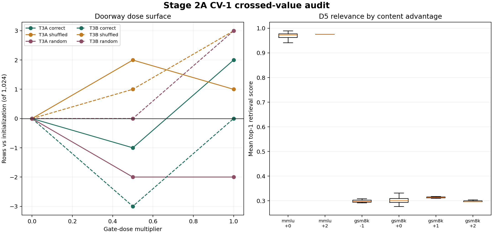

# Handoff: Stage 2A CV-1 Crossed-Value Audit and D5 Relevance Probe

**Date:** 2026-08-18  
**Program:** Paper Two, Stage 2A  
**Status:** complete, analyzed, packaged, and paid GPU released  
**Diagnostic reading:** no resolved content-identity effect under the fixed-map L4 audit  
**Registered T3 verdict:** unchanged, `SCREEN_BELOW_PROCEED_THRESHOLD`  
**Data boundary:** reused 1,024-row DEV panel only; CONFIRM and EVAL-E remain sealed

## 0. Bottom line

CV-1 does not establish that the learned memory values themselves caused the Stage 2A screen's small task effects. When the trained host maps were frozen and only value identity changed, correct values did not consistently beat shuffled or moment-matched random values.

At the full registered dose, the teacher-fingerprint host (T3a) scored two rows above its matched dose-zero initialization. Correct values beat random values by four rows and shuffled values by one row, but the paired probabilities were `0.3438` and `1.0000`. The literal n-gram host (T3b) returned exactly to initialization with correct values, while both shuffled and random values finished three rows above initialization. Correct T3b values were three rows below either control (`p=0.375` for each contrast).

The targeted D5 probe likewise found no useful routing signal. On MMLU and GSM8K, the correlation between top-1 retrieval relevance and row-level content advantage was approximately `0.04` in each battery, with Holm-adjusted `p=0.7963`. Compatibility-gate and entropy correlations were also near zero. Only four strict correct-content wins appeared among 613 targeted rows, with no strict losses, so the mechanism is too sparse here to support a learned relevance rule from these features.

The correct interpretation is narrower than the prior doorway hypothesis. The pathway is live, but the audit does not show that correct memory content is the source of the pooled benefit. A T4 sufficiency head should therefore not launch automatically from these receipts. Its stated prerequisite was content causality under fixed maps, and that prerequisite did not land.

One audit limitation is material. The unchanged seed-0 endpoints did not reproduce their original A100 screen outputs on the L4. T3a changed 158 predictions and 41 correctness labels; T3b changed 166 predictions and 38 correctness labels. The within-L4 crossed-value comparisons remain controlled, but the L4 absolute counts cannot replace or be pooled with the original A100 screen counts.

## 1. Question and rationale

The Stage 2A screen trained each memory arm's values, gate, and injection map together. Its positive arm-versus-control differences therefore mixed at least three effects:

1. value content;
2. a trained pathway that may use generic injected energy or bias; and
3. co-adaptation between values, gate, and projection.

CV-1 removed the between-arm co-adaptation ambiguity. It loaded the completed seed-0 T3a and T3b EMA endpoints, froze every non-value tensor, and rescored the same DEV rows after replacing only the value bank. D5 then asked whether the fingerprint host's retrieval telemetry predicted the rows on which correct values beat both controls.

This was score-only diagnostic reuse. It had no authority to revise the T3 screen verdict, open T3-full, score sealed data, or authorize training.

## 2. Locked design

### 2.1 Hosts and frozen state

- T3a teacher-fingerprint checkpoint SHA: `07378424dca2f5705e61a4bf18721aead574f795a6ff0bfb0762e6ba48769cee`.
- T3b literal n-gram checkpoint SHA: `0c1d00a51e134d232589b6aaa3cc9949563d3c22eca470b8dcde7bbb8b6eda79`.
- Frozen sidecar digest: `a3d3b6ea9b9c1c6857d2dd1a6ea96bce66b79b366501c7795348ab929e5a707f`.
- Panel SHA: `c0e15a890b598544059ac337cc475123f97c05e3c1626febcdee1c6d8fe02615`.
- Registered inference: K=4, bridge ceiling `0.02`, Stage 2A amplitude `0.05`.
- Diagnostic runtime: NVIDIA L4, BF16 model execution.

### 2.2 Value conditions

For each host:

- `correct`: the checkpoint's EMA value bank unchanged;
- `shuffled`: a fixed complete-row permutation, seed `20260818`;
- `random`: deterministic per-coordinate moment-matched Gaussian values, seed `20260819`.

The trained gate, projection, slot weights, addressing rule, bridge, control state, and frozen substrate stayed fixed. Every value transform asserted an unchanged fixed-map digest.

### 2.3 Dose surface

Each value condition was read at multipliers `0`, `0.5`, and `1.0`, applied immediately before the existing injection projection. Dose zero was physically evaluated once per host and reused for the three logical zero-dose cells. The two hosts' zero-dose serving outputs were bit-exact, establishing a common matched initialization within the L4 runtime.

The complete battery contained 14 physical evaluations and 18 logical cells.

### 2.4 D5

D5 used T3a's full-dose correct, shuffled, and random row receipts on MMLU and GSM8K. Its row-level outcome was:

`content_advantage = 2 * I(correct succeeds) - I(shuffled succeeds) - I(random succeeds)`.

Primary predictor: mean top-1 retrieval score. Secondary predictors: compatibility-gate mean and retrieval-entropy mean. The locked analysis used Spearman correlation, 10,000 deterministic permutations, and Holm correction across the two primary battery tests.

## 3. Integrity and execution

- Status: `complete_dev_score_only`.
- Optimizer constructed: false.
- Training authorized: false.
- CONFIRM scored: false.
- EVAL-E scored: false.
- Registered T3 verdict changed: false.
- Dose-zero host outputs bit-exact: true.
- Every checkpoint, panel, geometry, and source-summary hash passed.
- Every cell wrote durable row receipts before aggregation.
- No non-value tensor changed during value transformation.

The run required three resumable L4 allocations because Colab's CLI connection expired during long scoring passes. Completed physical cells were reused only after their status, checkpoint hash, condition, dose, and row-file hash matched. The final runner exited successfully and wrote a complete receipt bundle. The known L4 session was explicitly stopped after the bundle and session log were copied.

## 4. CV-1 pooled results

All deltas in this section are against the dose-zero initialization rescored in the same L4 runtime (`512/1,024`). This is the clean causal comparator for CV-1.

| Host | Value condition | Dose 0 | Dose 0.5 | Dose 1.0 |
|---|---|---:|---:|---:|
| T3a fingerprint | correct | 0 | -1 | **+2** |
| T3a fingerprint | shuffled | 0 | **+2** | +1 |
| T3a fingerprint | random | 0 | -2 | -2 |
| T3b literal | correct | 0 | -3 | 0 |
| T3b literal | shuffled | 0 | +1 | **+3** |
| T3b literal | random | 0 | 0 | **+3** |

There is no monotone content-specific dose response. Increasing correct-value dose helped T3a from `-1` to `+2`, but shuffled T3a was already `+2` at half dose. T3b moved in the opposite direction: controls improved with dose while correct values merely returned to initialization.

### 4.1 Direct correct-versus-control contrasts

| Contrast | Dose | Correct only | Control only | Net rows | Exact paired p |
|---|---:|---:|---:|---:|---:|
| T3a correct vs random | 0.5 | 3 | 2 | +1 | 1.0000 |
| T3a correct vs random | 1.0 | 7 | 3 | **+4** | 0.3438 |
| T3a correct vs shuffled | 0.5 | 3 | 6 | -3 | 0.5078 |
| T3a correct vs shuffled | 1.0 | 5 | 4 | +1 | 1.0000 |
| T3b correct vs random | 0.5 | 0 | 3 | -3 | 0.2500 |
| T3b correct vs random | 1.0 | 1 | 4 | -3 | 0.3750 |
| T3b correct vs shuffled | 0.5 | 0 | 4 | -4 | 0.1250 |
| T3b correct vs shuffled | 1.0 | 1 | 4 | -3 | 0.3750 |

No contrast resolves at 0.05. More importantly, the direction is not shared across hosts: the strongest content-favoring cell is T3a versus random at full dose, while every T3b contrast favors the control.

## 5. Battery decomposition at full dose

Values below are rows versus the matched L4 dose-zero initialization.

| Host / value | ARC-C | ARC-E | GSM8K | MBPP | MMLU | Tier-1 | Pooled |
|---|---:|---:|---:|---:|---:|---:|---:|
| T3a correct | +1 | -2 | **+2** | 0 | +1 | 0 | **+2** |
| T3a shuffled | +2 | -1 | 0 | 0 | 0 | 0 | +1 |
| T3a random | +1 | -2 | -1 | 0 | 0 | 0 | -2 |
| T3b correct | 0 | 0 | 0 | 0 | 0 | 0 | 0 |
| T3b shuffled | +2 | +1 | 0 | 0 | 0 | 0 | **+3** |
| T3b random | +2 | +1 | 0 | 0 | 0 | 0 | **+3** |

T3a's only potentially useful pattern is small and workload-local: correct values exceed random by three rows on GSM8K and exceed shuffled by two, with another one-row edge on MMLU. That is suggestive but not a pooled or replicated content result. T3b has no positive content separation on any battery.

The prior screen's invariant Tier-1 loss does not recur relative to the current initialization because that loss is inherited by the initialization itself. This confirms the strategy correction that successor floors must be defined against initialization, not the older base.

## 6. D5 relevance results

| Population | Rows | Strict wins | Strict losses | Retrieval rho | Permutation p | Holm p |
|---|---:|---:|---:|---:|---:|---:|
| GSM8K | 369 | 3 | 0 | +0.0446 | 0.3982 | 0.7963 |
| MMLU | 244 | 1 | 0 | +0.0387 | 0.6471 | 0.7963 |
| Pooled | 613 | 4 | 0 | +0.0184 | 0.6508 | n/a |

Secondary correlations were also negligible:

- GSM8K compatibility gate: `rho=+0.0457`, `p=0.3849`.
- MMLU compatibility gate: `rho=+0.0296`, `p=0.7371`.
- GSM8K retrieval entropy: `rho=-0.0474`, `p=0.3729`.
- MMLU retrieval entropy: `rho=-0.0214`, `p=0.8027`.

The response variable is nearly degenerate: 604 of 613 rows have content advantage zero. Four rows are strict wins and none are strict losses, but the sample is too sparse to support either a predictive relevance model or a general no-harm claim. The figure's right panel also reflects large battery-level retrieval-score scale differences, so it must be read within battery; the registered within-battery correlations are the valid test.

## 7. Cross-runtime reproduction audit

CV-1 ran on an L4, while the original T3 screen ran on an A100-SXM4-40GB. The full-dose correct-value cell loaded the exact original seed-0 endpoint SHA, yet it did not reproduce the archived A100 row outputs.

| Host | A100 correct | L4 correct | Predictions changed | Correctness gains | Correctness losses | Correctness labels changed |
|---|---:|---:|---:|---:|---:|---:|
| T3a | 505 | 514 | 158 | 25 | 16 | 41 |
| T3b | 506 | 512 | 166 | 22 | 16 | 38 |

This is not a scorer-only discrepancy: recorded predictions changed. The audit cannot isolate accelerator kernels from library/runtime numerical differences, so it is described as cross-runtime rather than hardware-only drift.

Scientific consequence:

- The original A100 screen endpoints and registered verdict remain the canonical screen result.
- CV-1's L4 absolute totals do not replace those endpoints.
- CV-1's within-L4 correct-versus-shuffled-versus-random contrasts remain controlled because all cells shared the same runtime, model, checkpoint, panel, batch settings, and score path.
- Future causal score batteries should run on the same accelerator/runtime as their reference endpoint, or include an unchanged-condition reproduction gate before non-reference cells are interpreted.

## 8. Interpretation

### 8.1 Supported

1. The score-only crossed-value machinery is live and preserves all non-value state.
2. Correct value identity is not necessary to produce the small L4 row movements observed through either trained host.
3. T3a contains a small, unresolved content-favoring signal at full dose, concentrated in GSM8K and MMLU.
4. T3b shows no content-specific benefit under its fixed trained map; shuffled and random values are descriptively better.
5. The measured retrieval relevance, compatibility gate, and entropy do not predict content advantage on the targeted rows.
6. Cross-runtime numerical sensitivity is large enough to change dozens of row outcomes and must be controlled explicitly.

### 8.2 Not supported

1. No claim that teacher or literal memory content caused the original T3 screen gains.
2. No claim that the doorway alone caused the original losses; the fixed-map dose surface is small and mixed.
3. No claim that T3a's four-row edge over random is replicated, significant, or general.
4. No evidence that top-1 retrieval relevance is a useful T4 training feature in the current formulation.
5. No T3-full, T4, or sealed-evaluation authorization.
6. No capability claim outside this reused DEV panel.

### 8.3 Program consequence

The conditional in the strategy memo does not fire. It authorized T4 as the next lever **if content proved causal under fixed maps**. CV-1 did not provide that proof. Proceeding directly to a memory-sufficiency head would risk training a selector over a pathway whose target content has not demonstrated consistent utility.

The cleaner reading is that the landed memory systems primarily learned an injection behavior, with weak or absent dependence on the stored value identity. The address geometry remains valid as a representation result, but the current value objective and delivery interface have not converted it into reliable content use.

## 9. Recommended strategy decisions

### D1. Bank CV-1 as a negative diagnostic on content identity

Recommended. Use the phrase: "Under a fixed-map crossed-value audit, correct memory values did not consistently outperform shuffled or moment-matched random values." Do not say that content never matters; T3a's small GSM8K/MMLU pattern remains unresolved.

### D2. Do not launch T4 from the current conditional authorization

Recommended. The current T4 target would be trained downstream of a content pathway that did not pass its causal prerequisite. A new T4 proposal would need an explicit supervision target and a design showing how it distinguishes correct content from generic beneficial perturbation.

### D3. Make same-runtime endpoint reproduction a precondition

Recommended. Any successor score-only intervention should first reproduce the unchanged host endpoint on the same hardware/runtime. If reproduction fails, only within-session contrasts may be interpreted, and historical absolute totals remain separate.

### D4. Decide between two repair directions before more GPU spend

Recommended options for strategy review:

1. **Value-use repair:** train an objective that directly contrasts correct against shuffled values under the same gate and map, so content identity is identifiable during learning rather than inferred after co-adaptation.
2. **Content-free control path:** treat generic injection as the candidate mechanism and test whether a low-rank learned bias or retrieved scalar reproduces the effect without a memory bank. If it does, retire the memory-content claim for this interface.

These are competing scientific explanations and should be compared directly rather than layered together.

### D5. Retain T3a only as a targeted mechanism probe

Recommended. The full-dose T3a GSM8K/MMLU pattern is the only content-favoring residue. If revisited, use a same-runtime, replicated, battery-targeted test with correct/shuffled/random arms and a target-size calculation based on the observed strict-win rate. Do not reopen a pooled T3 campaign from four strict wins.

## 10. Questions for strategy

1. Should the next campaign identify content use directly with a contrastive correct-versus-shuffled objective, or first test the simpler hypothesis that a content-free learned injection can reproduce the task effect?
2. Does T4 remain on the roadmap as a redesigned selector after one of those pathways demonstrates a causal target, or should it be suspended entirely for this interface?
3. Should same-accelerator reproduction be elevated to a standing receipt requirement for every score-only causal audit, with a row-level identity threshold fixed before scoring interventions?
4. Is the T3a GSM8K/MMLU residue worth a powered targeted follow-up, or is four strict wins too little headroom relative to the program's confirmation economics?

## 11. Limitations

- All results reuse the repeatedly inspected DEV panel.
- Only seed-0 host endpoints were audited.
- The diagnostic changed accelerator/runtime from the A100 screen to an L4.
- The historical base comparator was not rescored in the L4 session; initialization is the valid matched-runtime comparator.
- Correct, shuffled, and random cells share a runtime but autoregressive BF16 inference remains numerically sensitive.
- D5 has a highly sparse outcome: 604/613 zeros and only four strict wins.
- No correction was applied across the eight exploratory correct-versus-control contrasts; none is nominally significant even before such correction.
- The audit isolates value-bank identity after training, not the role values played during optimization.
- A post-training swap can expose dependence but cannot prove that a different contrastive training objective would fail.

## 12. Plain-language summary

We asked whether these memory systems were succeeding because they retrieved the right stored information, or because training had simply taught the model to respond to an extra signal.

The answer is that we do not yet have evidence for the stored-information explanation. We froze the trained machinery and replaced only the memory contents with shuffled or random values. The correct contents were not consistently better. In the fingerprint system they were a few rows better than random at full strength, but only one row better than shuffled. In the literal system, shuffled and random values were each three rows better than the correct values. None of these differences was statistically resolved.

We also tested whether the retrieval system's own confidence could identify the rare rows where correct content helped. It could not. The correlations were essentially zero, and only four of 613 targeted rows were clean wins for correct content over both controls.

This does not mean external memory is impossible. It means the current system has not shown that it uses memory content in a reliable way. The next design should either train content dependence directly, by contrasting correct and incorrect memories during learning, or test the simpler possibility that a generic learned injection produces the same effect without memory at all.

The audit also exposed a reproducibility problem. The same checkpoints changed dozens of row outcomes when moved from the original A100 runtime to an L4. The controlled comparisons inside the L4 run remain useful, but absolute scores from the two runtimes must stay separate.

## 13. Canonical artifacts

- Drive run root: `MyDrive/recurrent-qwen-svgd-artifacts/stage5/stage5_paper2_stage2a_cv1_d5_20260818`.
- Run summary: `receipts/summary.json`, 83,711 bytes, SHA-256 `0ef22a56a2de59a36224f32787e1179384b9f5c09ed29a6e54f536f6e8658e41`.
- Analysis summary: `receipts/analysis_summary.json`, 397,493 bytes, SHA-256 `e812cf23d9affc856d0b8077153245c0bb91419c0fc8a395afb8b44da0cc8185`.
- Final receipt archive: `receipts/stage2a_cv1_d5_receipts.tar.gz`, 11,405,309 bytes, SHA-256 `dd4afe8842cc60c2fb65b8b00e82663a50bb18a129410c4e80a352d817de795d`.
- Figure PNG: `docs/figures/paper2_stage2a_cv1_d5_20260818.png`, SHA-256 `20e4ea55db0ed8061b68e40635373011221ab879861835e4b8e6787792cfbacb`.
- Figure SVG: `docs/figures/paper2_stage2a_cv1_d5_20260818.svg`, SHA-256 `f1f2c930b796ddf4ad205b57fc310e87374ad23922258af982610802ac0198c6`.
- Colab session log: `artifacts/stage2a_cv1_d5_20260818/colab_session_log.jsonl`, SHA-256 `a32e4bf8773c3ca616440ea8283d1214c9d402c3b4a8636aaa75fd434adb7936`.
- Cross-runtime audit: `docs/PAPER2_STAGE2A_CV1_CROSS_RUNTIME_AUDIT_20260818.json`.
- Locked diagnostic spec: `docs/PAPER2_STAGE2A_CV1_D5_DIAGNOSTIC_SPEC_20260818.md`.
- Machine spec SHA-256: `fd5fc0f65d3d590d9517b73b3c524e541087e43cab505952122de810cfbe7ca0`.
- Build commits: `14e6b7b63d5713da53239bd226958e92e99d7ae4`, packaging fix `8933b1dc863afc1df11b138949e435c415830424`.

| Drive artifact | Research-folder ID | Run-folder ID |
|---|---|---|
| This handoff | `1NTa_EUrUK3dG4NfFjPcXymsyzvqfJcfB` | `1Z5WEyYb5w3w_lQQniWR83VcV_6t8psAy` |
| Cross-runtime audit | `1WBM2tEB86qHd3y6CGvvphPPfS6NniD1w` | `1LPMhH_t5Epq17M8B5mX1-ISydJFZ2QGh` |
| Figure PNG | `1thQgrSbd3etJH_C4tFPNZPL9BpP4v_k5` | `1rO0jkrZyluP5Uaijnrtyhqk5CskCrGoa` |
| Figure SVG | `1MZsgccY2vuIm-owLU2WVMhEzbltLUO8R` | `13PgjPLPysB5854Z9j8atlOSe8RdMKC-E` |

## 14. Closeout state

- All 14 physical and 18 logical cells completed.
- D5 completed with 10,000 permutations per test and Holm correction.
- No optimizer or training path was entered.
- CONFIRM and EVAL-E remain sealed.
- The complete receipt set is durable on Drive and copied locally.
- The named L4 session `stage2a-cv1-d5-r3` was explicitly terminated.
- One server-side CPU session remains listed as an unowned orphan and was not touched.
