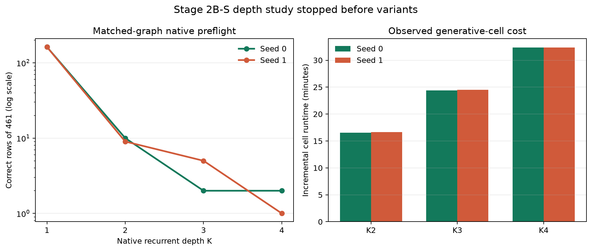

# Paper Two Stage 2B-S Depth Study: Preflight Stop and Amendment Request

**Date:** 2026-08-23  
**Status:** STOPPED BEFORE VARIANTS; A100 RELEASED  
**Governing authority:** `STRATEGY_2BS_DEPTH_STUDY_HANDOFF_20260822.md`  
**Executed code:** commit `20f4d802d3242ddf0e3b19f150b1586659342618`  
**Executed lock SHA-256:** `771ce6950d67f552b43cd186703717ed404614b86968dd1321ed1f84a652ad12`

## 1. Bottom line

The native matched-graph preflight completed for both seeds and stopped before any
variant cell, exactly as the hard gate required.

- Seed 0 reproduced its canonical curve exactly: **162 / 10 / 2 / 2** correct of
  461 at K1 through K4.
- Seed 1 measured **162 / 9 / 5 / 1**, versus the machine lock's
  **162 / 9 / 5 / 2**.
- The one-row seed-1 discrepancy is not evidence of a model or runtime defect.
  The locked seed-1 K4 value of 2 had no prior canonical native-schedule receipt.
  The earlier prelude stopped on seed 0 before seed-1 scoring, while the old
  autopsy's seed-1 initialization K4 was the invalid hybrid P3.5 cell. The value
  2 available in that old table was the **trained stop endpoint**, not a measured
  seed-1 native initialization reference. The coding implementation incorrectly
  converted an unspecified "seed-1 counterpart" into an exact value of 2.
- Scientifically, both seeds show the same severe native depth collapse. The
  difference between one and two K4 rows is immaterial to the registered
  additivity threshold of K1 plus 20 rows. Procedurally, it still required a stop
  because the machine lock said exact reproduction.
- Live timing also falsified the design memo's "cheap" cost assumption. The full
  matrix cannot fit within one roughly 80-compute-unit Colab allocation under the
  pinned estimator. A staged matrix amendment is therefore requested before more
  GPU work.

## 2. Registered design

This was a score-only existence study on the authoritative
`Stage2BTaskInferenceGraph`. It registered four write schedules, K1 through K4,
an amplitude cross, two seeds, and two endpoints. The primary question was
whether deferred terminal write with no recurrent re-entry could recover at least
20 correct rows over the native K1 baseline. No optimizer, training, CONFIRM read,
or EVAL-E read was authorized.

Before any variant, the runner had to reproduce the native initialization curve.
A mismatch required a stop and relay. That is where this run ended.

## 3. Execution and repairs

The score-only runner and schedule graphs were implemented under tests. The final
remote validation reported **50 tests passed** before scoring.

Two execution-integrity repairs were required:

1. The first seed-0 attempt used an incorrect fresh-module RNG seed. The hard
   state-digest assertion exposed it before variants. The initialization seed was
   corrected to the banked `20260819 + seed`, with exact trainable-state digests
   pinned for both seeds.
2. Drive lacked the registered seed-1 P3.4 checkpoint mirror. The retained local
   checkpoint was staged only after its SHA-256 matched the lock exactly:
   `97ad532a5bffd72b2563799047b517e531e00115793bf4808f060148dfffc1ec`.
   The source substitution is disclosed in a dedicated provenance receipt. A
   wrong-hash fallback is rejected by test.

The Colab CLI attachment expired twice during the long seed-1 run. In both cases
the same live endpoint was reattached; the model process continued without
interruption. No replacement VM or cross-session cell was introduced.

## 4. Integrity gates

| Contract | Result |
|---|---|
| Accelerator | NVIDIA A100-SXM4-40GB |
| Torch / CUDA | 2.11.0+cu128 / 12.8 |
| Weights / attention | bfloat16 / SDPA |
| Initialization state digests | Exact, both seeds |
| Checkpoint chain hashes | Exact, both seeds |
| Variant cells scored | **0** |
| Optimizer constructed / steps | **false / 0** |
| CONFIRM / EVAL-E scored | **false / false** |
| Durable stop snapshot | Local SHA verified |
| Paid sessions after closeout | **0** |

## 5. Native preflight results

### Correct rows of 461

| Native depth | Seed 0 expected | Seed 0 observed | Seed 1 machine expectation | Seed 1 observed |
|---:|---:|---:|---:|---:|
| K1 | 162 | **162** | 162 | **162** |
| K2 | 10 | **10** | 9 | **9** |
| K3 | 2 | **2** | 5 | **5** |
| K4 | 2 | **2** | 2 | **1** |

Seed 0's two K4 successes were `gsm8k-evaluation-1139` and
`gsm8k-evaluation-176`. Seed 1's sole K4 success was
`gsm8k-evaluation-176`. Every cell contains all 461 row-level predictions and
its own SHA-256.

### What this establishes

The native graph is strongly subtractive after K1 in both seeds. Seed 0 retains
6.2%, 1.2%, and 1.2% of its K1 correct count at K2, K3, and K4. Seed 1 retains
5.6%, 3.1%, and 0.6%. This is a replicated structural baseline, but it does not
resolve `SUBTRACTIVE`, `ADDITIVE`, or `SCHEDULE-DEPENDENT`, because no registered
variant ran.

## 6. Why the seed-1 stop is a contract-definition issue

The evidence chain is explicit:

1. The governing handoff requested seed 0's `162/10/2/2` and "its seed-1
   counterpart"; it did not state the seed-1 vector.
2. The prior prelude result states that seed 0 failed first and therefore seed 1
   had **no K-sweep result**.
3. The prior autopsy's initialization K4 values of 160/161 were withdrawn because
   they came from the P3.5 one-shot scorer. Its stop-endpoint K4 value happened to
   be 2 in both seeds, but that is a different endpoint.
4. Commit `fcdc01ec` introduced `[162, 9, 5, 2]` directly in the new machine
   lock without citing a seed-1 native initialization receipt.
5. The present run is state-digest exact, checkpoint-hash exact, runtime matched,
   and reproduces the previously available seed-1 K1 through K3 values exactly.

The appropriate correction is not to call 1 "close enough" to 2. It is to mark
the old 2 as an ungrounded transcription and treat the measured
`162/9/5/1` curve as the first canonical seed-1 native initialization reference,
subject to strategy ratification.

## 7. Measured compute cost

Artifact completion times give nearly identical incremental runtimes in both
seeds:

| Cell | Seed 0 | Seed 1 |
|---|---:|---:|
| K2 after K1 | 16.53 min | 16.63 min |
| K3 after K2 | 24.38 min | 24.48 min |
| K4 after K3 | 32.38 min | 32.35 min |

K2 through K4 alone cost about **73.3 minutes per native curve**, excluding K1,
model loading, and staging. The native amplitude cross requires three such curves
for each of two seeds and two endpoints. Even excluding every K1 cell and
subtracting the two completed initialization curves, the remaining native cells
have a measured lower bound of about **12.2 A100 hours**. At the observed Colab
rate of roughly 5.3 compute units per hour, that is about **65 compute units**
before deferred-write, no-reentry, partial-interleave, or 2,048-row margin cells.
The complete locked matrix therefore exceeds an 80-unit allocation.

## 8. Recommended amendment

Preserve every scientific threshold and comparator, but execute the matrix as a
registered cascade:

1. **Bank the preflight.** Seed 0 is an exact reproduction. Ratify seed 1
   `162/9/5/1` as its first canonical matched-graph reference; do not spend another
   32 minutes trying to reproduce an expectation that never had a receipt.
2. **Run the direct discriminator first.** Initialization endpoint,
   deferred-terminal-write/no-reentry, gamma 0.05, K1-K4, both seeds. This is the
   handoff's primary write-schedule hypothesis and can resolve
   `SCHEDULE-DEPENDENT` directly.
3. **Conditional expansion.** If the deferred schedule clears K1+20 in both
   seeds, run its step-1,000 counterpart, amplitude controls, and DEV-2 margins
   needed for the final claim. If it does not, proceed to per-loop-write/no-reentry
   and partial-interleave at gamma 0.05 before deciding whether the full amplitude
   cross is decision-relevant.
4. **Score margins only for retained decision cells.** Preserve the 2,048-row
   panel and estimator, but avoid paying for margins on cells eliminated by a
   predeclared branch.
5. **Keep the same keys.** The +20-row additivity threshold, both-seed rule,
   seed-disagreement escalation, sealed partitions, and no-training boundary do
   not change.

This changes sequencing and cost, not the scientific success definition.

## 9. Decisions requested

1. Ratify `162/9/5/1` as the canonical seed-1 native initialization curve, or
   specify another evidence-based reference and its receipt.
2. Ratify the staged direct-discriminator cascade above, or explicitly authorize
   the additional Colab budget for the full matrix.
3. Confirm that step-1,000 and DEV-2 margins become conditional follow-ups rather
   than unconditional first-wave cells.

No further GPU work should begin until these three items are resolved.

## 10. Receipts and retention

- Stop snapshot: `C:/Users/mshap/AppData/Local/Temp/stage2bs_preflight_seed1_stop.tgz`
  - 2,929,201 bytes
  - SHA-256 `6bb5408d45298ee0dbc7ab3ef4bee92f163c78cb4fa48c59470e418c735192c9`
- Analysis JSON:
  `outputs/stage5/stage5_paper2_stage2bs_depth_study_20260822/analysis/preflight_stop_analysis.json`
- Reproducible analyzer:
  `analysis/build_paper2_stage2bs_depth_preflight_stop.py`
- Figure:
  `docs/figures/paper2_stage2bs_depth_preflight_stop_20260823.svg` and `.png`
- Seed receipts:
  `receipts/seed_0/preflight.json`, `receipts/seed_1/preflight.json`
- Provenance receipts:
  `receipts/seed_0/checkpoint_provenance.json`,
  `receipts/seed_1/checkpoint_provenance.json`
- Row-level outputs: all eight native K cells under
  `private/seed_{0,1}/preflight/<session>/generation/`

## 11. Plain-language summary

The safety check worked, but it exposed a paperwork error rather than a model
failure. Seed 0 reproduced perfectly. Seed 1 got one correct answer at depth four,
while the lock expected two. When the provenance was traced, there was no earlier
seed-1 measurement supporting the expected two; that value had been filled into
the lock from the wrong endpoint. The new measurement is therefore the first real
seed-1 baseline, and it tells the same scientific story as seed 0: the native
looping system falls apart after one pass.

The run also showed that the planned sweep is far more expensive than its design
memo assumed. The right next move is not to weaken the thresholds or ignore the
stop. It is to correct the unsupported seed-1 reference and run the most decisive
write-schedule comparison first, expanding only if the result requires it.
