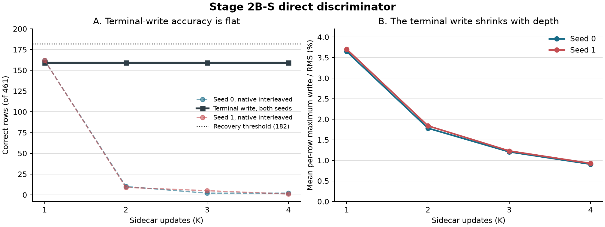
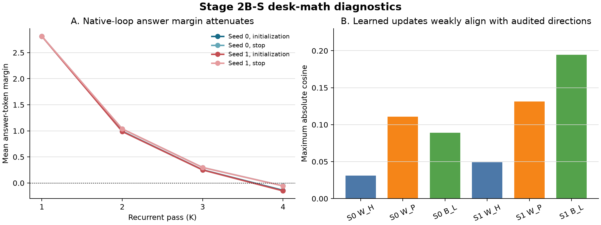

# Paper Two Stage 2B-S: Direct Cascade and Desk-Math Wave

- **Date:** 2026-08-23
- **Status:** DIRECT CELL COMPLETE; FALLBACK PAUSED FOR STRATEGY RELAY; A100 RELEASED
- **Governing cascade authority:** Drive `1BL-2x_mdRqJY56u55Tyf1kXHBT4JkHom`, SHA-256 `868c2ba8a839c075d3fba14315e0242846b7c90557e673dad9eda3a24fa7017e`, 6,525 bytes
- **Adjudication basis:** Drive `1x8BTHXEJnhVHhtsI7mhRG_Wy_vf49iTi`, SHA-256 `c28eca58e3b681b81196f6ff8f724533eca1aa5a184db82360c6e3bf020ba878`, 12,336 bytes
- **Math-foundations basis:** Drive `1OfUuCvwTxlx4R1LEN7Ns3uCoGFy5oKa3`, SHA-256 `6a52d1bc1e57fd403cfaa767b6029b5d7a8f206751bfeb03e4a80eb08b0ce7e7`, 18,018 bytes
- **Executed code:** commit `62ba59a6e062667e87224258c9f5c219de8958cf`
- **Executed machine lock SHA-256:** `3f9c89707e978d18c7a30686ad956725b53a020bcf309c4ab94c193121fe90b1`

## 1. Bottom line

The deferred-terminal-write/no-re-entry discriminator completed in both seeds.
Every K1-K4 cell scored **159/461**, with the same battery split in every cell:
GSM8K `105/369`, MBPP `34/67`, and Tier-1 `20/25`. The registered recovery
threshold was `182/461`, so neither seed cleared the K1+20 bar. The machine
verdict is therefore `FALLBACK_BRANCH_AUTHORIZED_AWAITING_RELAY`, and no fallback
cell has started.

The result is more informative than a simple negative. Removing recurrent-block
re-entry eliminates the catastrophic native depth collapse: the native curves
were `162/10/2/2` and `162/9/5/1`, while terminal write stays at 159 through K4.
But extra latent steps add no correct answers. Prediction behavior is almost
inert after K1: seven of eight higher-K cells are prediction-identical to their
seed's K1 cell, and the sole changed prediction remains wrong. At the same time,
the deployed write amplitude shrinks approximately as `1/K`, from about 3.7% of
RMS at K1 to 0.9% at K4. The system has learned a harmless terminal correction,
not compounding useful computation.

Scientifically, this is consistent with the preregistered
`SCHEDULE-NEUTRALIZED` reading: recurrence can be made harmless, but no additional
answer mass is created. Procedurally, the registered machine branch is still the
fallback branch, and strategy must relay before `per_loop_write_no_reentry` runs.

The desk-math wave also landed. Its two blind mechanistic predictions were not
supported as stated. The trained update is broad and weakly aligned rather than
a one- or two-spike CE-dominated update, and recurrent harm is dominated in
magnitude by signal attenuation rather than accumulated bias. This strengthens
the case that the present failure is a combination of destructive re-entry and
insufficient correction-aligned signal, not one isolated bad matrix direction.

## 2. Experimental design and rationale

### Direct discriminator

The score-only cascade asked whether useful recurrent computation already exists
but is destroyed when each loop writes back through the recurrent block. It
therefore evaluated the initialization endpoint with:

- schedule: deferred terminal write, no recurrent-block re-entry;
- amplitude: `gamma = 0.05`;
- depths: K1 through K4;
- seeds: 0 and 1;
- fixed panel: 461 rows;
- primary threshold: at least native K1 plus 20 correct rows in both seeds.

The direct cell was deliberately first. A two-seed pass would open recovery
controls and conditional endpoint/margin reads. A two-seed miss would stop for
relay before the two registered fallback schedules. A seed split would enter no
branch. No optimizer, training, CONFIRM read, or EVAL-E read was authorized.

### Desk-math wave

The CPU-only desk wave tested the mathematical story against already banked
artifacts:

1. **D-M1:** singular spectra and update-direction alignment. Blind prediction:
   one or two outlier spikes, with CE descent much greater than global correction
   and cluster directions.
2. **D-M2:** per-row margin recursion. Blind prediction: a common additive drift
   would fit best and accumulated bias would dominate K4 flips.
3. **D-M3:** JVP amplification. Optional and deferred if it required non-trivial
   model execution.
4. **D-M4:** planning-only BBP calculations for the row counts needed to recover
   correction directions.

## 3. Integrity and execution

| Contract | Result |
|---|---|
| Direct cells | 8/8 complete, 461 rows each |
| Checkpoint and trainable-state lineage | exact |
| Accelerator | NVIDIA A100-SXM4-40GB |
| Weights / attention | bfloat16 / SDPA |
| Optimizer constructed / steps | **false / 0** |
| CONFIRM / EVAL-E scored | **false / false** |
| DEV-2 margin rows scored | **0**; conditional by design |
| Fallback branch started | **false** |
| Desk wave | CPU-only, existing artifacts |
| Paid Colab sessions after closeout | **0** |

The long direct run was resumed from a retained, SHA-verified durable snapshot.
All previously completed cells were restored byte-for-byte, seed 1 K3 resumed at
row 281, and the final archive contains complete row-level outputs for all eight
cells. No cell was recomputed across a different model state.

## 4. Direct-cascade results

### Correct rows of 461

| Seed | Schedule | K1 | K2 | K3 | K4 | Best K>1 vs native K1 | Clears 182? |
|---:|---|---:|---:|---:|---:|---:|---|
| 0 | Native matched graph | 162 | 10 | 2 | 2 | -152 | no |
| 0 | Deferred terminal write | **159** | **159** | **159** | **159** | **-3** | **no** |
| 1 | Native matched graph | 162 | 9 | 5 | 1 | -153 | no |
| 1 | Deferred terminal write | **159** | **159** | **159** | **159** | **-3** | **no** |

### Battery decomposition, identical in all eight direct cells

| Battery | Correct | Rows | Accuracy |
|---|---:|---:|---:|
| GSM8K | 105 | 369 | 28.46% |
| MBPP | 34 | 67 | 50.75% |
| Tier-1 | 20 | 25 | 80.00% |
| **Pooled** | **159** | **461** | **34.49%** |

### Behavioral and continuous telemetry

| Seed | K | Prediction changes vs K1 | Correctness changes | Mean max write / RMS | Mean minimum answer margin |
|---:|---:|---:|---:|---:|---:|
| 0 | 1 | 0 | 0 | 3.648% | 0.2072 |
| 0 | 2 | 0 | 0 | 1.783% | 0.2066 |
| 0 | 3 | 0 | 0 | 1.207% | 0.2063 |
| 0 | 4 | 1 | 0 | 0.907% | 0.2066 |
| 1 | 1 | 0 | 0 | 3.704% | 0.2072 |
| 1 | 2 | 0 | 0 | 1.840% | 0.2072 |
| 1 | 3 | 0 | 0 | 1.230% | 0.2074 |
| 1 | 4 | 0 | 0 | 0.927% | 0.2077 |

The lone changed prediction is seed 0 K4 on one GSM8K row, from `1500` to `7`;
both are wrong. The terminal schedule is therefore not bit-exact after K1, but it
is accuracy-flat and nearly prediction-inert. The inverse-K write shrinkage is a
directly measured implementation behavior and should constrain the next design.

## 5. Desk-math results

### D-M1: spectral and directional structure

| Seed | Matrix | IID-MP outlier count | Maximum absolute tested alignment |
|---:|---|---:|---:|
| 0 | `delta_W_H` | 38 | 0.031 |
| 0 | `delta_W_P` | 40 | 0.111 |
| 0 | `delta_bridge_B_L` | 49 | 0.089 |
| 1 | `delta_W_H` | 42 | 0.049 |
| 1 | `delta_W_P` | 43 | 0.131 |
| 1 | `delta_bridge_B_L` | 49 | 0.194 |

The registered one- or two-spike prediction is falsified under the specified IID
Marchenko-Pastur fit. The observed 38-49 outliers also show that the IID bulk is a
poor literal model for these trained matrices, so the counts should be read as
evidence of broad structure, not as 38-49 independent causal modes. The predicted
alignment ordering, CE much greater than global correction greater than cluster
directions, is also unsupported. All measured cosines are modest, and cluster
directions sometimes have the largest alignment.

### D-M2: margin recursion

| Seed | Endpoint | K1 margin | K4 margin | CV winner | Abs attenuation contribution | Abs bias contribution |
|---:|---|---:|---:|---|---:|---:|
| 0 | initialization | 2.814 | -0.141 | row-specific `c` | 2.676 | 0.519 |
| 0 | stop | 2.814 | -0.055 | common `c` | 2.601 | 0.424 |
| 1 | initialization | 2.814 | -0.152 | common `c` | 2.598 | 0.522 |
| 1 | stop | 2.814 | -0.056 | common `c` | 2.596 | 0.430 |

The common-bias model wins cross-validation in three of four cells, but the
registered claim that bias accumulation dominates is falsified. Signal
attenuation contributes roughly five to six times more absolute margin movement
than bias. Removing either term prevents nearly all observed positive-to-
nonpositive flips, so both are causally needed in the fitted model; attenuation
is the primary magnitude term.

### D-M3 and D-M4

D-M3 was deferred exactly as authorized because a trustworthy JVP comparison
requires non-trivial model execution. D-M4 produced planning estimates, not
certified sample-complexity bounds. Depending on cluster and seed, the estimated
raw cluster sizes are approximately 160-2,487 rows; estimated counts for 0.5
directional alignment are about 306-3,790, and for 0.75 alignment about
778-7,560. These calculations ignore document correlation and repeat dose and
must not be treated as a training guarantee.

## 6. Integrated interpretation

The direct and desk results fit one coherent model:

1. **Native recurrent re-entry is destructive.** It attenuates answer-relevant
   margin strongly enough to drive K4 below zero.
2. **Deferring the write removes that destruction.** Accuracy remains stable
   through K4 instead of collapsing.
3. **The private latent updates do not yet add useful answer computation.** The
   terminal output is virtually unchanged after K1, and deployed write amplitude
   falls about inversely with K.
4. **The trained correction channel is not a clean low-rank task direction.** Its
   measured structure is broad and only weakly aligned to the tested CE and
   correction references.

This does not show that recurrent architectures cannot work. It narrows the
claim: this substrate currently offers a choice between destructive native
re-entry and harmless but non-additive terminal write. A successful successor
must preserve state, avoid repeated margin attenuation, and train an explicitly
correction-aligned signal that remains active as depth increases.

## 7. Limitations

- The direct test uses one initialization endpoint, one amplitude, two seeds,
  and one 461-row DEV slice.
- The 159-versus-162 difference is small, but the experiment was not powered to
  prove equivalence. `SCHEDULE-NEUTRALIZED` therefore remains a strategy
  adjudication rather than a new statistical equivalence claim.
- DEV-2 margins were intentionally conditional and remain unscored; the eventual
  deciding schedule must include them.
- D-M1 uses a simple IID Marchenko-Pastur fit on structured trained matrices.
- D-M2 is a descriptive fitted recursion, not an identified causal structural
  equation.
- D-M4 row counts omit correlation and dose effects.
- D-M3 remains open.
- CONFIRM and EVAL-E remain sealed, so no confirmatory capability claim is made.

## 8. Questions and requested decisions

1. Adjudicate whether the replicated `159/461` flat curves qualify for the
   preregistered `SCHEDULE-NEUTRALIZED` sub-key, while preserving the machine
   record that both seeds missed K1+20.
2. If the cascade proceeds, authorize only the next registered fallback,
   `per_loop_write_no_reentry`, at `gamma = 0.05`, both seeds. Do not open
   `partial_interleave` unless that cell also misses and is relayed.
3. Require the next implementation to report unnormalized accumulated write
   magnitude as well as deployed post-aggregation magnitude, so inverse-K
   attenuation cannot masquerade as latent inactivity.
4. Decide whether D-M3 is decision-relevant before spending GPU. The current
   direct result already localizes the dominant behavioral distinction without
   it.
5. Carry D-M4 only as a sizing prior for correction-aligned supervision, with a
   correlation-aware power calculation before any future lock.

## 9. Recommended next step

Follow the ratified cascade literally: wait for strategy relay, then run
`per_loop_write_no_reentry` only. Its purpose is now sharp. If accuracy stays
flat while accumulated write magnitude grows, the latent computation is absent
or unreadable. If accuracy improves, terminal aggregation was suppressing a real
multi-step signal. If accuracy collapses, repeated writes themselves are harmful
even without recurrent-block re-entry. Only that result determines whether
`partial_interleave` is worth its cost.

No new training, amplitude sweep, or sealed evaluation should open from this
wave.

## 10. Artifacts and receipts

- Final durable direct archive: 8,882,436 bytes, SHA-256
  `6dd4c644a129a4e84cbe59edc772d4a5b8df176cc4a9ccf1f02c7459a965308e`.
- Direct-wave machine receipt: SHA-256
  `73d38cb8e48c4880dc9aa59eec16c788f746e0a0277fb7d1abf5ce5a47c960f1`.
- Desk-math receipt: 27,679 bytes, SHA-256
  `5d5f21f5a70a9b09f860b2fdd473ef75e760fdea5e50410dfa152b0cecd110aa`.
- Reproducible analysis:
  `eval/build_paper2_stage2bs_direct_desk_handoff.py`.
- Analysis summary:
  `outputs/stage5/stage5_paper2_stage2bs_direct_desk_20260823/analysis/summary.json`.
- Figures:
  `docs/figures/paper2_stage2bs_direct_cascade_20260823.{svg,png}` and
  `docs/figures/paper2_stage2bs_desk_math_20260823.{svg,png}`.
- All eight generation receipts contain 461 row-level predictions and passed
  retention SHA verification.
- Colab closeout: `colab sessions` returned no active sessions after stop.

## 11. Plain-language summary

The original loop damaged the model each time it re-entered the transformer.
When we prevented that re-entry and waited until the end to write the result,
the damage disappeared: four latent steps answered exactly as many questions as
one. But the extra steps did not help either. In practical terms, we found a way
to make depth harmless, not useful.

The internal measurements explain why. The final write gets smaller as more
steps are requested, and the learned update is not strongly pointed toward the
task corrections we wanted. The architecture is therefore not disproven, but
the remaining path is narrower. The next test should ask whether multiple writes
can accumulate safely without re-entering the destructive transformer block. If
that also fails, the current feedback implementation should give way to a new
recurrent substrate rather than more tuning.
