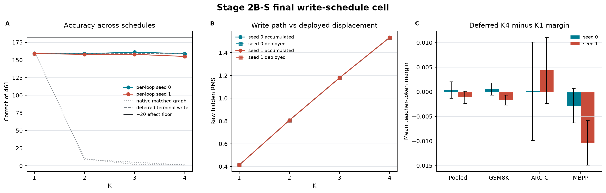

# Paper Two Stage 2B-S Final Write-Schedule Cell: Result and Strategy Handoff

**Date:** 2026-08-23

**Status:** Complete; registered `SCHEDULE_NEUTRALIZED_MARGIN_BANKED`; current implementation line closed

**Authority:** `STRATEGY_2BS_FINAL_CELL_AUTHORIZATION_20260823.md`, Drive `1JB2gFt7cwthK4gyY4BgBCVNUfKoStDqF`, 4,196 bytes, SHA-256 `60b52390d2db1e898a88bffaba494211e700322154c08208edc462f684c20911`

**Executed code:** commit `f0ce749d322ebe2abe8d5406192a23b050a6c2d5`

**Executed machine lock SHA-256:** `058c5b5fcf7542760fc5e8ef00d2f053fa84fbb7cb9a5d2e5d0901b2d950ab60`

## 1. Bottom line

The final registered schedule made additional loops fully active and almost fully deployed, but not useful. Under `per_loop_write_no_reentry` at gamma 0.05, accumulated write magnitude rose monotonically from about 5.03% of hidden-state RMS at K1 to 18.65% at K4 in both seeds. More than 99.95% of the accumulated displacement reached the deployed state at K4. Accuracy nevertheless remained inside the registered nine-row flat band: seed 0 scored `159/159/161/159` and seed 1 scored `159/158/158/155` over K1-K4, against the `182/461` effect floor.

This is not an inert-path result. At K4, `206/461` and `208/461` generated predictions changed relative to K1. The changes simply lacked correction alignment. Seed 0 produced 11 fixes and 11 regressions; seed 1 produced 10 fixes and 14 regressions. The deferred DEV-2 margin panel agrees: mean K4-minus-K1 teacher-token margin was `+0.000373` in seed 0 and `-0.001135` in seed 1, with both bootstrap intervals crossing zero and both medians exactly zero.

The registered verdict is therefore **`SCHEDULE-NEUTRALIZED`**. Terminal aggregation was not hiding a useful multi-step signal, because removing aggregation dilution allowed writes to accumulate and reach the deployed state without creating answer mass or positive continuous margin. The authorized cascade ends here. `partial_interleave` was not run, and no further tuning of this implementation is authorized by the governing map.

## 2. Question and rationale

The preceding direct cell used four sidecar updates followed by one averaged terminal write. It held accuracy at `159/461` through K4 but reduced deployed write amplitude approximately as `1/K`. That left one clean ambiguity: useful private updates might exist but be suppressed by terminal aggregation.

The final cell removed that ambiguity by writing each private update into the persistent state without recurrent-block re-entry. It therefore separated three possibilities under a pre-registered map:

1. **Improves:** private updates contain additive answer-relevant computation once allowed to accumulate.
2. **Collapses:** repeated writes are intrinsically harmful even without recurrent re-entry.
3. **Flat while writes accumulate:** the schedule is neutralized, but the private updates do not add task-relevant signal.

The third outcome occurred independently in both seeds.

## 3. Experimental design

- Endpoint: Stage 2B initialization endpoint, both registered seeds.
- Schedule: `per_loop_write_no_reentry`.
- Amplitude: gamma `0.05`.
- Depths: K1, K2, K3, and K4.
- Task panel: fixed 461-row DEV slice: 369 GSM8K, 67 MBPP, and 25 Tier-1 rows.
- Registered effect floor: `182/461`, native K1 plus 20 rows.
- Conservative flat band: all K values within nine rows of K1.
- Dual write telemetry: unnormalized accumulated write magnitude and deployed post-aggregation magnitude, each also normalized by hidden-state RMS.
- Conditional margin panel: deferred-terminal-write K1 and K4 on the fixed 2,048-row DEV-2 panel in both seeds.
- Runtime: NVIDIA A100-SXM4-40GB, bfloat16, SDPA, PyTorch 2.11.0+cu128, CUDA 12.8.
- No optimizer, training, CONFIRM scoring, or EVAL-E scoring was authorized.

## 4. Integrity and execution

| Contract | Result |
|---|---|
| Generation cells | 8/8 complete, 461 rows each |
| Margin cells | 4/4 complete, 2,048 rows each |
| Checkpoint and trainable-state lineage | SHA-asserted |
| Optimizer constructed / steps | **false / 0** |
| CONFIRM / EVAL-E scored | **false / false** |
| Partial interleave executed | **false** |
| Per-seed classification | `FLAT_ACCUMULATING` / `FLAT_ACCUMULATING` |
| Final machine status | `SCHEDULE_NEUTRALIZED_MARGIN_BANKED` |
| Paid Colab sessions after closeout | **0** |

Colab enforced an approximately one-hour assignment lifetime during this score-only job. The runner's content-addressed resume contract preserved completed cells and partial row files. The first pruned VM's local-only mirror required a deterministic seed-0 replay; subsequent sessions resumed from locally downloaded durable archives, skipping hash-complete cells. The final archive contains one canonical complete file for every registered cell. This affected cost and wall time, not model state, panel membership, or estimators.

## 5. Task results

### Correct rows of 461

| Seed | Schedule | K1 | K2 | K3 | K4 | K4 minus K1 | Clears 182? |
|---:|---|---:|---:|---:|---:|---:|---|
| 0 | Native matched graph | 162 | 10 | 2 | 2 | -160 | no |
| 0 | Deferred terminal write | 159 | 159 | 159 | 159 | 0 | no |
| 0 | **Per-loop write, no re-entry** | **159** | **159** | **161** | **159** | **0** | **no** |
| 1 | Native matched graph | 162 | 9 | 5 | 1 | -161 | no |
| 1 | Deferred terminal write | 159 | 159 | 159 | 159 | 0 | no |
| 1 | **Per-loop write, no re-entry** | **159** | **158** | **158** | **155** | **-4** | **no** |

The final schedule prevents native depth collapse, but it does not improve over the harmless direct schedule or its own K1 endpoint. The best higher-depth cell is seed 0 K3 at `161/461`, only two rows above K1 and 21 rows below the effect floor.

### K4 paired decomposition relative to K1

| Seed | Prediction changes | Change rate | Fixes | Regressions | Net |
|---:|---:|---:|---:|---:|---:|
| 0 | 206/461 | 44.69% | 11 | 11 | 0 |
| 1 | 208/461 | 45.12% | 10 | 14 | -4 |

The architecture is behaviorally active at depth. Almost half the rows change, but the intervention is approximately answer-neutral in seed 0 and mildly harmful in seed 1. This distinguishes `SCHEDULE-NEUTRALIZED` from an unused or disconnected write path.

## 6. Write-path result

| Seed | K | Accumulated raw RMS | Deployed raw RMS | Accumulated / hidden RMS | Deployed / accumulated |
|---:|---:|---:|---:|---:|---:|
| 0 | 1 | 0.413471 | 0.413471 | 5.027% | 100.000% |
| 0 | 2 | 0.806078 | 0.805817 | 9.801% | 99.968% |
| 0 | 3 | 1.179144 | 1.178714 | 14.339% | 99.964% |
| 0 | 4 | 1.533984 | 1.533332 | 18.649% | 99.957% |
| 1 | 1 | 0.413477 | 0.413477 | 5.027% | 100.000% |
| 1 | 2 | 0.806142 | 0.805881 | 9.802% | 99.968% |
| 1 | 3 | 1.179216 | 1.178785 | 14.342% | 99.963% |
| 1 | 4 | 1.533782 | 1.533182 | 18.657% | 99.961% |

Accumulated magnitude grows by about `3.71x` from K1 to K4, close to linear in depth. The deployed state tracks it almost exactly. Cancellation or aggregation shrinkage therefore cannot explain the missing accuracy gain in this cell.

## 7. Deferred margin result

| Seed | K1 mean margin | K4 mean margin | K4 minus K1 | Bootstrap 95% CI | Median delta | Positive / zero / negative |
|---:|---:|---:|---:|---|---:|---:|
| 0 | 2.613082 | 2.613454 | +0.000373 | [-0.001295, +0.002036] | 0.000000 | 35.64% / 27.54% / 36.82% |
| 1 | 2.597770 | 2.596635 | -0.001135 | [-0.002358, +0.000108] | 0.000000 | 26.46% / 44.19% / 29.35% |

The continuous signal is effectively unchanged. Seed 0's pooled interval spans small positive and negative movement. Seed 1 trends slightly negative, driven mainly by GSM8K and MBPP, but its pooled interval still reaches zero. The result supplies no evidence that deeper private updates move answer-token margins toward the teacher.

## 8. Integrated interpretation

The cascade now localizes three separate properties of the current implementation:

1. **Recurrent-block re-entry causes catastrophic depth harm.** Native K4 falls to `2/461` and `1/461`.
2. **Deferring re-entry makes depth harmless.** Both non-re-entry schedules remain near `159/461`.
3. **Neither averaging nor write cancellation hid useful computation.** Per-loop writes accumulate to about 18.65% of hidden RMS, alter about 45% of predictions, and still deliver no net accuracy or teacher-margin gain.

The most defensible mechanism statement is therefore not that the pathway is dead. It is that the pathway produces substantial, behavior-changing updates without a reliable correction direction. Current private computation is **schedule-neutralized and task-neutral**, not additive reasoning.

Under the binding authorization, this closes the current implementation cascade. The result does not falsify recurrent computation in general, the broader Sidecar design, or a successor trained with an explicitly ordered depth objective. It does show that more schedule tuning on this exact implementation is not justified by the evidence.

## 9. Limitations

- Two seeds, one endpoint, one amplitude, and one DEV task panel were evaluated.
- The 461-row task panel is not powered to prove strict statistical equivalence among 155-161 correct rows. The verdict follows the registered nine-row flat band, not a post-hoc equivalence claim.
- The 2,048-row margin panel is dominated by GSM8K positions (`1,732/2,048`), while several batteries contain only one to six rows.
- Margin telemetry uses bfloat16 serving arithmetic; the large zero-delta fractions partly reflect quantization.
- The experiment tests one non-re-entry write schedule and does not identify which learned update components produce fixes versus regressions.
- CONFIRM and EVAL-E remain sealed, so no confirmatory capability claim is made.
- Repeated Colab pruning required resumable execution across multiple sessions. All canonical files and hashes are retained, but wall-clock and compute cost exceeded the original estimate.

## 10. Strategy decisions and next steps

The governing map already determines the immediate decision:

1. Bank `SCHEDULE_NEUTRALIZED_MARGIN_BANKED` as the final result of this cascade.
2. Do not run `partial_interleave`.
3. Do not tune this implementation further.
4. Preserve the three-stage causal story in the paper record: destructive re-entry, harmless deferred execution, and active but correction-neutral per-loop writes.
5. Draft the successor 2B-S charter against the final key. Any successor should make correction alignment or ordered depth use a trainable objective rather than treat schedule alone as the missing ingredient.

Open scientific questions for the successor design are whether a correction-conditioned objective can separate the observed fixes from regressions, whether depth ordering can turn private updates into cumulative signal, and whether the write channel should be trained against continuous margin improvement rather than only endpoint task loss. These are design inputs, not authorizations from this handoff.

## 11. Plain-language summary

We finally let every private thinking step write its full result into the state, without sending that state back through the model block that previously destroyed performance. The writes became large and changed nearly half the answers, so the mechanism was definitely doing something. But it did not do the right thing consistently: helpful and harmful answer changes canceled, and the model's continuous preference for the teacher's answer stayed essentially unchanged.

That closes the scheduling explanation. The useful computation was not merely being averaged away. The current architecture can make extra depth non-destructive, but it has not learned to make extra depth beneficial. The next design must improve what each step computes, not only where or when the step is written.

## 12. Canonical artifacts and closeout

- Final durable archive: 15,437,678 bytes, SHA-256 `b13b2a9131aea63d11602e8c6aaa9ccfb6ed86ba824cbdd04fb1e2489a417d08`.
- Machine wave receipt: SHA-256 `387c2891f1465802239936e1321561a1a05eac0f0818fd9af4abff3f828bd32e`.
- Tracked analysis summary: `docs/receipts/paper2_stage2bs_final_cell_analysis_20260823.json`, SHA-256 `2afe92d4f74ea2158fb0c206a26935615e1687e1e92f77c14f2d334899e36e69`.
- Figure PNG: `docs/figures/paper2_stage2bs_final_cell_20260823.png`, SHA-256 `7ebbff265137b107069e237ad7cbf51c378e0d0607881bee109e16a3bc6f3d45`.
- Figure SVG: `docs/figures/paper2_stage2bs_final_cell_20260823.svg`, SHA-256 `43dc14c95c31cbd24d1b57b6ead6eea7dc409268e11ccc8a1a467cb412e2198c`.
- Paid compute: all Colab assignments released; server reports no active sessions.
