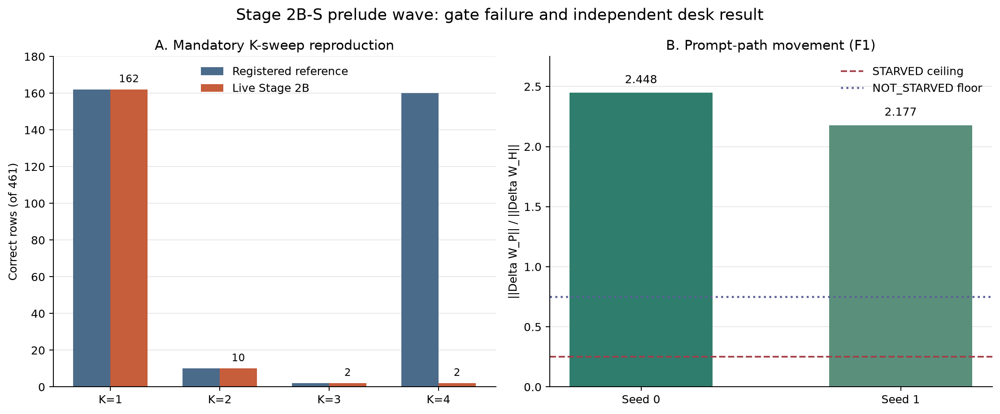

# Paper Two Stage 2B-S Prelude Wave: Stopped-Gate Result and Strategy Handoff

**Date:** 2026-08-21

**Status:** Prelude-1 stopped at its mandatory reproduction gate; Prelude-2 complete

**Authority:** `STRATEGY_2BS_PRELUDE_HANDOFF_20260821.md` plus ratified PA-1 amendment

**Executed lock SHA-256:** `4d9151d9b487cfaa155c46165771327063377e97f830e4d4e9c6b3590d283c90`

## 1. Bottom line

The wave produced one invalidated premise and one clean negative diagnosis.

Prelude-1 did not reach its three causal probes. Its mandatory seed-0 K-sweep was registered to reproduce `162/10/2/160` correct rows at K=1/2/3/4. The live Stage 2B inference graph instead produced `162/10/2/2`. The stop was correct and occurred before any probe cell, optimizer construction, CONFIRM read, or EVAL-E read.

The discrepancy is now localized exactly. K=1 through K=3 were computed by the Stage 2B task-inference graph. The registered K=4 autopsy cell was not. It was copied from the P3.5 amplitude-surface scorer. All 461 registered K=4 predictions match that P3.5 source exactly; all 461 native Stage 2B K=4 predictions differ. The published claim that the Stage 2B graph had an initialization-time K=4 recovery from 2 to 160 is therefore an estimator-composition artifact, not evidence of reusable fourth-loop computation in that graph.

Prelude-2 completed independently and returned `NOT_STARVED`. The prompt-conditioned matrix moved 2.448 and 2.177 times as far as the hidden-only matrix in seeds 0 and 1. This strongly rejects the preregistered `STARVED` prediction. Insufficient prompt-path parameter movement is not a credible explanation for the A-D1 failure.

## 2. Questions and registered design

### Prelude-1: reusable computation or cancellation

The registered question was whether the apparent K=4 recovery at initialization was reusable computation or brittle phase cancellation. The plan required:

1. A bit-exact unperturbed K-sweep reproduction on both seeds.
2. An epsilon-grid perturbation injected into K2.
3. K2/K3 write-zeroing.
4. A cross-question K3-to-K4 state transplant.

The governing handoff made the first item an unconditional gate: failure meant stop the line and run no probe cells. Because seed 0 failed, no seed-1 scoring or causal intervention was scientifically authorized.

### Prelude-2: was the prompt path starved?

The PA-1 amendment registered

`R_F1 = ||Delta W_P||_F / ||Delta W_H||_F`.

The verdict bands were:

- `STARVED`: ratio at or below 0.25 in both seeds.
- `NOT_STARVED`: ratio at or above 0.75 in either seed.
- `PARTIAL`: otherwise.
- `DEGENERATE`: hidden-path denominator below its dtype-epsilon scale.

This was a CPU-only checkpoint comparison. It loaded no model, built no optimizer, and read no task partition.

## 3. Execution and integrity

- Runtime class for the failed scoring gate: NVIDIA A100-SXM4-40GB, bfloat16, SDPA, matching the registered autopsy runtime class.
- Lock SHA matched the executed receipt.
- Seed-0 initialization state was reconstructed before scoring.
- Seed-1 initialization state was reconstructed score-blind and durably receipted.
- Optimizer constructed: false.
- Optimizer steps: 0.
- CONFIRM scored: false.
- EVAL-E scored: false.
- Prelude-1 causal probe cells run: false.
- Prelude-2 model loaded: false.
- All Colab sessions were released after durable receipt verification.

The final Colab assignment was explicitly unassigned after it appeared as an orphaned CLI backend. A post-closeout `colab sessions` query returned no active sessions.

## 4. Prelude-1 gate result

### Correct rows of 461

| Forced depth | Registered reference | Live Stage 2B graph | Prediction identity |
|---:|---:|---:|---|
| K=1 | 162 | 162 | 461/461 exact |
| K=2 | 10 | 10 | 461/461 exact |
| K=3 | 2 | 2 | 461/461 exact |
| K=4 | 160 | 2 | 0/461 exact |

A separate fresh K=4 rerun reached 105 rows before interruption. It scored 0/105, and every one of those 105 predictions differed from the registered autopsy K4 cell. This independently rules out a stale complete-file or one-off cache explanation.

### Exact provenance result

The autopsy implementation accepts an optional `precomputed_k4` in `_k_sweep`. For K4, it writes those precomputed rows instead of invoking the Stage 2B graph. The autopsy caller supplied `amplitude_rows[state_name][0.05]`, and initialization amplitude rows at gamma 0.05 were themselves read from the registered P3.5 amplitude surface.

Prediction-level comparisons establish:

- Live Stage 2B K1 versus autopsy K1: 461/461 exact.
- Live Stage 2B K2 versus autopsy K2: 461/461 exact.
- Live Stage 2B K3 versus autopsy K3: 461/461 exact.
- Autopsy K4 versus the P3.5 amplitude generation subset: 461/461 exact.
- Live Stage 2B K4 versus autopsy K4: 0/461 exact.
- Fresh live K4 partial versus autopsy K4: 0/105 exact.

This is a graph mismatch, not stochastic variation.

## 5. Claim correction

The prior autopsy handoff's K-sweep table and all conclusions specifically dependent on an initialization K4 recovery in the Stage 2B graph must be withdrawn or amended. In particular, the following statements are no longer supported:

- that Stage 2B initialization recovered from 2 correct at K3 to 160/161 at K4;
- that Stage 2B training destroyed that native fourth-pass recovery;
- that the K4 recovery demonstrated a useful depth-specific computation inside the Stage 2B graph.

This correction is scoped. It does **not** erase separately measured results from the P3.5 scorer, including its amplitude-surface capability, nor does it erase the autopsy's direct Stage 2B K1-K3, component, correction-field, or held-out-objective reads. The broader finding that held-out objectives can improve while task-facing behavior remains poor still has independent support, but it may not be justified by the invalid hybrid K4 contrast.

The code search found this precomputed K4 substitution only in the autopsy K-sweep and its tests. No evidence presently shows that the registered Stage 2B training run itself used this hybrid scorer. A paper-wide and ledger-wide phrase audit is still required before publication so the invalid K4 claim is not carried forward indirectly.

## 6. Prelude-2 result

| Seed | `||Delta W_P||_F` | `||Delta W_H||_F` | Ratio | Verdict contribution |
|---:|---:|---:|---:|---|
| 0 | 2.259131 | 0.922860 | 2.447968 | `NOT_STARVED` |
| 1 | 2.104334 | 0.966418 | 2.177457 | `NOT_STARVED` |

The hidden-path denominator was non-degenerate in both seeds. Its dtype-epsilon scale was `4.0371e-5`, versus measured movements of 0.923 and 0.966.

Additional descriptive telemetry:

- Loop-LoRA relative movement was approximately `3e-6`, effectively dormant at the precision of this audit.
- Initializer, bridge, and both innovation matrices moved materially.
- Top singular directions of W_P and W_H had low absolute cosine alignment with the tested correction references, generally below about 0.11.

The F1 result measures optimization allocation, not functional usefulness. It shows that W_P was not starved. It does not show that W_P learned a helpful map. The low tested alignment makes objective or geometry mismatch more plausible than insufficient prompt-path dose, but this remains descriptive.

## 7. Blind prediction scorecard

| Prediction | Result | Scoreability |
|---|---|---|
| Prelude-1: `SMOOTH + DEPENDENT + MIXED` | Not tested | Not scoreable; mandatory baseline gate failed |
| Prelude-2: `STARVED` | `NOT_STARVED` in both seeds | Falsified |

The Prelude-1 prediction must not be retrospectively graded from the failed baseline. None of its registered discriminators ran.

## 8. Interpretation

The strongest finding is methodological and architectural at once. The earlier apparent fourth-loop recovery joined two valid but different evaluation systems in one depth curve. Each cell was internally real, but the curve was not a matched-estimator curve. The preflight prevented causal probes from being interpreted against a nonexistent native baseline.

On the actual Stage 2B inference graph, K2 and K3 collapse relative to K1 and K4 does not recover. That makes the originally proposed epsilon, zero-write, and transplant probes unidentifiable as written: there is no 158-row K4-over-K3 recovery margin to explain.

The independent desk audit also closes one tempting repair. Increasing prompt-path training merely because the path might have been starved is not evidence-based. W_P moved more than twice W_H in both seeds. The next explanation should focus on what direction the prompt path learned, how its objective relates to task behavior, and whether the serving graph matches the graph used to define success.

## 9. Limitations

- Prelude-1 stopped on seed 0, so seed 1 has a score-blind initialization receipt but no K-sweep result.
- No causal discriminator ran; the reusable-computation-versus-cancellation question remains unanswered for the P3.5 graph.
- The fresh K4 replication is partial at 105/461 rows, although the complete quarantined K4 result and exact source match already identify the mismatch.
- F1 is parameter movement, not gradient funding, causal contribution, or capability.
- Singular-vector alignment uses a limited registered reference set and is descriptive.
- Runtime package version strings were not preserved in the final failed-gate receipt; hardware class, dtype, and attention backend were preserved. This is an execution-receipt gap, not a scientific substitution.

## 10. Decisions requested from strategy

1. **Bank the correction.** Mark the autopsy K4 recovery and its dependent claims as estimator-composition artifacts in the tracker, claim ledger, and paper context.
2. **Do not waive the failed gate.** Substituting `2` for the expected `160` would change the scientific question after seeing the result and leave the registered probes without a positive baseline.
3. **Choose one new matched-graph route:**
   - run newly preregistered interventions on the P3.5 graph where the 160-row K4 cell actually exists;
   - repair or reconcile the Stage 2B serving graph to achieve bit-exact P3.5 K4 identity, then rerun the unchanged preflight under an amendment;
   - close the Prelude-1 question for Stage 2B and treat native K2-K4 collapse as the boundary result.
4. **Do not prioritize more prompt-path dose.** F1 rejects starvation. If A-D1 reopens, first test direction/objective alignment or serving-graph consistency.
5. **Audit downstream text.** Search every manuscript, handoff, tracker, and figure for the invalid `160/161 to 2` K4 narrative before it is cited.

The coding recommendation is the first route if the scientific target remains the apparent K4 recovery: interrogate the graph that actually produced it. The third route is the lowest-cost option if Stage 2B itself is the object of study. The second route should be chosen only if strategy believes the two graphs were intended to be identical and can state the missing identity contract before implementation.

## 11. Plain-language summary

The planned diagnostic depended on a surprising result: the model looked almost completely broken after two and three internal passes, then looked good again after four. Before testing why, the code was required to reproduce that pattern exactly. It could not.

The audit found why. The first three points and the fourth point had been produced by different evaluation paths. When all four were measured through the same Stage 2B path, the scores were 162, 10, 2, and 2. There was no fourth-pass recovery to explain in that system. Stopping was therefore the right outcome; continuing would have generated precise answers to the wrong question.

The separate parameter audit did answer its question. The route carrying prompt information was not neglected during training. It changed more than twice as much as the hidden-only route in both runs. The problem is more likely what that route learned or how it is evaluated, not that it received too little opportunity to learn.

## 12. Canonical artifacts and receipts

- Machine analysis: `outputs/stage5/stage5_paper2_stage2bs_preludes_20260821/analysis/stopped_wave_analysis.json`
- Reproducible analyzer: `analysis/build_paper2_stage2bs_prelude_wave.py`
- Figure SVG: `docs/figures/paper2_stage2bs_prelude_wave_20260821.svg`
- Figure PNG: `docs/figures/paper2_stage2bs_prelude_wave_20260821.png`
- Durable run root: `MyDrive/recurrent-qwen-svgd-artifacts/stage5/stage5_paper2_stage2bs_preludes_20260821/`
- Prelude-1 failed-gate receipt: `receipts/failed_attempts/r3_seed0_count_162_10_2_2_status.json`
- Prelude-1 complete native K4 quarantine: `private/quarantine/k_sweep__stage2bs_preflight__seed0_k4__count2__e9eada5b8da7d22c.jsonl`
- Prelude-1 fresh K4 partial: `private/preflight/seed_0/preflight_k_sweep/k_sweep__stage2bs_preflight__k4.partial.jsonl`
- Prelude-2 summary: `receipts/prelude2/prelude2.json`, SHA-256 `a115817abe291eee26327e005a474ccd66f351bccb506867bec1d9005a3959c4`
- Prelude-2 private singular vectors: `private/prelude2/top_singular_vectors.pt`, SHA-256 `be0c06eb068de376d896c17a8447ef82450d977cf4bacee0cfa9e86f2abd70ff`
- Live K4 quarantine SHA-256: `e9eada5b8da7d22c867845d4825a16407d4ac0a039617108d12b5bba470dc307`
- Fresh K4 partial SHA-256: `a5d8752c54bd76e3065463bf8923705cdd98e5f89de86735a28ed6ace13153dc`
- Registered autopsy K4 SHA-256: `d35c95b741114228914144f1801d57d149d8f325576f9175aef39ade7bb841f6`
- P3.5 amplitude source SHA-256: `13732e986949aa2bcec5b4060947a262b6c3a980305659cf7ca604d61df08815`

## 13. Closeout

- Prelude-1: stopped at mandatory gate; no probe verdict.
- Prelude-2: complete; `NOT_STARVED`.
- Optimizer work: none.
- CONFIRM and EVAL-E: sealed and untouched.
- Paid Colab compute: released.
- Next GPU spend: not authorized by this handoff; strategy decision required.
