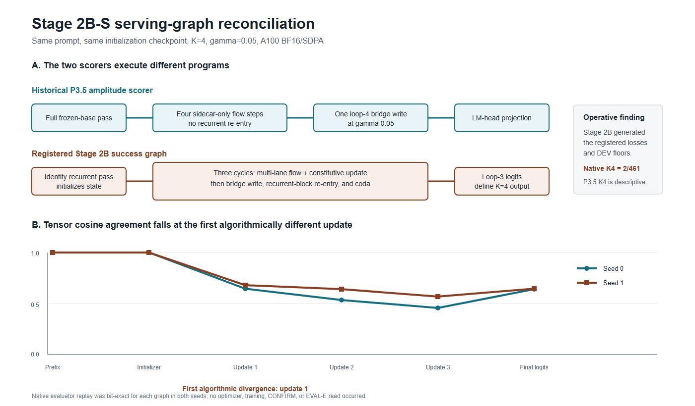

# Paper Two Stage 2B-S Serving-Graph Reconciliation: Result and Strategy Handoff

**Date:** 2026-08-22

**Status:** Complete, score-only; both seeds agree

**Authority:** `STRATEGY_2BS_RECONCILIATION_HANDOFF_20260822.md`, Drive `1V4LREoiFsGlT-IsMMbuSO0WgPA78xArF`, SHA-256 `4cb2f9b2e05da7bbe1400a43e64412df59743ecf921aaca1463605460537153f`

**Executed lock SHA-256:** `0396ae35200bcd60bee898bd593bcf0aa11d95a43dd34a4c79d1b6315cdb4121`

## 1. Bottom line

The discrepancy is a scorer artifact, not a Stage 2B serving bug. The historical P3.5 amplitude scorer and the registered Stage 2B task graph execute different forward programs. Both programs were reproduced bit-exactly against their native evaluators in both seeds. Static call-chain provenance establishes that the Stage 2B graph generated the registered CE, forward-KL, monotonicity losses, and DEV floors. Its native K4 result of 2/461 is therefore the operative Stage 2B result.

The historical P3.5 amplitude scorer performs one frozen-base forward pass, advances the sidecar state four times without recurrent-block re-entry, applies one loop-4 bridge write, and projects once through the LM head. The Stage 2B graph performs one identity recurrent pass, then three cycles of sidecar update, bridge write, recurrent-block re-entry, and coda evaluation. Its fourth output is the result after the third re-entry. It has no P3.5-style fourth sidecar-only update and no one-shot loop-4 write.

The registered blind prediction was directionally right that P3.5 represented a one-shot correction and that Stage 2B was authoritative, but wrong about the first divergence. The paths differ before the bridge/amplitude application. Their first algorithmically different operation is the first sidecar update. The prediction is therefore recorded as unsupported, not partially passed.

## 2. Question and identity contract

The registered question was why the P3.5 amplitude scorer reported 160 correct rows at K4 while the native Stage 2B graph reported 2, with 0/461 prediction agreement on the same initialization state.

Before tracing, the lock stated the equivalence condition: the two paths could be called the same computation only if they executed the same ordered initializer, state update, capped AnchoredBridge write, and suffix/head computation four times with identical reset and cache semantics. Required checkpoints ran from tokenized input through prefix, initializer, every loop state/write/head input, and final logits. Same-process identity was registered as bit-exact.

That equivalence claim failed. The failure is legitimate because the implementations do not satisfy its antecedent: they do not execute the same ordered operations or even the same number of sidecar-update/write cycles.

## 3. Design

- Identical prompt: `gsm8k-evaluation-763`, 118 tokens, prompt-token SHA-256 `6ca3e188d33b4ce651a7e98de673f17cfba91e2138c9f9f37e71198aff819e12`.
- Identical per-seed immutable P3.5 EMA initialization state.
- Forced K4 and gamma 0.05.
- One NVIDIA A100-SXM4-40GB, bfloat16, SDPA, PyTorch 2.11.0+cu128, CUDA 12.8.
- The P3.5 path was manually instrumented at prefix, base hidden state, initializer, four pre/post flow states, final bridge write, head input, and logits.
- The Stage 2B path was instrumented at its native wrapper callbacks: prefix, identity-pass coda, initializer, three pre/post sidecar states, three bridge writes, three re-entry outputs, and loop logits.
- Each manual trace was checked against the unmodified native evaluator before any cross-graph comparison.
- Static source provenance independently identified which graph generated Stage 2B training losses and DEV floors.
- No optimizer was constructed. No training, CONFIRM scoring, or EVAL-E scoring occurred.

## 4. Native replay validation

| Seed | P3.5 manual trace vs native evaluator | Stage 2B manual trace vs native evaluator | Initialization state unchanged |
|---:|---|---|---|
| 0 | Bit-exact, max delta 0, top-1 1249 | Bit-exact, max delta 0, top-1 785 | Yes |
| 1 | Bit-exact, max delta 0, top-1 1249 | Bit-exact, max delta 0, top-1 785 | Yes |

This is the key instrumentation control. The disagreement is not produced by the hooks or by two approximate reconstructions. Each trace exactly reproduces its own live graph.

## 5. Localization result

Two localization statements are needed because the lock required exact identity while the scientific question asked where the paths diverge materially.

### Strict first identity failure

The first non-bit-exact tensor is `prefix_output` in both seeds. Max absolute delta is 0.0625, top-32 absolute-coordinate agreement is 1.0, and cosine is numerically approximately 1.00007. The discrepancy arises because P3.5 obtains layer states from a monolithic frozen-base forward while Stage 2B manually executes the recurrent wrapper's prelude/block/coda path. The downstream initializer states remain nearly identical: cosine 0.99999845 and max delta `9.79e-5` in both seeds.

This strict result must remain in the receipt because bit-exactness was registered. It is not, however, the explanation for the 160-versus-2 outcome.

### First algorithmic divergence

The first different algorithmic operation is `loop_1_post_state`:

| Stage | Seed 0 cosine | Seed 1 cosine | Seed 0 top-32 agreement | Seed 1 top-32 agreement |
|---|---:|---:|---:|---:|
| Initializer / loop-1 pre-state | 0.999998 | 0.999998 | 1.000 | 1.000 |
| Loop-1 post-state | 0.647617 | 0.680999 | 0.5625 | 0.65625 |
| Loop-2 post-state | 0.535152 | 0.635111 | 0.5000 | 0.75000 |
| Loop-3 post-state | 0.454859 | 0.573316 | 0.34375 | 0.62500 |

At this first update, P3.5 calls the single-lane `base_flow.step`. Stage 2B performs its registered multi-lane flow plus constitutive update under M2. Stage 2B then writes through the bridge and re-enters the recurrent block; P3.5 does neither until its single final write. The states separate immediately and remain separate.

## 6. Final-logit result

| Seed | Logit cosine | Max absolute delta | Top-128 token-set overlap | P3.5 top-1 | Stage 2B top-1 |
|---:|---:|---:|---:|---:|---:|
| 0 | 0.642955 | 11.046875 | 50.78% | 1249 | 785 |
| 1 | 0.647186 | 11.031250 | 49.22% | 1249 | 785 |

The same prompt produces the same divergent top-1 pair in both seeds. This is structural replication, not seed noise.

## 7. Success-defining graph

Static provenance passed all four registered checks:

1. Stage 2B training invokes the Stage 2B recurrent wrapper.
2. Registered DEV floors invoke `Stage2BTaskInferenceGraph`.
3. Stage 2B serving runs the recurrent wrapper with depth enabled.
4. P3.5 serving runs four flow steps followed by one bridge write.

Therefore `Stage2BTaskInferenceGraph` is the success-defining graph. The registered Stage 2B-D losses and floors were not trained under one graph and served under another. No serving repair is indicated by this audit.

## 8. Interpretation

The earlier hybrid K curve joined measurements from two real but non-equivalent systems. P3.5's K4 point measures whether four sidecar-only state refinements followed by one corrective write can help. Stage 2B's K4 point measures whether three update-write-reentry cycles following an identity pass help. Those are different causal questions.

The historical P3.5 amplitude surface remains valid for its own graph. It should not be cited as evidence that the Stage 2B recurrent graph contains useful fourth-loop computation. Its paper and tracker description needs a provenance footnote naming the one-shot sidecar semantics.

For Stage 2B, native K4=2/461 remains the operative result. The next scientific question is now clean: on the authoritative Stage 2B graph, can any score-only configuration make K2-K4 additive over K1, or is its depth pathway subtractive as built? That study requires a new strategy specification and is not authorized by the reconciliation handoff.

## 9. Blind prediction scorecard

| Registered prediction | Result | Score |
|---|---|---|
| First divergence at bridge/amplitude application | Divergence begins at the first sidecar update, before any bridge write | Unsupported |
| P3.5 is a one-shot corrective estimate rather than full iterated recurrence | Confirmed by dynamic trace and source provenance | Supported |
| Stage 2B graph defines registered success | Confirmed | Supported |

The compound `registered_prediction_supported` field is false because its preregistered first-divergence claim failed.

## 10. Limitations

- The dynamic trace used one matched GSM8K row. The graph topology and native replay identities are deterministic and replicated across both seeds, but tensor agreement values are row-specific.
- Prefix execution is not bit-exact across the two implementations. The audit preserves this strict failure and separately identifies the first algorithmic divergence. It does not relabel the prefix as exact.
- The probe localizes graph semantics; it does not re-estimate 461-row task accuracy, which was already banked.
- The result does not determine whether the P3.5 one-shot computation is scientifically preferable. It only prevents transferring that result to Stage 2B.
- The CLI-mounted Drive path was read-only. Seed 0 was staged from that mount; the seed-1 P3.4 and P3.5 files were copied from their canonical Drive paths with `rclone` after the mount's stale directory view omitted one visible file. All checkpoint SHA assertions passed. Receipts were written to local scratch and downloaded before compute release. This is a transport difference, not a model or data substitution.

## 11. Decisions requested from strategy

1. Bank the preregistered scorer-artifact mapping and native Stage 2B K4=2 as operative truth.
2. Add a provenance footnote to the P3.5 amplitude-surface result: four sidecar-only updates, one final bridge write, no recurrent re-entry.
3. Preserve P3.5 results as descriptive evidence for that one-shot graph; do not use them as Stage 2B depth evidence.
4. Design the authorized-next-in-sequence depth-capability existence study on `Stage2BTaskInferenceGraph`, with matched-graph K1-K4 reads and no hybrid cells.
5. Keep training closed until that design is reviewed and locked.

No additional coding-agent judgment is needed on this reconciliation. Both seeds select the same pre-registered decision branch.

## 12. Plain-language summary

The two programs disagreed because they were not two implementations of the same computation. One lets the sidecar think four times in isolation and then make one correction. The other repeatedly writes into the model and sends the result back through the recurrent block three times after an initial pass. They begin from almost the same state, but their first thinking update sends them in different directions. By the end they select different next tokens.

The Stage 2B training run was evaluated with the second program, so its poor four-pass score is real for that system. The encouraging P3.5 score is also real, but it belongs to the first, one-shot system. The next experiment should ask whether the true Stage 2B graph can benefit from depth at all, not attempt to explain a fourth-pass recovery that occurred in a different graph.

## 13. Canonical artifacts and closeout

- Machine summary: `outputs/stage5/stage5_paper2_stage2bs_reconciliation_20260822/analysis/summary.json`, SHA-256 `9dfb35f5904122fd9d7f537571df7a95b2a20f697ba87828a4ec775d05f3a69b`.
- Seed-0 summary: `analysis/seed_0_summary.json`, SHA-256 `b52b4d6c36ea9076e4d7404ca3909f2d01631a85d4be2d88f1abd91ee6b53b8e`.
- Seed-0 stage table: `analysis/seed_0_stage_table.json`, SHA-256 `f6cd049d503ffe9836738007e847b25e6ac925e6cf6951d9348c19762293b079`.
- Seed-1 summary: `analysis/seed_1_summary.json`, SHA-256 `965a0c68886f0ec91735d42dfbff815f5f4f92288ec814dfffe45eefc85919c7`.
- Seed-1 stage table: `analysis/seed_1_stage_table.json`, SHA-256 `d3f019481cca5e5bd30b0986a06b0649fc90bd38a0a4478d407fccba6b0e8bf2`.
- Private paired tensor SHA-256: seed 0 `420721d6145e5930210997afbbdc7a7168dcdc80be6dd02aa5ced64d572795d3`; seed 1 `984927b9dc771f44ee2e3eced6ff86adacf563dd4c0f1124d4f8ff5721fc9120`.
- Figure SVG: `docs/figures/paper2_stage2bs_reconciliation_20260822.svg`.
- Figure PNG: `docs/figures/paper2_stage2bs_reconciliation_20260822.png`.
- Runtime: NVIDIA A100-SXM4-40GB, bfloat16, SDPA, PyTorch 2.11.0+cu128, CUDA 12.8.
- Optimizer constructed: false. Optimizer steps: 0. Training: false.
- CONFIRM scored: false. EVAL-E scored: false.
- Next GPU spend: not authorized by this handoff.

