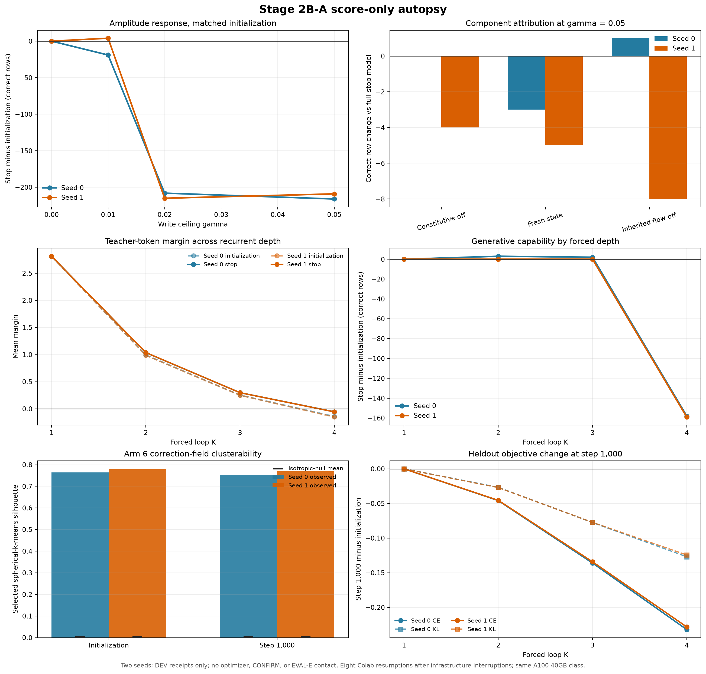

# Paper Two Stage 2B-A Score-Only Autopsy: Results and Strategy Handoff

**Date:** 2026-08-21

**Status:** complete; both score-only seed receipts validated

**Authority:** signed score-only diagnostic lock; no training authorized

**Signed lock SHA-256:** `c35cda73642d52badb32fda54251ab9d9da47fb5d268fa3106762a64b204d167`
**Signature record:** Drive `1OSaglrQTMNkf_hWDLudeMIXYnnNLdrwK`, SHA-256 `bbdd5c05d08e6e6e9fc2c4d2a3d128b657f7b4b479c185c18b089b756aee481b`

## 1. Bottom line

Both seeds give the same central answer. The Stage 2B failure is not rescued by a smaller write ceiling and is not localized to the constitutive innovation or either other single tested state-construction component. Instead, training improves every held-out token-level objective measure while destroying a functional fourth-pass computation that is present at initialization: K4 accuracy falls from 160 to 2 of 461 rows in seed 0 and from 161 to 2 in seed 1, while K1 remains exactly 162 in both seeds.

The correction field is strongly structured, non-isotropic, and battery-associated in both seeds, but that structure is already present before Stage 2B training. The learned mean writeback aligns only weakly with the mean local correction direction, with loop-4 cosines of 0.136 and 0.151. The evidence therefore supports a replicated objective-interface mismatch and a need for task-preserving or correction-aligned supervision. It does not support a scalar-radius repair, a one-component constructor repair, or the specific claim that question states collapse into a common attractor.

## 2. Question and rationale

The registered Stage 2B-D campaign stopped at step 1,000 because both seeds suffered a severe DEV-1 capability loss and every additional recurrent pass reduced the teacher-token margin. The frozen one-pass path remained exact, so the damage was localized to the new recurrent route. This score-only autopsy asks why that route failed without reopening training or touching either sealed exam.

The signed design separates three explanations:

1. **H-B, magnitude:** the learned direction is useful at a write ceiling below 0.05.
2. **H-C, constitutive constructor:** the constitutive innovation is specifically harmful relative to the inherited residual-flow update.
3. **H-A, attractor or task-signal loss:** recurrent question states lose useful task distinctions while held-out training-objective metrics improve or remain flat.

A read-only correction-field arm additionally tests whether locally useful correction directions have reproducible low-dimensional structure, and whether the learned mean writeback aligns with that correction field.

## 3. Locked design

- Seeds: 0 and 1.
- Checkpoints: deterministic Stage 2B initialization and the registered step-1,000 EMA stop checkpoint.
- Runtime: NVIDIA A100-SXM4-40GB, bfloat16 weights, SDPA.
- DEV-1: 1,024 frozen rows for amplitude, component, and generative K-sweep reads.
- DEV-2: fixed, hash-selected 256-row subsample for continuous margins, state geometry, component telemetry, and correction-field analysis.
- Held-out training slice: 32 rows and 14,383 next-token positions for per-loop CE, forward KL, and monotonicity.
- Amplitude cells: gamma in {0, 0.01, 0.02, 0.05} at initialization and stop.
- Component cells at gamma 0.05: standard, constitutive off, fresh state each loop, and inherited residual flow off.
- K sweep: generative DEV-1 rows at forced K in {1, 2, 3, 4}.
- Arm 6: read-only autograd correction direction, deterministic spherical k-means, isotropic row-direction null, eigengap, battery mutual information, and mean-field alignment.
- Onset: exact checkpointed endpoints only, steps 0 and 1,000. Contemporaneous training telemetry is descriptive and cannot support an interpolated onset claim.
- Optimizer construction and parameter updates: prohibited.
- CONFIRM and EVAL-E: prohibited and sealed.

## 4. Execution and integrity

### Preserved invariants

- Optimizer constructed: false.
- Optimizer steps: 0.
- CONFIRM scored: false.
- EVAL-E scored: false.
- Zero-write predictions: exact after same-process replay.
- Zero-write full logits: bit-exact.
- Component pass-one path: bit-exact.
- Disabled-component activation: exact zero for the named component.
- Arm-6 parameter mutation: false; parameter versions and state digests unchanged.
- Sparse-loop projection equivalence: passed.
- Incremental-cache transport: passed.

### Registered execution deviation

The lock requested one session for every diagnostic cell. Colab infrastructure and DriveFS interruptions required eight resumptions across nine A100 assignments. Every resumption used the same registered A100-SXM4-40GB class, bfloat16 weights, and SDPA backend, but the same-session condition is false and is disclosed rather than waived.

Repairs were limited to execution integrity and estimator-preserving acceleration: same-process replay for the hard gamma-zero identity gate, local hot-path receipt writes with periodic Drive mirroring, strict correction-field artifact resume, vectorization of the algebraically identical cosine-silhouette calculation, and atomic per-batch K-sweep resume with validated reuse of complete cells. No model, dataset, metric, threshold, or scientific arm changed.

Execution endpoints, in order:

1. `gpu-a100-s-kkb-usc1f1-39l56xkbw0ya5`
2. `gpu-a100-s-kkb-usc1b2-2ki9mjv2avcv5`
3. `gpu-a100-s-kkb-ass1c2-sqq094w45cyp`
4. `gpu-a100-s-kkb-use1b2-3v3wh1cmymx60`
5. `gpu-a100-s-kkb-usc1c1-136xe36zf4pt5`
6. `gpu-a100-s-kkb-usc1f1-22l3n9eirgmxj`
7. `gpu-a100-s-kkb-usc1c0-34h8yrptjtva0`
8. `gpu-a100-s-kkb-ass1c0-uhsx0epxjsgm`
9. `gpu-a100-s-kkb-usc1c1-irzgm8lw61wx`

## 5. Amplitude response: H-B

### Pooled DEV-1 correct rows of 1,024

| State | Gamma | Seed 0 | Seed 1 |
|---|---:|---:|---:|
| Initialization | 0.00 | 305 | 305 |
| Initialization | 0.01 | 307 | 293 |
| Initialization | 0.02 | 506 | 508 |
| Initialization | 0.05 | 510 | 510 |
| Step 1,000 | 0.00 | 305 | 305 |
| Step 1,000 | 0.01 | 288 | 297 |
| Step 1,000 | 0.02 | 298 | 293 |
| Step 1,000 | 0.05 | 294 | 301 |

For seed 0, no lower nonzero gamma beats either its matched initialization or the registered gamma-0.05 initialization. Gamma 0.01 is 19 rows below its matched initialization; gamma 0.02 is 208 below. Gamma 0 is the exact zero-write plumbing control and reproduces the same checkpoint-independent 305-row read.

**Two-seed adjudication:** H-B is unsupported. Neither seed recovers useful capability by reducing gamma below 0.05. Seed 1 gains four rows at gamma 0.01 relative to its matched initialization, but remains 213 rows below its registered gamma-0.05 initialization; the small sign reversal does not replicate in seed 0 and is not a capability rescue.

## 6. Component attribution: H-C

### Pooled DEV-1 correct rows at gamma 0.05

| Diagnostic mode | Seed 0 | Change vs standard | Seed 1 | Change vs standard |
|---|---:|---:|---:|---:|
| Standard | 294 | 0 | 301 | 0 |
| Constitutive off | 294 | 0 | 297 | -4 |
| Fresh state each loop | 291 | -3 | 296 | -5 |
| Inherited residual flow off | 295 | +1 | 293 | -8 |

Seed 0 does not localize the failure to the constitutive innovation. Turning it off is exactly neutral, while turning off inherited flow is one row better. The effects are negligible relative to the roughly 216-row loss from registered initialization.

**Two-seed adjudication:** H-C is unsupported. Constitutive-off is neutral in seed 0 and four rows worse in seed 1. None of the tested single component interventions materially restores the approximately 209-216 rows lost from the registered initialization.

## 7. Correction-field structure: Arm 6

Both seeds show a strong, non-isotropic correction-field geometry at both endpoints:

| Metric | Seed 0 init | Seed 0 stop | Seed 1 init | Seed 1 stop |
|---|---:|---:|---:|---:|
| Selected spherical k | 2 | 2 | 3 | 3 |
| Selected silhouette | 0.7643 | 0.7536 | 0.7794 | 0.7696 |
| Isotropic-null upper-tail p | 0.00775 | 0.00775 | 0.00775 | 0.00775 |
| Leading normalized eigengap | 0.6383 | 0.6296 | 0.6384 | 0.6307 |
| Eigengap-null upper-tail p | 0.00775 | 0.00775 | 0.00775 | 0.00775 |
| Cluster-battery normalized MI | 0.7704 | 0.7704 | 0.8765 | 0.8765 |
| Battery-permutation p | 0.000244 | 0.000244 | 0.000244 | 0.000244 |

The structure is already present at initialization and changes little at the stop. It therefore does not explain the failure by appearing during Stage 2B training. The mean step-1,000 loop-4 writeback aligns only weakly with the mean initialization correction direction in both seeds, with cosines of 0.1357 and 0.1507. The result is replicated evidence that useful local correction directions have stable structure, but the learned recurrent write does not align strongly with their mean field. This is a design opportunity, not evidence that the current write learned the correction geometry.

## 8. Attractor, K sweep, and objective-task divergence: H-A

### Generative correct rows of 461 by forced depth

| Forced K | Seed 0 init | Seed 0 stop | Seed 1 init | Seed 1 stop |
|---:|---:|---:|---:|---:|
| 1 | 162 | 162 | 162 | 162 |
| 2 | 10 | 13 | 9 | 9 |
| 3 | 2 | 4 | 5 | 5 |
| 4 | 160 | 2 | 161 | 2 |

The protected K1 read remains unchanged in both seeds. Initialization has a highly non-monotone trajectory: K2 and K3 are destructive, but K4 recovers almost all K1 capability. Stage 2B training destroys that K4 recovery in both seeds. The registered stop is therefore not a generic failure to preserve K1; it is a replicated failure to preserve the depth-specific computation that made the fourth pass functional.

### State and task-signal diagnostics

- Seed 0 K1-to-K4 margin Pearson/Spearman: 0.3140/0.4032 at initialization and 0.3159/0.4163 at stop.
- Seed 1 K1-to-K4 margin Pearson/Spearman: 0.3104/0.4008 at initialization and 0.3313/0.4217 at stop.
- Centered loop-4 off-diagonal state cosine: 0.0410 to 0.0408 in seed 0 and 0.0411 to 0.0407 in seed 1.
- Raw loop-4 off-diagonal state cosine: 0.9471 to 0.9449 in seed 0 and 0.9474 to 0.9448 in seed 1.
- Loop-4-minus-loop-1 direction cosine across rows: 0.9346 to 0.9287 in seed 0 and 0.9353 to 0.9280 in seed 1.

The raw states share a large common component, but centering removes it and leaves little cross-question similarity. Task-margin rank/order correlation does not collapse from initialization to stop. Thus the specific H-A subclaim of new question-state convergence or task-signal-correlation collapse is not supported in either seed.

### Held-out objective

| Metric | Seed 0 init | Seed 0 stop | Seed 1 init | Seed 1 stop |
|---|---:|---:|---:|---:|
| Loop-4 CE | 3.2440 | 3.0120 | 3.2432 | 3.0149 |
| Loop-4 forward KL | 1.8519 | 1.7249 | 1.8532 | 1.7288 |
| Monotonicity component | 1.2531 | 1.1261 | 1.2544 | 1.1300 |

All three held-out objective measures improve in both seeds while the K4 generative read falls from 160 or 161 to 2. This is replicated objective-task divergence. It does not establish an attractor or state-collapse mechanism.

**Two-seed adjudication:** the operational part of H-A is supported: training erases useful depth-specific task behavior while improving the registered held-out objective. The proposed representational mechanism is not supported: neither centered state similarity nor task-margin correlation shows a new collapse. The warranted successor is therefore a task-preservation or correction-alignment intervention, not an attractor-specific repair.

## 9. Supported findings

1. The failure is robust to reducing gamma over the tested range. No common lower gamma beats the registered initialization.
2. No single tested state-construction component explains the loss. All component interventions remain within eight rows of the failed standard cell.
3. Stage 2B training preserves K1 exactly but destroys the functional K4 recovery in both seeds.
4. Loop-4 CE, forward KL, and the monotonicity component improve in both seeds while K4 task accuracy collapses.
5. Local correction directions have strong, replicated non-isotropic and battery-associated structure at initialization and stop.
6. The learned mean writeback has only weak alignment with the mean local correction direction in both seeds.

## 10. Findings not supported

1. H-B, a smaller scalar write ceiling as the rescue.
2. H-C, the constitutive innovation as the specific harmful constructor.
3. New convergence of centered question states into a common attractor.
4. Collapse of K1-to-K4 task-margin correlation.
5. Emergence of correction-field structure during Stage 2B training; the structure predates training.

## 11. Interpretation

The failed system is not simply writing too much, and one bad constructor is not the cause. It is optimizing the wrong proxy for the behavior the program needs. The loss rewards token-level movement toward the teacher and reduced monotonicity penalty, but those improvements do not preserve the sequence-level computation that makes the fourth pass useful. The result is especially clear because the one-pass path remains exact while the fourth-pass recovery disappears in both seeds.

The correction-field result makes the negative informative rather than merely terminal. Local directions that would improve the teacher-token margin are not random; they have a strong low-rank, battery-associated geometry. The current writeback barely aligns with their mean. A successor should therefore add an explicit task-preservation anchor and test correction-aligned or cluster-conditional writes. It should not spend another campaign on gamma tuning or single-component substitutions within the closed M2 route.

## 12. Limitations and claim boundaries

- The same-session execution condition was violated by infrastructure interruptions; all hardware/software semantics were held fixed and the deviation is fully receipted.
- The two seeds test replication of this fixed recipe, not population-level seed variance.
- DEV-1 and DEV-2 are reused development instruments; neither sealed exam was opened.
- The Arm-6 correction directions are local first-order quantities, not guaranteed finite-step task improvements.
- The 32-row held-out training slice measures objective behavior but is not a task battery.
- Only initialization and step 1,000 are exact checkpointed onset endpoints; no intermediate onset timing may be claimed.
- H-C materiality was not numerically thresholded in the signed lock, so effect sizes are reported and interpreted conservatively.
- The M2 route remains closed as built regardless of this autopsy.

## 13. Open questions and strategy decisions

1. Which answer-bearing positions account for the K4 recovery at initialization, and which loss terms move those positions in the wrong direction during Stage 2B training?
2. Can a task-preservation anchor retain the initialization K4 recovery while keeping the observed CE/KL improvements?
3. Does supervising toward local correction directions, or routing among the battery-associated correction clusters, outperform the current mean writeback target?
4. Is the K4 recovery a reusable computation or a brittle phase-specific cancellation? A successor should test this directly before making an algorithmic-depth claim.
5. What continuous task-facing metric can connect token-level objectives to final greedy answers without reopening a sealed exam during development?

## 14. Plain-language summary

The model already knew how to recover after four internal passes before this training stage. The new training made its local loss numbers look better, but it erased that recovery in both random seeds. Turning the write strength down did not fix it, and removing individual pieces of the recurrent update did not fix it either. The internal states also did not all collapse into the same state, so that simple explanation is wrong.

The useful lead is that the directions that would locally correct the model are highly organized rather than random. The trained write did not point strongly in those directions. The next experiment should teach the recurrent path to preserve task performance and to use those structured correction directions, instead of continuing to optimize the same proxy more gently.

## 15. Canonical artifacts and receipts

- Signed lock: `training/paper2_stage2b_autopsy_lock.json`
- Reproducible analyzer: `analysis/analyze_paper2_stage2b_autopsy.py`
- Machine analysis: `artifacts/stage2b_autopsy_20260820/analysis/analysis_summary.json`
- Final receipt manifest: `artifacts/stage2b_autopsy_20260820/final_receipts_manifest.json`
- Figure SVG: `docs/figures/stage2b_autopsy_20260820.svg`
- Figure PNG: `docs/figures/stage2b_autopsy_20260820.png`
- Durable run root: `MyDrive/recurrent-qwen-svgd-artifacts/stage5/stage5_paper2_stage2b_autopsy_20260820/`
- Seed summaries: `receipts/seed_0/summary.json`, `receipts/seed_1/summary.json`
- Private diagnostic artifacts: `private/seed_0/`, `private/seed_1/`
- Execution logs: `receipts/logs/`

## 16. Closeout state

- Seed 0 score-only receipt: complete and validated.
- Seed 1 score-only receipt: complete and validated.
- Paid A100 session: released after receipt, figure, and test validation.
- Optimizer continuation: prohibited.
- CONFIRM: sealed.
- EVAL-E: sealed.
