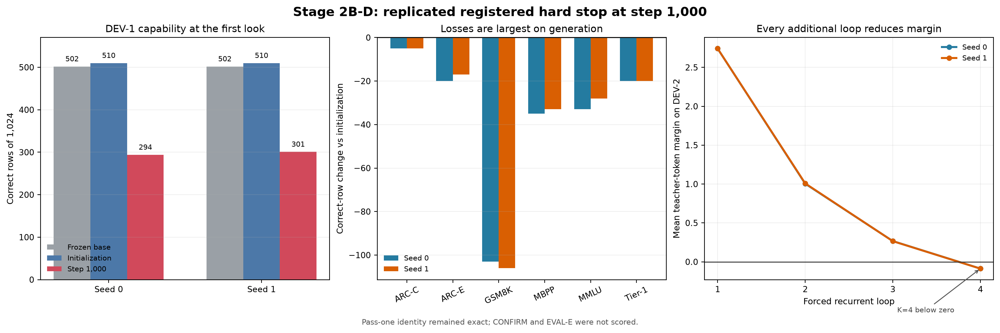

# Paper Two Stage 2B-D Registered Stop: Results and Strategy Handoff

**Date:** 2026-08-19  
**Status:** complete registered early stop; no continuation authorized  
**Registered verdict:** `REPLICATED_DEV1_HARD_FLOOR_STOP_AT_STEP_1000`  
**Execution commit:** `dae24d8c3fae04b0ef4a73da1310921828ece525`  
**Signed lock SHA-256:** `30a97e175200d3a58bc0cc0c200acec301d3a4f4cd662466d4c3491b9f816597`

## 1. Bottom line

Both registered Stage 2B-D seeds independently hit the DEV-1 hard safety floor at the first scheduled look, step 1,000. Seed 0 fell from 510 to 294 correct rows of 1,024 relative to its initialization; seed 1 fell from 510 to 301. GSM8K fell to 2/369 in both seeds, MBPP to 0/67, and Tier-1 to 0/25. These are not threshold-edge misses or plausible small-panel noise. The registered stop was necessary.

The failure is also well localized. The unchanged pass-one path remained bit-exact in both seeds, all active gradients were finite, the finite-horizon catastrophe tripwire remained clear, and Sinkhorn residuals were zero. On the independent 2,048-row DEV-2 margin panel, however, every additional loop reduced the mean teacher-token margin in both seeds, from 2.742 at K=1 to approximately -0.088 at K=4. The system learned recurrent computation that was actively harmful under the registered task read.

The step-5,000 separation gate was never reached and is not eligible for adjudication. No further optimizer steps are authorized. CONFIRM and EVAL-E remain sealed.

## 2. Question and rationale

Stage 2B-D tested whether the idle-loop boundary could be overcome by giving later recurrent passes three things the prior systems lacked: dedicated loop-scoped LoRA capacity, a constitutive hidden-state innovation, and full-sequence teacher distillation with an explicit monotonicity hinge. The first pass was structurally protected so the frozen serving path could not be changed by the new recurrent machinery.

The positive-seeking hypothesis was that later loops would become ordered and useful: K2 would improve on K1, K3 on K2, and K4 on K3. The registered campaign planned 24,000 steps, but required DEV-1 safety at every look and a formal depth-separation adjudication at step 5,000. A large capability failure on DEV-1 always overrode the later scientific gate.

## 3. Locked design

- Substrate: frozen `Qwen/Qwen2.5-0.5B-Instruct` lineage.
- Initialization: the two P3.5 Arm-S EMA endpoints.
- Added trainable parameters: 2,246,869 per seed.
- Recurrent state: four mHC lanes, eight slots per lane, latent width 128.
- M2 behavior: constitutive hidden-state innovation active; dynamic routing, loop LoRA, and `rho` intentionally dormant at this stage.
- Training objective: full-sequence teacher-token CE, forward KL on the pinned 14B top-128 lattice, and an adjacent-loop monotonicity hinge with delta 0.01.
- Training corpus: 2,920 documents, 1,256,942 non-padding next-token positions, maximum sequence length 512.
- Planned dose: 24,000 steps, batch 128, two seeds.
- Curriculum: M2 through step 2,500, M3 through 5,000, then M4.
- Optimizer: AdamW; peak learning rates `5e-4` new modules, `5e-5` loop LoRA, `2e-4` gates.
- Amplitude: training lottery 0.02 to 0.11; registered read 0.05.
- Runtime: one NVIDIA A100-SXM4-40GB per seed, BF16, SDPA; NVIDIA driver 580.82.07 and reported CUDA 13.0.
- Evaluation roles: DEV-1 carried hard floors and both-comparator task reporting; DEV-2 carried per-loop margin telemetry. CONFIRM and EVAL-E were prohibited.

Seed-specific calibrated objective weights were:

| Seed | CE | KL | Monotonicity |
|---:|---:|---:|---:|
| 0 | 0.280581 | 0.620660 | 0.098759 |
| 1 | 0.223668 | 0.661709 | 0.114623 |

## 4. Execution and integrity

Both seeds ran from the same pinned commit and signed lock. The runtime tests passed 39/39 before execution. Durable checkpoints were written every 20 steps, so the registered stop did not erase the trajectory needed for later read-only diagnosis.

The original seed-0 step-zero false stop caused by an overbroad gradient-liveness assertion remains preserved as archaeology. It was repaired before this campaign and consumed no registered attempt. The actual campaign then completed 1,000 optimizer steps in each seed and independently returned `stop_reason = dev1_hard_floor`.

| Receipt | Seed 0 | Seed 1 |
|---|---|---|
| Canonical summary SHA-256 | `90b6e4c9...69b0` | `faafb988...fb23` |
| Step-1,000 EMA SHA-256 | `50cbf437...2f58` | `830bbfa1...2bc` |
| Status | stopped | stopped |
| Stop reason | `dev1_hard_floor` | `dev1_hard_floor` |
| CONFIRM scored | false | false |
| EVAL-E scored | false | false |

## 5. DEV-1 capability result

### Pooled result

| Seed | Frozen base | Initialization | Step 1,000 | Change vs init | Change vs base |
|---:|---:|---:|---:|---:|---:|
| 0 | 502/1,024 | 510/1,024 | 294/1,024 | -216 rows (-21.09 points) | -208 rows (-20.31 points) |
| 1 | 502/1,024 | 510/1,024 | 301/1,024 | -209 rows (-20.41 points) | -201 rows (-19.63 points) |

### Battery decomposition against initialization

| Battery | Rows | Seed 0 init to current | Seed 1 init to current |
|---|---:|---:|---:|
| ARC-Challenge | 76 | 41 to 36 (-5) | 42 to 37 (-5) |
| ARC-Easy | 243 | 192 to 172 (-20) | 190 to 173 (-17) |
| GSM8K | 369 | 105 to 2 (-103) | 108 to 2 (-106) |
| MBPP | 67 | 35 to 0 (-35) | 33 to 0 (-33) |
| MMLU | 244 | 117 to 84 (-33) | 117 to 89 (-28) |
| Tier-1 | 25 | 20 to 0 (-20) | 20 to 0 (-20) |

The generative group (GSM8K, MBPP, Tier-1) fell to 2/461 in each seed, from 160/461 and 161/461 at initialization. The multiple-choice group also declined, but less severely: 292/563 versus 350/563 in seed 0 and 299/563 versus 349/563 in seed 1. Autoregressive compounding is therefore plausible, but it is not the whole explanation because the independent single-position margin read also deteriorated with every loop.

## 6. Registered safety floor

| Seed | GSM8K floor | Observed | Miss | Tier-1 floor | Observed | Miss |
|---:|---:|---:|---:|---:|---:|---:|
| 0 | 91 | 2 | 89 | 19 | 0 | 19 |
| 1 | 94 | 2 | 92 | 19 | 0 | 19 |

This is exactly the type of event a hard stop should terminate. The misses are large, replicated, and distributed across hundreds of rows. Relaxing or rounding the boundary would not change the decision. Continuing to step 5,000 would have violated the signed safety contract and spent compute on a model already far outside its admissible operating region.

## 7. Depth result on DEV-2

| Forced loop | Seed 0 mean margin | Seed 1 mean margin |
|---:|---:|---:|
| K1 | 2.7421 | 2.7421 |
| K2 | 1.0042 | 1.0078 |
| K3 | 0.2664 | 0.2654 |
| K4 | -0.0873 | -0.0878 |

Adjacent-loop transitions were all negative:

| Transition | Seed 0 | Seed 1 |
|---|---:|---:|
| K1 to K2 | -1.7380 | -1.7343 |
| K2 to K3 | -0.7378 | -0.7424 |
| K3 to K4 | -0.3537 | -0.3532 |

The two trajectories are nearly identical. This is stronger than a null depth result: under the registered read, later loops systematically move away from the teacher token and cross the mean decision boundary by K4.

## 8. What the integrity checks exclude

- **Frozen-path corruption:** excluded at the observed checkpoint. Pass-one maximum absolute logit difference was exactly 0.0 in both seeds.
- **Numerical explosion:** not supported. All active gradient tensors were finite; no active gradient was missing.
- **Finite-horizon instability:** not supported at the registered watch. Centered gains were approximately 1.000 to 1.005, below the catastrophe threshold of 100.
- **Sinkhorn failure:** excluded at the observed checkpoint. Row and column residual maxima were 0.0.
- **A one-seed accident:** excluded as the primary explanation. The capability and depth-margin patterns replicated closely.

The localization is stage-specific. M2 intentionally held dynamic routing and loop LoRA dormant, so this result primarily tests the constitutive/state-construction path interacting with the inherited flow, bridge, and control machinery. It does not test the later M3/M4 mechanisms because safety made those stages ineligible.

## 9. Interpretation

### Supported

1. The Stage 2B-D M2 recipe learned harmful recurrent computation by step 1,000 in both seeds.
2. The harm was caused by the added recurrent path, not by a change to the protected first pass.
3. Additional loop depth was directionally harmful on the smooth DEV-2 margin estimator.
4. Generation tasks were especially vulnerable, consistent with repeated per-token perturbations compounding across a decoded sequence.
5. The registered DEV-1 floor prevented unnecessary additional spend and preserved a scientifically interpretable boundary.

### Not established

1. Which individual component caused the harmful direction. The constitutive innovation, inherited bridge/read, amplitude, and objective interaction were not factorially ablated.
2. Whether the 0.05 read amplitude was too large for the newly learned direction. Prior amplitude safety applied to predecessor directions, not automatically to this one.
3. Whether task rehearsal, a task-level preservation objective, stronger monotonicity funding, or a progressive-depth curriculum would rescue the route.
4. Whether the training distribution's CE/KL improved while task behavior declined; that comparison requires a dedicated receipt.
5. Any result on CONFIRM, EVAL-E, or non-DEV generalization.

## 10. Likely mechanism and alternatives

The simplest current account is objective misalignment at the recurrent interface. M2 optimized full-sequence teacher-token CE/KL over general and code documents, with monotonicity receiving 20% of the independent-gradient budget only at calibration. At the stop, the observed loop ordering directly contradicted the desired monotone behavior. The recipe may have learned token-level directions that reduce its training objective while disrupting task-specific answer trajectories, especially when applied repeatedly during generation.

Three alternatives remain live and separable:

- **Magnitude failure:** the learned direction is useful at a smaller amplitude but harmful at 0.05.
- **Component failure:** constitutive innovation is harmful while another recurrent component is neutral or useful.
- **Preservation failure:** the recurrent state is trainable, but the objective provides no task-level constraint against destroying fragile acquired behavior.

The current receipts do not choose among them.

## 11. Recommended next decision

No continuation of the registered campaign is permissible. The next rational action, if strategy wants diagnosis rather than immediate route retirement, is one new score-only autopsy using the preserved checkpoints. It should be locked before execution and should separate:

1. checkpoint onset, using selected retained checkpoints from the 20-step trajectory;
2. amplitude response, including a zero-write identity control and smaller registered reads;
3. component attribution, especially constitutive innovation versus the inherited recurrent write path;
4. K=1 through K=4 behavior under the same scorer; and
5. training-distribution CE/KL versus DEV task retention.

That audit can determine whether the next design needs a smaller operating radius, a different state constructor, or an explicit task-preservation objective. A new training campaign should not open until this attribution is measured. Strategy may instead close this exact M2 route now; the present evidence is sufficient for that bounded decision.

## 12. Limitations

- Task behavior was scored at the first registered look, not continuously before step 1,000.
- The two seeds estimate replication of this recipe, not population-level seed variance.
- DEV-1 and DEV-2 are reused development instruments; no sealed exam was opened.
- The result applies to M2. M3 and M4 were not reached.
- Component-level causality is unresolved without the proposed read-only ablations.
- Absolute results are tied to A100 BF16 SDPA and the registered reader.

## 13. Plain-language summary

We tried to teach the model to use four internal thinking passes, while guaranteeing that its ordinary first pass stayed untouched. That protection worked: the original one-pass behavior was exactly unchanged. But the extra thinking passes learned the wrong thing. After 1,000 training steps, both independent copies lost about 20 percentage points on the safety panel. Math, code, and the Tier-1 check nearly collapsed. A separate measure showed why: each extra pass pushed the model farther from the teacher's answer, and the fourth pass crossed to the wrong side on average.

This was not a close call, and stopping was not excessive caution. The safety check prevented us from spending four times more compute on a model already showing the same severe failure in both copies. The useful scientific result is that simply adding recurrent capacity, more distillation data, and a monotonicity penalty did not make depth useful under this recipe. The next question is narrower: was the learned write too large, was the state constructor wrong, or did the objective fail to protect task behavior? The saved checkpoints let us answer that without more training.

## 14. Canonical artifacts

- Machine analysis: `artifacts/stage2b_depth_20260819/analysis/analysis_summary.json`
- Final receipt manifest: `artifacts/stage2b_depth_20260819/final_receipts_manifest.json`
- Figure SVG: `docs/figures/stage2b_depth_step1000_stop_20260819.svg`
- Figure PNG: `docs/figures/stage2b_depth_step1000_stop_20260819.png`
- Reproducible analyzer: `analysis/analyze_paper2_stage2b_depth_stop.py`
- Signed lock: `training/paper2_stage2b_depth_executed_lock.json`
- Durable run root: `MyDrive/recurrent-qwen-svgd-artifacts/stage5/stage5_paper2_stage2b_depth_20260819/`
- Seed summaries: `receipts/seed_0_summary.json`, `receipts/seed_1_summary.json`
- Seed look receipts: `receipts/seed_0_look_01.json`, `receipts/seed_1_look_01.json`
- Step-1,000 EMA checkpoints: `private/seed_0/ema_step_01000.pt`, `private/seed_1/ema_step_01000.pt`
- Step-zero archaeology: `receipts/archaeology/seed_0_summary_stopped_step0_false_gradient_liveness.json`

## 15. Closeout state

- Seed 0 paid A100: released.
- Seed 1 paid A100: released.
- CPU closeout session: released.
- Server-side Colab check: no active sessions.
- Optimizer continuation: not authorized.
- Step-5,000 adjudication: ineligible.
- CONFIRM: sealed.
- EVAL-E: sealed.
