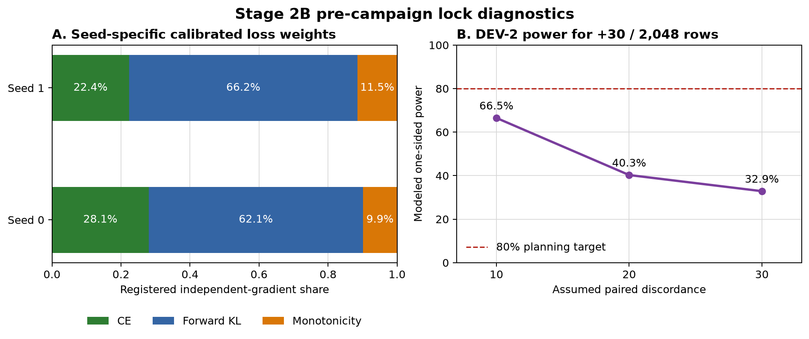

# Stage 2B Depth Campaign: Pre-Campaign Lock Handoff

**Date:** 2026-08-18  
**Status:** pre-campaign build complete; unsigned executed lock ready for Mark's signature; training remains disabled  
**Branch:** `codex/phase3-opening-build`  
**Governing charter:** Drive `1izjyOV3699BaSDTVntKi_8-vJfnl4Gtx`, SHA-256 `48aed379110a4614b6091592890713af9fe40b444f0a918c8ddef3cf5845d3b0`

## 1. Executive reading

The authorized no-training batch is complete. The Stage 2B recurrent-depth system builds, preserves the pass-one serving path exactly, remains finite under the M0 stability battery, and now has an exact full-sequence training corpus, pinned sparse-teacher estimator, per-seed loss constants, frozen DEV-2 manifest, and all required pre-campaign riders.

The executed lock is assembled but deliberately unsigned. `training_authorized`, `locked_before_training`, and `mark_signed` remain `false`. No optimizer was constructed, no optimizer step ran, and CONFIRM and EVAL-E were not scored.

Two qualifications are material. First, DEV-2's modeled power for a +30/2,048-row effect is 32.9% to 66.5% across the preregistered discordance range, not 80%. Second, the available GSM8K and MBPP archives contain verified final answers but no execution-verified intermediate traces or registered step boundaries. The verified-depth loss therefore has weight zero; the campaign tests whether fixed four-loop, loop-aware distillation plus the monotonicity hinge defeats the idle-loop optimum.

## 2. Experimental design now bound

- Frozen substrate: `Qwen/Qwen2.5-0.5B-Instruct`.
- Initialization: P3.5 Arm S EMA endpoints, seed 0 SHA `a047e2e7...26ca6`, seed 1 SHA `e36cddb7...fccb`.
- Recurrent state: four mHC lanes, eight slots per lane, latent width 128.
- Routing: lane-axis Birkhoff map using 20 log-space Sinkhorn iterations.
- Innovation: constitutive hidden-state innovation gated by prompt context.
- Loop LoRA: rank 16 on recurrent-block `q/k/v/o` projections; structurally zero on pass one and active only on later passes.
- Loop count: fixed at four. The prior depth lottery is retired.
- Training dose, pending signature: 24,000 steps, batch 128, two seeds, looks every 1,000 steps.
- Curriculum: M2 steps 1-2,500; M3 2,501-5,000; M4 5,001-24,000. M0 and M1 are verification states, not optimizer stages.
- Learning rates: new modules `5e-4`, loop LoRA `5e-5`, gates `2e-4`; AdamW, 500-step warmup, cosine landing over the last 10%, EMA 0.999 primary.
- Amplitude: training lottery `[0.02, 0.11]`; registered read `0.05`.
- Kill gate: step 5,000. Continue only if at least one seed has positive means and positive lower 95% bootstrap bounds for both K2-to-K3 and K3-to-K4 answer-token-margin transitions.

## 3. Full-sequence estimator and corpus

The corpus freezes 2,920 documents and 1,256,942 non-padding next-token positions at maximum length 512:

| Source / stratum | Rows |
|---|---:|
| Reused DEV-C training split | 979 |
| Option B fresh training documents | 1,941 |
| Code | 1,409 |
| General | 1,511 |

Corpus SHA-256: `2e3e4f8c...e135`. The old-document split reuses seed `20260804`; old evaluation documents remain excluded. The 32-row loss-calibration panel is fixed 16 code / 16 general at seed `20260818`, contains 14,383 next-token positions, and has manifest SHA `5d9e6784...4b21`.

At every position and each of four loop outputs, the objective uses teacher-token CE and forward KL on the pinned 14B teacher's cached top-128 lattice. Teacher and student logits are renormalized on that identical support. Examples are weighted equally after averaging their token losses.

## 4. Calibrated loss constants

The exact M4 estimator was differentiated over all 2,246,869 trainable parameters on both initialization seeds. The desired independent-gradient shares were KL 50%, CE 30%, and monotonicity 20%.

| Seed | CE weight | KL weight | Monotonicity weight | Realized shares |
|---|---:|---:|---:|---|
| 0 | 0.280581 | 0.620660 | 0.098759 | 30% / 50% / 20% |
| 1 | 0.223668 | 0.661709 | 0.114623 | 30% / 50% / 20% |

The unweighted component means were almost identical across seeds: CE 2.24474 versus 2.24500, KL 1.21637 versus 1.21641, and monotonicity 1.25399 versus 1.25390. Gradient norms were not identical: seed-0/seed-1 ratios were approximately 1.35 for CE, 1.81 for KL, and 1.97 for monotonicity. Seed-specific weights are therefore the defensible binding; averaging them would violate the matched-estimator rule.

The hinge margin is `delta = 0.01`. The per-seed monotonicity weight above is `lambda_m` and multiplies the sum of the three adjacent-loop hinge terms. Verified-depth weight is `0.0` under the disclosed archive fallback.

## 5. M0 stability and identity

The A100 M0 receipt passed:

- Pass-one logits match the unchanged serving path exactly: maximum absolute difference `0.0`.
- Trained loop-LoRA leakage on pass one: `0.0`.
- M1 replicated-lane identity difference: `0.0`.
- All 48 loop-LoRA adapters were present.
- Maximum finite-horizon gain: `73.4796`, below the registered `100` tripwire.
- Sinkhorn row and column residual maxima: `0.0`.
- Mean second routing eigenvalue: `0.999306`.
- Lane effective rank: `1.00319`, expected at replicated-lane initialization and now a baseline for later diversification.

The gain is finite but high enough to remain a real observatory item. This receipt establishes safe initialization, not future optimization stability.

## 6. Pre-campaign riders

### Seed ensemble

The margin-arbitrated seed ensemble was negative: 506/1,024 versus the best constituent at 508/1,024. No ensemble gain is carried into Stage 2B.

### Runtime discordance

The desk audit found small high-margin subsets among runtime-sensitive rows: 9 for T3a and 8 for T3b. The paired fixed-prompt probe then produced the same top token (`1249`) on A100 and L4, although logits were not bit-identical: maximum absolute delta `0.375`, mean absolute delta `0.05726`. The campaign is pinned to A100 BF16 SDPA; cross-hardware results are described as top-token aligned, not numerically identical.

## 7. DEV-2 and inference limits

DEV-2 was frozen score-blind before model contact: 2,048 rows sampled from 9,207 candidates, manifest SHA `6b9ebf40...0adb`. It contains 1,732 GSM8K, 263 ARC-Challenge, 40 MBPP, and 13 floor-only rows across ARC-Easy, MMLU, and Tier-1.

At the +30-row design target and one-sided alpha 0.05, modeled power is:

| Paired discordance | Power |
|---:|---:|
| 10% | 66.5% |
| 20% | 40.3% |
| 30% | 32.9% |

DEV-2 is useful for smooth margin trajectories and directionality, but a null discrete-accuracy result at this effect size will remain weak evidence unless discordance is unusually low. The registered step-5,000 margin gate is therefore the correct early decision instrument.

## 8. Interpretation

The preflight supports launching the registered campaign after signature. It does not establish that depth will help. The key scientific risk remains unchanged: replicated lanes begin effectively rank one, and the prior system learned idle-loop behavior. Stage 2B now gives later loops unique trainable capacity and a direct penalty for failing to improve, with enough token-level dose to test whether that optimum can be escaped.

Three outcomes remain clean:

1. Both seeds separate by step 5,000: continue to the 24,000-step endpoint and measure whether recurrent depth produces capability gains.
2. One seed separates: continue that seed under the registered rule and report seed dependence.
3. Both remain flat: terminate at 20% of budget and bank a causal boundary on this architecture and recipe.

## 9. Limitations and open questions

- The executed lock still requires Mark's separate signature. Training is not authorized before it.
- No execution-verified intermediate trace target is available. Any later addition would be a new amendment, not a silent change.
- DEV-2 does not deliver 80% power for the +30-row target under the modeled discordance range.
- Cross-runtime logits are not bit-identical, so registered training and primary evaluation remain hardware-pinned.
- M0 lane rank is near one by construction; useful lane diversification must be demonstrated during training.
- The finite-horizon gain is under the tripwire but not small. It must be logged at every audit look.

## 10. Plain-language summary

We have finished building and checking the experiment, but we have not started training. The original model's first pass is exactly unchanged. Extra capacity exists only inside later thinking loops. The training data and teacher signals are frozen, the loss balance has been measured separately for each seed, and the early-stop test is defined in advance.

The experiment now asks one focused question: if later loops receive their own trainable machinery, much more token-level supervision, and an explicit cost for failing to improve, do they begin doing useful work? Five thousand steps is enough for the first answer. If neither seed shows ordered improvement, the campaign stops early. If at least one does, it continues under the already-written 24,000-step plan.

## 11. Receipt map

- Unsigned executed lock: `training/paper2_stage2b_depth_executed_lock.draft.json`
- DEV-2 receipt: `artifacts/stage2b_depth_20260818/dev2/dev2_manifest_receipt.json`
- Corpus/calibration manifest receipt: `artifacts/stage2b_depth_20260818/data_prelock/summary.json`
- Seed-ensemble receipt: `artifacts/stage2b_depth_20260818/riders/seed_ensemble_summary.json`
- R-1 receipt: `artifacts/stage2b_depth_20260818/riders/r1_runtime_discordance_summary.json`
- M0 stability receipt: `artifacts/stage2b_depth_20260818/runtime_preflight/a100_40gb/m0_stability_summary.json`
- Cross-runtime receipt: `artifacts/stage2b_depth_20260818/runtime_preflight/r1_fixed_prompt_cross_runtime.json`
- Loss-calibration status and seed receipts: `artifacts/stage2b_depth_20260818/loss_calibration/`
- Durable Drive receipt folder: `MyDrive/recurrent-qwen-svgd-artifacts/stage5/stage5_paper2_stage2b_loss_calibration_20260818/receipts/`

## 12. Required next action

Strategy should review the assembled lock and this handoff. If Mark signs the executed lock, the coding lane may flip `mark_signed`, `locked_before_training`, and `training_authorized` in one signature commit and launch M2 for both seeds. Until then, the correct state is **ready, unsigned, and stopped**.
